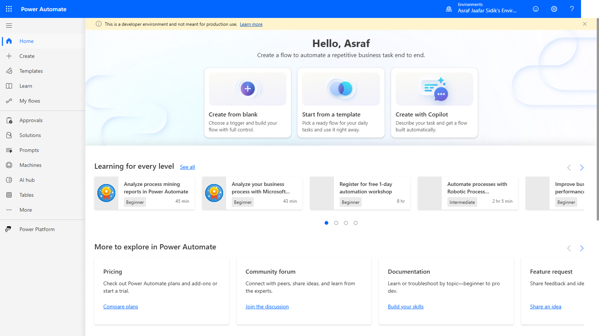
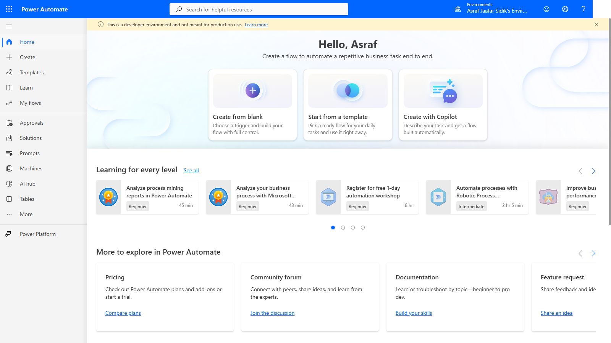
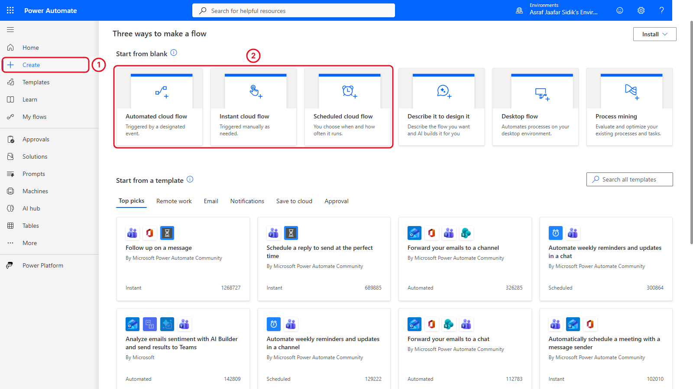
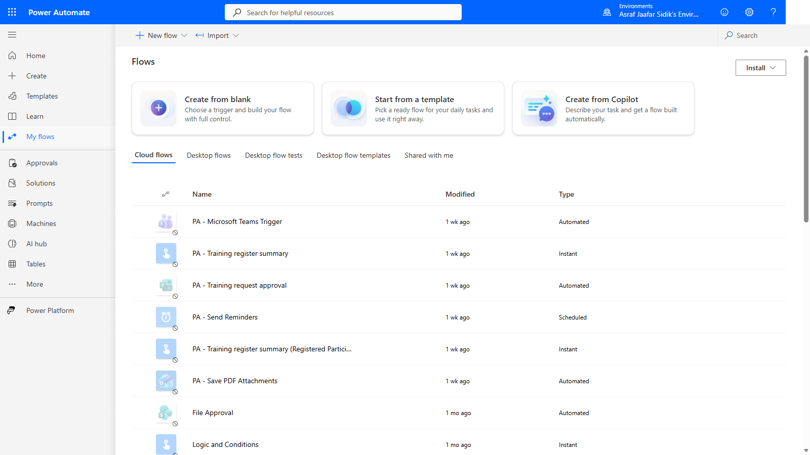

# 01 - Understand Power Automate

Before you build anything, learn the vocabulary of a flow, the three ways a cloud flow can start, and where the main pages live in Power Automate.

> **Copy-paste values:** the planning template for this chapter is on the [copy-paste page](./copy-paste.md).

**Estimated time:** 45 minutes

**Your result:** A simple automation plan and familiarity with the Power Automate Home and Create pages.

---

## What You Will Learn

- Identify a repetitive business task that could benefit from automation
- Explain the trigger, actions, data, condition and result of a flow
- Choose between an automated, instant and scheduled cloud flow
- Open Power Automate and find Home, Create and My flows
- Write a short plan before building an automation

You need a Windows computer with Microsoft Edge, an internet connection and your training work or school account. You don't need the Excel workbook, a form or any test files yet. You prepare those in Chapter 2.

---

## Your Business Scenario

You coordinate training for a small organisation. Course materials arrive by email, session details are stored in Excel, and participants need reminders. You keep downloading attachments, copying information into messages and checking whether requests were approved.

Each of those tasks has a recognisable starting point and repeatable steps. Over the two days you use Power Automate to do some of those steps for you.

---

## 1.1 What Is Automation?

Automation means setting up a repeatable process so software performs the steps when a defined event happens, or when you ask it to run.

Power Automate calls an automation a **flow**. This course builds **cloud flows**, which work with online services such as Outlook and OneDrive for Business.

A flow applies your rule every time, including a wrong one. If you pick the wrong folder or recipient, the flow repeats that mistake. So every flow needs a clear rule and a test.

> **Tip:** Start with a small task whose result you can check easily. A good first flow saves one test attachment to the correct folder.

---

## 1.2 Recognise the Parts of a Flow

Take this requirement: *When an email with the subject marker [PA TRAINING] arrives, examine each attachment. If the attachment is a PDF, save it to the training attachments folder.*

| Part | Plain-language meaning | Example |
|------|------------------------|---------|
| Trigger | What starts the flow | A matching email arrives |
| Action | A step the flow carries out | Create a file in OneDrive for Business |
| Data | Information a step receives or produces | The attachment's name and contents |
| Condition | A question that selects a path | Is this attachment a PDF? |
| Loop | Steps repeated for each item | Check each attachment in the email |
| Result | The business outcome you verify | Matching files appear in the intended folder |

The basic pattern is: something starts the flow, the flow follows its steps, you check the result. A flow only needs a condition or a loop when the process calls for one.

> **Try it:** Imagine a training email with two attachments, `CourseOutline.pdf` and `TrainerPhoto.jpg`. Walk the rule through each one. The PDF is saved, the image is skipped, and the folder should end up with `CourseOutline.pdf` only. If an email has no PDFs at all, the flow still runs successfully and creates nothing.

---

## 1.3 Choose How the Flow Starts

| Cloud-flow type | When it starts | Training example |
|-----------------|----------------|------------------|
| Automated | When a specified event occurs | Save attachments when a training email arrives |
| Instant | When you deliberately start it | Create an Excel summary when you're ready to share it |
| Scheduled | At a time and frequency you configure | Send training reminders every Monday morning |

Pick the type by asking *what should make this process begin?* Sending an email doesn't tell you the type. All three can send email. Only their starting points differ.

**Quick check.** Pick a type for each request, then check the answers.

1. Whenever a new training request is submitted, ask someone to approve it.
2. At 9:00 AM every Friday, prepare a weekly reminder.
3. Let me generate a summary whenever I need one.

Answers: 1 is Automated, 2 is Scheduled, 3 is Instant.

---

## 1.4 Connectors and Connections

A **connector** gives Power Automate a set of triggers and actions for one service. Office 365 Outlook provides email operations. OneDrive for Business provides file operations.

A **connection** links those operations to an account. Whenever a later lesson asks you to sign in to a connector, check that you're using the training account, and that it has permission for the mailbox, folder or resource involved.

The core exercises use standard connectors only. Power Automate Free can create and run cloud flows with standard connectors but can't share flows, so you build and own your own flows. See [Power Automate license types](https://learn.microsoft.com/en-us/power-platform/admin/power-automate-licensing/types).

> **Tip:** Office 365 Outlook and Outlook.com are different connectors. Go by the connector name in the lesson, not the icon.

---

## 1.5 Explore Power Automate

**Open the training workspace**

1. In Edge, go to [make.powerautomate.com](https://make.powerautomate.com) and sign in with your training account.
2. Check that the page says **Power Automate** at the upper left.

   

   *The Power Automate home page.*

3. Look at the top right of the blue bar. The small word **Environments** sits above your environment's name. An environment is a workspace that holds Power Platform resources, including flows.
4. Compare it with the environment your trainer gave you. If they differ, ask before you build anything.

*The environment selector shows which workspace you're in. Yours will have a different name.*

**Find the three cloud-flow choices**

1. If you see only icons on the left, select the three-line menu icon at the top left (above **Home**) to show the labels. Then select **Create** in the left navigation.
2. Under **Start from blank** you see six tiles. Three of them create cloud flows from scratch, and those are what this course uses:

   | Tile | Description on the tile | Used in this course |
   |------|------------------------|---------------------|
   | Automated cloud flow | Triggered by a designated event | Yes |
   | Instant cloud flow | Triggered manually as needed | Yes |
   | Scheduled cloud flow | You choose when and how often it runs | Yes |
   | Describe it to design it | Describe the flow you want and AI builds it for you | Chapter 9 |
   | Desktop flow | Automates processes on your desktop environment | No |
   | Process mining | Evaluate and optimize your existing processes and tasks | No |

   

   *The three cloud-flow tiles come first under Start from blank. Describe it to design it is the Copilot option you'll try in Chapter 9.*

   > **Note:** The heading **Three ways to make a flow** refers to the three sections of the page: Start from blank, Start from a template and Start from a connector. Those aren't the three cloud-flow types. The types are three of the six tiles inside the first section.

3. Decide which tile you'd use for a flow that starts when someone submits a form. The answer is **Automated cloud flow**: a form submission is an event that happens without you starting it. Instant means *you* start the flow.

**Locate your flows**

1. Find **My flows** in the left navigation. You'll come back here to find every flow you build.

   

   *My flows lists every flow you've built. Your list is probably empty for now. The flows you build in Chapters 3 to 8 appear here. This screenshot shows the trainer's flows, so the names may differ slightly from the ones you build (for example, Save PDF Attachments instead of Save training PDF attachments).*

2. Select **Home** at the top of the left navigation to return to the start page.

---

## 1.6 Plan Before You Build

A short plan makes the designer much easier to use. Here's the plan for the attachment scenario:

| Planning question | Example answer |
|-------------------|----------------|
| What task repeats? | Saving PDF training attachments from email |
| What starts it? | An email with the training subject marker arrives |
| What information is needed? | Attachment name and contents |
| What rule applies? | Save PDF attachments; skip other file types |
| Where should the output go? | The training attachments folder in OneDrive for Business |
| How will I test it? | Use an email with a PDF and an image, then check the folder |

Chapter 2 prepares the resources this plan refers to. Chapter 3 turns it into a working flow.

---

## Independent Practice: Plan a Weekly Reminder

Allow five minutes. Every Monday morning, a training coordinator wants to remind people about upcoming sessions. Session details are in Excel. People whose training is marked Completed should not get a reminder.

1. Choose a cloud-flow type.
2. State the start time and time zone.
3. List three pieces of information the flow needs from Excel.
4. Write one rule that decides whether a reminder is sent.
5. Describe a test with one person who should get a reminder and one who shouldn't.

A good plan uses a scheduled flow with a local time zone, needs values like email address, session date, course title and status, sends only for upcoming incomplete training, and tests both an included and an excluded record.

---

## Tips and Troubleshooting

| What you notice | What to do |
|-----------------|-----------|
| A different Microsoft account opens automatically | Check the account shown on the page. Use the Edge profile meant for training |
| You can't open Power Automate | Check the address and connection, then ask the trainer to verify access. Note the error message |
| The environment name is unfamiliar | Compare it with the class instructions before creating anything |
| Create isn't visible | Select the three-line menu icon at the top left to show the navigation labels. If it's still missing, ask the trainer to check access |
| The page looks different from the screenshot | Look for the named command. Layouts vary |
| A trial or upgrade prompt appears | Check what you selected. The core lessons use the Free baseline |
| You can't decide which flow type to use | Finish the sentence "This process should begin when..." and match it to a type |

---

## Lesson Summary

A trigger starts a flow, actions perform the steps, and data moves between them. Conditions choose a path and loops repeat work for each item. You can now tell automated, instant and scheduled flows apart, find the main Power Automate pages, and describe an automation before you build it.
