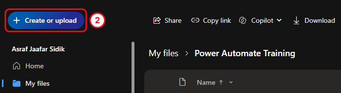
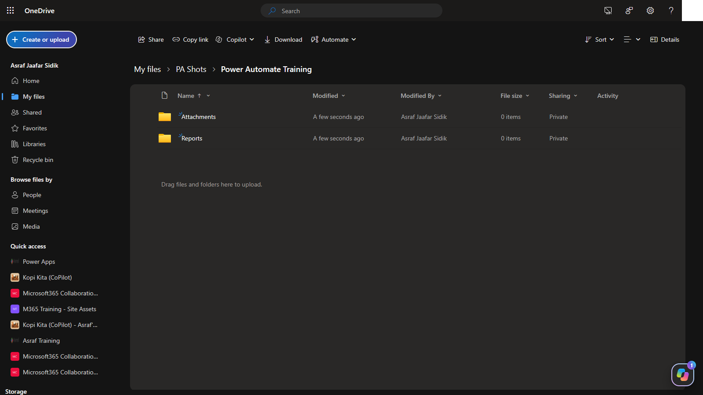
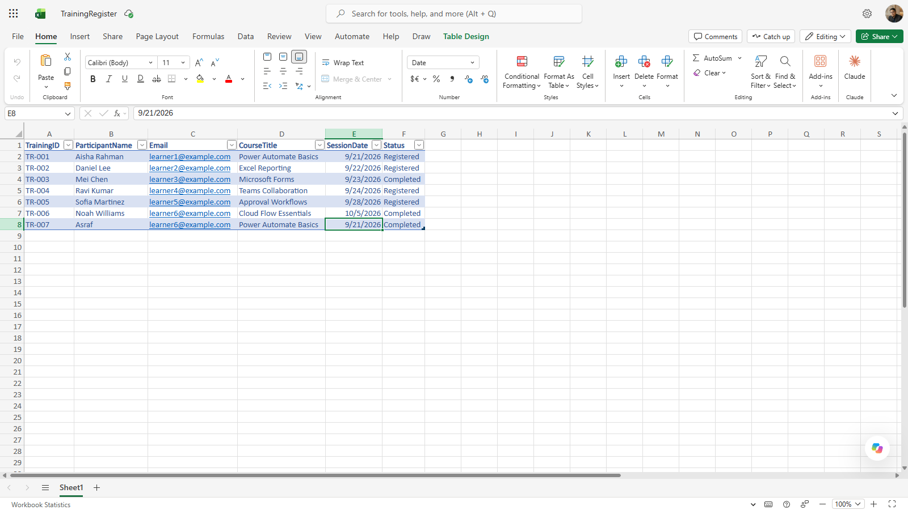
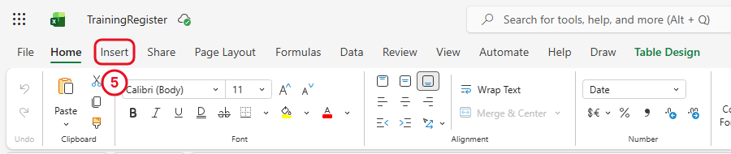
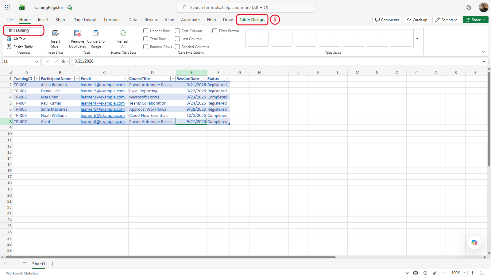
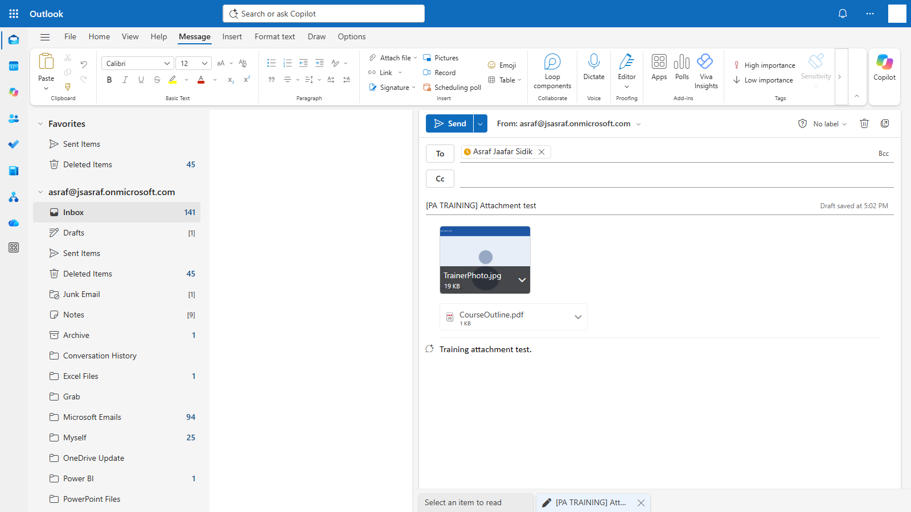

# 02 - Prepare Your Training Workspace

Every flow in this course reads from or writes to something: a folder, a table, a mailbox, a form, a Teams chat. Set those up first and the later build steps become predictable.

> **Copy-paste values:** the Excel headers, table name and email subject are on the [copy-paste page](./copy-paste.md).

**Estimated time:** 90 minutes

**Your result:** A training folder, an Excel workbook with a table, and safe test data for the first two build exercises.

---

## What You Will Learn

- Create a dedicated training folder structure in OneDrive for Business
- Build an Excel workbook and format its data as a named table
- Prepare a safe test email with sample attachments
- Confirm that Forms, Teams and your Power Automate environment are ready

> **Note:** Use your own training account and the environment your trainer names. Never put real participant information in the practice resources. Use fictional names and test addresses only.

Forms and Teams preparation in this chapter are trainer-led readiness checks, because those destinations depend on your organisation's policy.

---

## Apps You'll Use

Everything in this course runs in the browser. Start from the Microsoft 365 home page and you can reach every app from it.

| App | Web address | What you use it for |
|-----|-------------|---------------------|
| Microsoft 365 home | [m365.cloud.microsoft](https://m365.cloud.microsoft) | Your starting point. The app launcher (nine dots, top left) opens every app below |
| OneDrive | Open from the app launcher | The training folder and the Excel register |
| Outlook | [outlook.office.com](https://outlook.office.com) | Test emails and the emails your flows send |
| Microsoft Forms | [forms.office.com](https://forms.office.com) | The training request form (Chapter 6) |
| Teams | [teams.microsoft.com](https://teams.microsoft.com) | Flow bot messages (Chapters 6 and 11) |
| Power Automate | [make.powerautomate.com](https://make.powerautomate.com) | Building your flows |

Sign in to each one with your **work or school account**, the same one every time.

> **Note:** Used to OneDrive as a folder in File Explorer? That folder and OneDrive on the web are the same storage, so files appear in both. During class, use the web version so your screen matches the screenshots. Power Automate can only see files inside OneDrive: a workbook saved to your Desktop or Documents outside the OneDrive folder is invisible to it.

---

## 2.1 Create the Training Folders in OneDrive

1. Open [m365.cloud.microsoft](https://m365.cloud.microsoft), select the app launcher (nine dots, top left), then **OneDrive**. Select **My files** on the left.
2. Select the blue **Create or upload** button at the top left, then **Folder**.

   

   *Create or upload makes folders, uploads files and creates new Office documents.*
3. Name the folder `Power Automate Training` and select **Create**.
4. Select the new folder's name to open it. The path at the top now reads **My files > Power Automate Training**.
5. Inside it, create two subfolders the same way (**Create or upload** > **Folder**): `Attachments` and `Reports`.

*Both subfolders inside Power Automate Training.*

**Checkpoint:** You can see `Attachments` and `Reports` inside `Power Automate Training`. The Chapter 3 flow writes to Attachments. Summary outputs can go to Reports.

---

## 2.2 Create the Excel Workbook

1. Inside `Power Automate Training`, select **Create or upload**, then **Excel workbook**. Check the breadcrumb first: the workbook is created in whichever folder you're viewing.
2. When Excel for the web opens, select the file name in the title bar and rename it `TrainingRegister`. Excel adds `.xlsx` for you.
3. Select cell **A1**, then paste the six column headers from the copy-paste page. Each one lands in its own column: TrainingID, ParticipantName, Email, CourseTitle, SessionDate, Status.

4. Enter six fictional rows below the headers. Include at least two upcoming sessions, one completed session, and one session outside the training week. Use the trainer's approved test addresses in the Email column.

   > **Tip:** Short on time? Your trainer may tell you to upload the ready-made [TrainingRegister.xlsx](./TrainingRegister.xlsx) to `Power Automate Training` instead (**Create or upload** > **Files upload**). It already has the `tblTraining` table and six fictional records, so you can skip to the checkpoint.

   

   *Fictional rows. The example.com addresses can't receive mail. (This workbook has a seventh test row; yours needs six.)*

5. Select any cell with data in it, then select the **Insert** tab and **Table**. In the box that opens, make sure **My table has headers** is ticked, and select **OK**. The rows turn into a striped table.

   

   *Table is on the Insert tab, near its left end.*
6. With a cell in the table still selected, select the **Table Design** tab that has appeared at the end of the ribbon.
7. At the far left of that tab, select the name box (it reads something like **Table1**), type `tblTraining` and press Enter.

*Set the table name on the Table Design tab.*

**Checkpoint:** The workbook is named `TrainingRegister.xlsx`, the data is a formatted table named `tblTraining`, and the table has six fictional records.

If Power Automate can't find the table later, check three things: the workbook is in OneDrive for Business, the range is formatted as a table, and the table name is exactly `tblTraining`.

---

## 2.3 Prepare a Test Email

1. Get the two test files onto your computer. They're in the course ZIP you downloaded at the start, inside `02-prepare-workspace/test-files`. (No ZIP? Open the [test-files](https://github.com/Asraf-JS/Microsoft-Power-Automate/tree/main/02-prepare-workspace/test-files) folder, select a file, then select the **Download raw file** button at the top right.)
2. Open Outlook on the web ([outlook.office.com](https://outlook.office.com)) with the training account and select **New mail**.
3. In **To**, type your own email address, the mailbox you connect to Power Automate in Chapter 3. In the subject line, enter `[PA TRAINING] Attachment test`.
4. Select **Attach file** on the ribbon, then **Browse this computer**, and pick `CourseOutline.pdf`. Repeat for `TrainerPhoto.jpg`.
5. **Don't send it.** Close the message window. Outlook keeps it in **Drafts**.

*The test email waits in Drafts until Chapter 3.*

> **Important:** Don't attach real course materials or any file whose name contains a person's name. The filename shows up in run history and in your OneDrive folder.

The Chapter 3 flow only reacts to new messages, so you send this draft during the test in section 3.6.

---

## 2.4 Confirm Forms Readiness

Open Microsoft Forms and confirm the training account can create a form. You build the **Training Request** form in Chapter 6, right before the flow that uses it. It will ask for Requester name, Course, Preferred date and Business reason, with fictional answers only.

---

## 2.5 Confirm the Teams Training Destination

Ask the trainer for the team and channel, or the training chat, and write its name down. The trainer confirms posting access before the Teams exercises: the optional extension in Chapter 4 and the approval messages in Chapter 6.

The Teams connector is standard, but your organisation may restrict posting or require the Workflows app. If you can't post a test message, tell the trainer before building the summary flow.

---

## 2.6 Confirm the Power Automate Environment

1. Return to Power Automate.
2. Check the environment selector near the top of the page.
3. Confirm it matches the environment your trainer gave you.

> **Key point:** OneDrive files, Excel workbooks, Forms and Teams destinations aren't packaged automatically when a solution is moved. Keep a note of where each resource lives. Your trainer demonstrates moving flows in Chapter 10.

---

## Independent Practice

Find the row in `tblTraining` whose Status is Completed. Which later reminder test should exclude it, and why? Then write a second test email without the `[PA TRAINING]` marker, save it as a draft, and predict whether the attachment flow should process it once it's sent.

---

## Lesson Summary

You created a dedicated OneDrive training area with its folders and Excel table, prepared safe inputs for the attachment and summary exercises, confirmed the environment, and noted where the Forms and Teams work will happen. Next you build the flow that saves qualifying email attachments.
