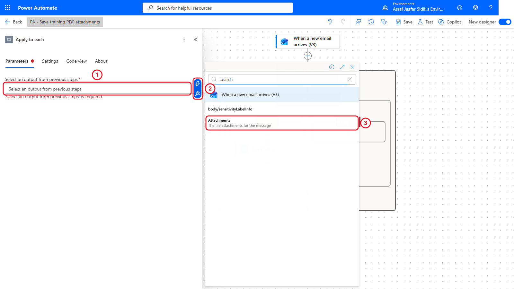
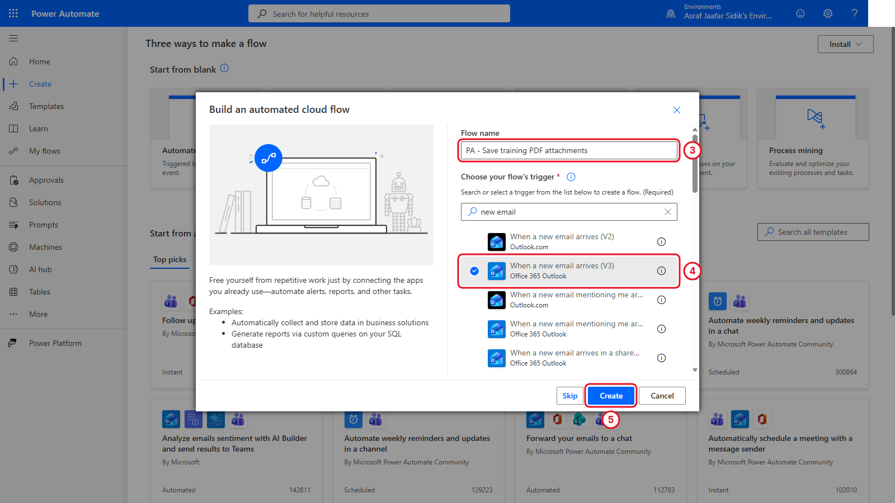
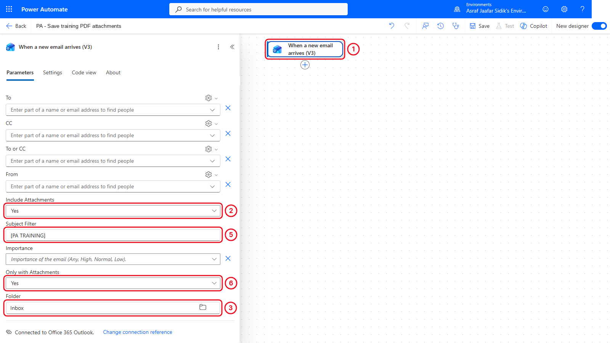
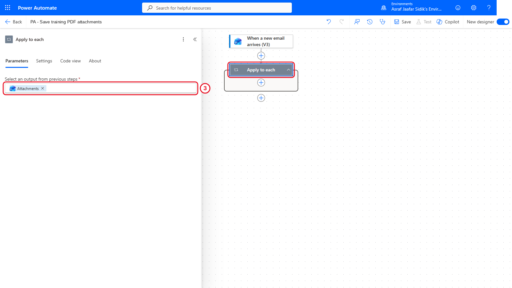
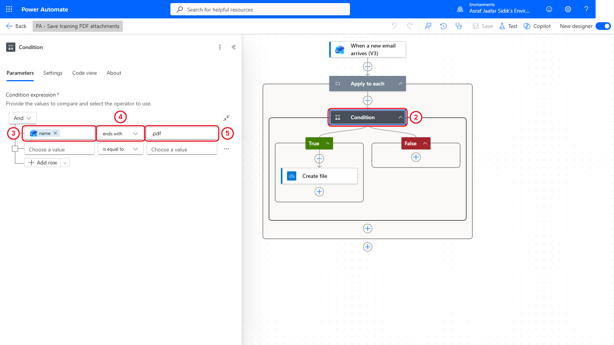
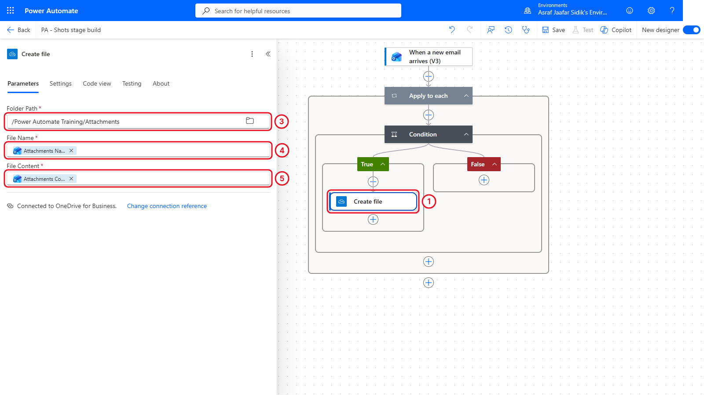
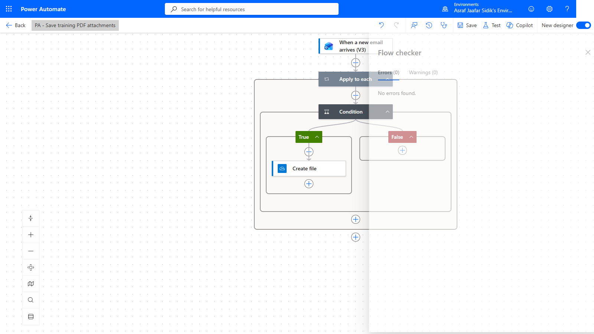
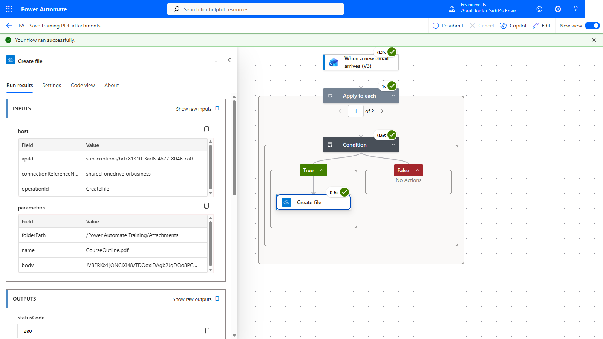
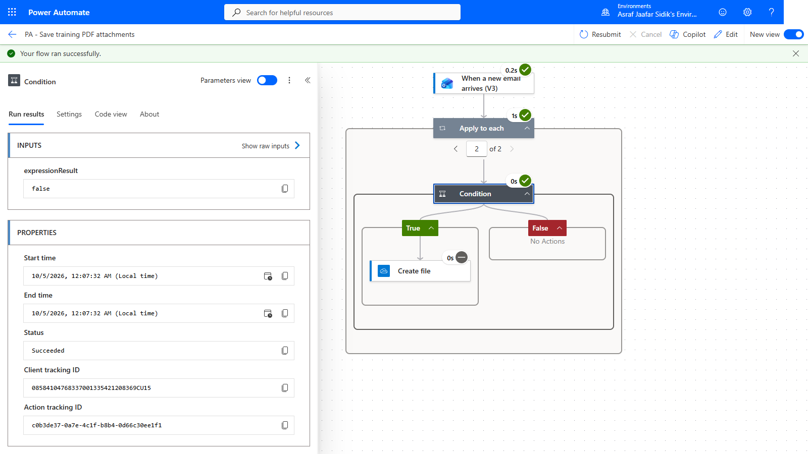

# 03 - Save Email Attachments Automatically

Your first build: an automated flow that watches for training emails and saves only the PDF attachments to OneDrive. Everything in this chapter is point and click.

> **Copy-paste values:** the flow name and subject filter are on the [copy-paste page](./copy-paste.md).

**Estimated time:** 90 minutes

**Your result:** An automated cloud flow that examines new training emails and saves only PDF attachments to OneDrive for Business.

**Connectors:** Office 365 Outlook and OneDrive for Business, both standard.

---

## What You Will Learn

- Create an automated cloud flow from a business requirement
- Configure an Outlook trigger with a subject filter
- Process several attachments with **Apply to each**
- Use a condition to select PDF files
- Insert values with the **dynamic content** picker
- Test a matching and a non-matching case, then inspect run history

---

## Before You Begin

Complete Chapter 2. Check that the `Attachments` folder exists and the test email from section 2.3 is saved in Drafts. That draft uses the subject `[PA TRAINING] Attachment test` and has two fictional attachments from the Chapter 2 [test-files](https://github.com/Asraf-JS/Microsoft-Power-Automate/tree/main/02-prepare-workspace/test-files) folder:

| File | Purpose |
|------|---------|
| CourseOutline.pdf | The attachment that should be saved |
| TrainerPhoto.jpg | The attachment that should be skipped |
| SessionNotes.docx | Used only in the independent practice |

> **Note:** OneDrive never silently overwrites a file. If you run the test twice with the same attachment, Create file either fails with a duplicate-name error or OneDrive saves `CourseOutline (1).pdf`. Both are correct behaviour. Delete the file from Attachments before a repeat test.

**The rule:** when a new email arrives with `[PA TRAINING]` in the subject, examine each attachment. If its name ends in `.pdf`, create a file in the Attachments folder.

---

## How to Insert Dynamic Content

You'll do this in every chapter, so learn it once. **Dynamic content** is a value produced by an earlier step, such as an email's subject or an attachment's name.

1. Click into the field you want to fill.
2. Select the **lightning bolt** icon that appears beside the field (or type `/` and choose **Insert dynamic content**).
3. Pick the value from the list. Values are grouped under the step that produces them. Use the search box if the list is long.

*The lightning bolt opens the dynamic content picker. Values are grouped by the step that produced them.*

The value appears in the field as a coloured token. To remove it, select the **x** on the token.

---

## 3.1 Create the Automated Cloud Flow

1. Open Power Automate and confirm the correct environment.
2. Select **Create**, then **Automated cloud flow**.
3. In **Flow name**, enter `PA - Save training PDF attachments`.
4. In the trigger search box, type `new email`, then select **When a new email arrives (V3)** under **Office 365 Outlook**.
5. Select **Create**. The designer opens with only the trigger on the canvas.

*Name the flow and pick the Office 365 Outlook trigger before selecting Create.*

---

## 3.2 Configure the Trigger

1. Select the trigger to open its settings.
2. Set **Include Attachments** to **Yes**.
3. Set **Folder** to **Inbox**.
4. Select **Show all** under **Advanced parameters**.
5. In **Subject Filter**, enter `[PA TRAINING]`.
6. Set **Only with Attachments** to **Yes**.

Don't save yet. Power Automate won't save a flow that has only a trigger, so you'll save once the first action is in place.

*All four trigger fields set. Use Show all if a field is hidden.*

**Checkpoint:** No field shows a red validation message. The flow only starts for *new* matching messages. It doesn't go back and process mail already in the inbox.

---

## 3.3 Add Apply to Each

1. Select the **+** below the trigger, then **Add an action**.
2. Search for `Apply to each` and select it (it's under **Control**).
3. Click into **Select an output from previous steps**, open the dynamic content picker, and select **Attachments** under *When a new email arrives (V3)*.

*The loop runs once for every attachment in the email.*

If **Attachments** isn't in the list, go back to the trigger and confirm Include Attachments is set to Yes.

---

## 3.4 Add the PDF Condition

1. Inside the loop, select **+**, then **Add an action**.
2. Search for `Condition` and select it (under **Control**).
3. Click into the left **Choose a value** box. Open the dynamic content picker and select **Attachments Name**.
4. Set the middle box to **ends with**.
5. In the right box, type `.pdf`.

*The condition asks one question about the current attachment: does its name end in .pdf?*

> **Tip:** Make sure you picked **Attachments Name** (the current attachment's name), not **Subject** or another text value. Inside a loop, the "Attachments ..." values always refer to the item the loop is currently on.

---

## 3.5 Create the OneDrive File

1. In the **True** branch, select **+**, then **Add an action**.
2. Search for `OneDrive for Business`, then select **Create file** from that connector's group.

> **Tip:** Search by connector name, not action name. Several connectors have an action called Create file, and it's easy to grab the wrong one.

3. In **Folder Path**, select the folder icon and browse to `Power Automate Training` > `Attachments`.
4. In **File Name**, insert **Attachments Name** from the dynamic content picker.
5. In **File Content**, insert **Attachments Content**.
6. Leave the **False** branch empty. That's the deliberate decision to skip non-PDF files.

*Create file sits inside True. False stays empty.*

7. Select **Save**, then **Flow checker**. Confirm 0 errors and 0 warnings.

*The finished flow: trigger, loop, condition, and one action in True.*

---

## 3.6 Test a Positive Case

1. Select **Test**, choose **Manually**, then **Test**.
2. Wait for the banner asking you to send a new email. The flow is now listening.
3. Open the draft from section 2.3 in Outlook and send it.
4. Back in Power Automate, wait for the run to finish. Every step shows a green tick.
5. Select **Apply to each**. The counter reads **2 of 2** (or 1 of 2). Select **Create file** to see that it succeeded.

*The run processed both attachments.*

6. Open the Attachments folder in OneDrive. The PDF is there. No image file was created.

---

## 3.7 Test a Negative Case

You don't need another email. The mixed test already produced both outcomes.

1. In the same run, use the arrows on **Apply to each** to switch to the other iteration.
2. Select **Condition**. The result is **false**, Create file shows as skipped, and the False branch has nothing to run.

*The image attachment took the False branch, so nothing was created.*

> **Key point:** A run can succeed while deliberately producing nothing. *Succeeded* means the process completed, not that every branch created an output.

---

## Independent Practice

Change the condition to save `.docx` attachments instead of PDFs. Send one test email with both `SessionNotes.docx` and `CourseOutline.pdf`. Predict which file appears, run it, then change the condition back to `.pdf`.

---

> **Going further: your first look at an expression.** Send the same PDF twice and OneDrive numbers the copy or refuses it. To give every file a unique name, replace the **File Name** token with an expression that adds the date and time in front: type `/`, choose **Insert expression**, and paste the timestamp expression from the copy-paste page. It produces names like `20260913-094512-CourseOutline.pdf`. You'll meet expressions properly in Chapters 4 and 5. Optional.

---

## Tips and Troubleshooting

| Problem | Check |
|---------|-------|
| The flow doesn't run | The message must be new, contain `[PA TRAINING]` in the subject, and reach the mailbox used by the Outlook connection |
| Attachments isn't in the dynamic content list | Turn on Include Attachments in the trigger, save, and reopen the loop |
| The loop runs but creates nothing | Check the condition: left is **Attachments Name**, middle is *ends with*, right is `.pdf` |
| Create file fails | OneDrive connection, folder path, file name and file content |
| Duplicate file error | Delete the old file from Attachments, or try the Going further box |
| The JPG is saved | Create file is outside the condition. Drag it into True |

---

## Lesson Summary

This flow combines an event trigger, a loop over attachments, a condition for the business rule and a OneDrive action for the result, all built by clicking and picking dynamic content. You tested both a file-producing path and a successful no-output path. Next, an instant flow reads the Excel table and sends a summary.
