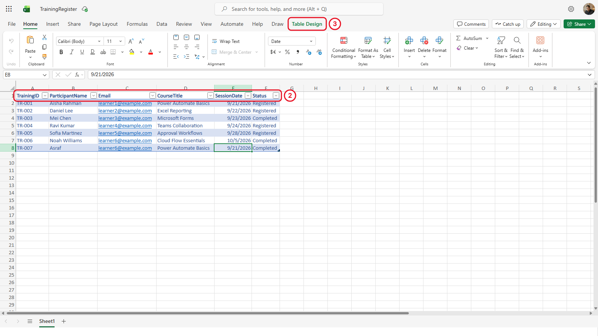
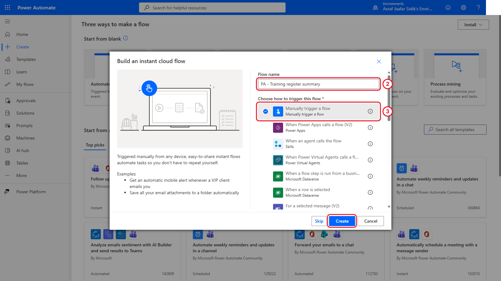
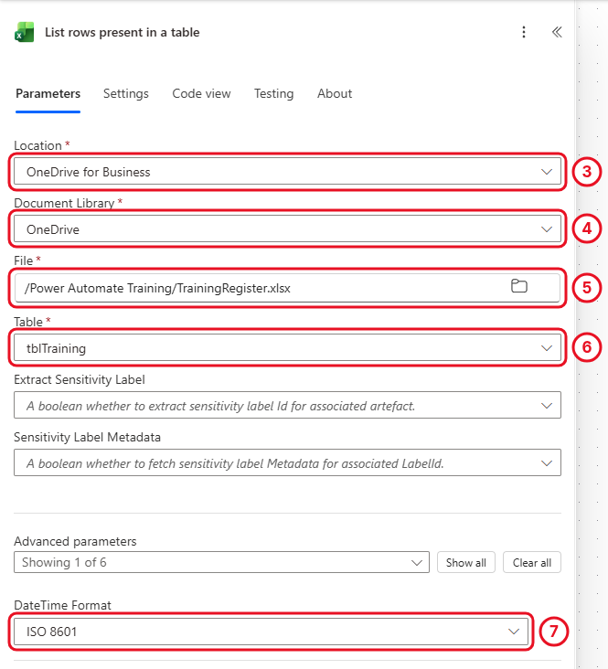
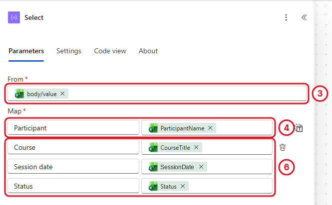
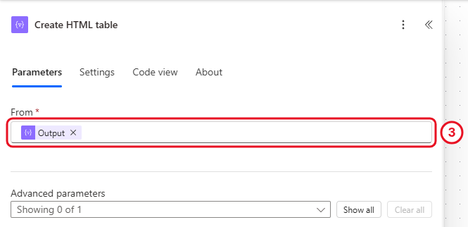
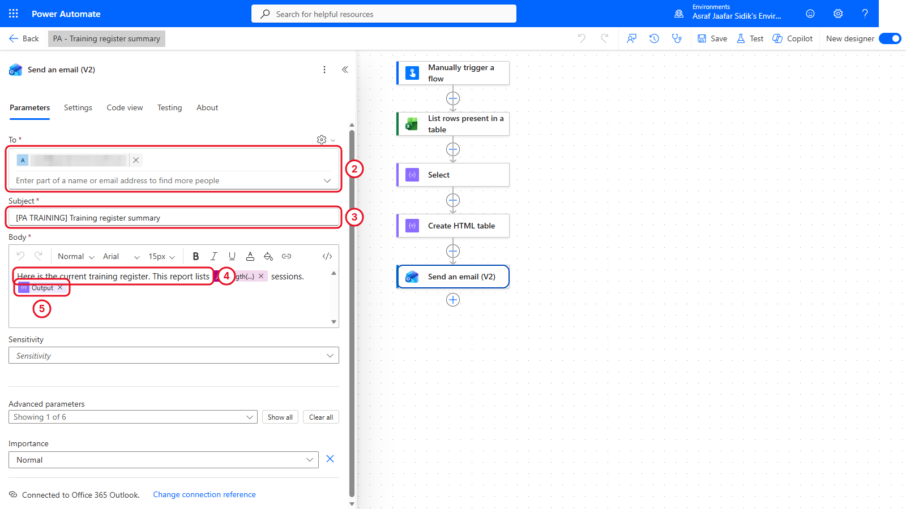
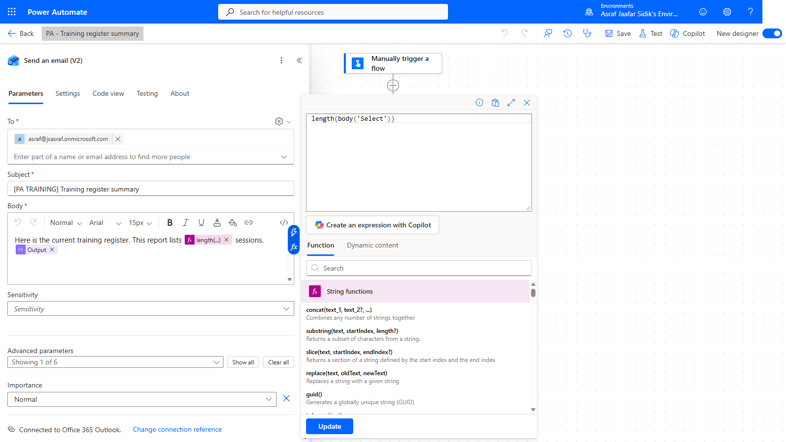
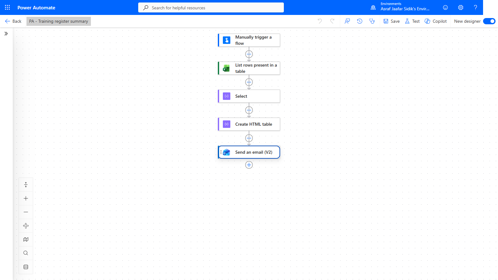
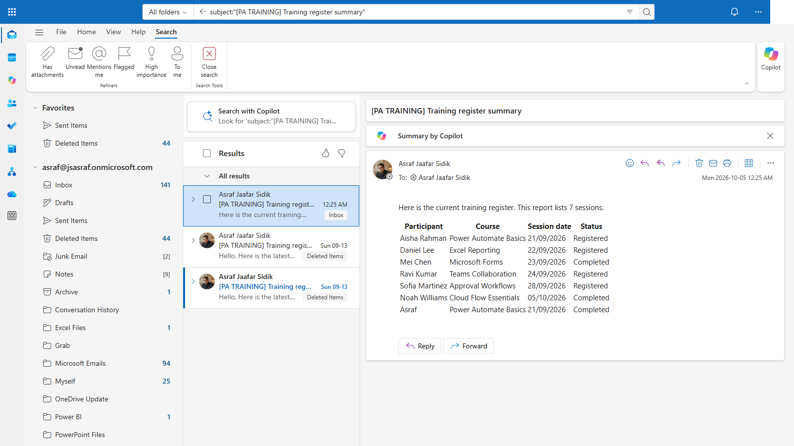

# 04 - Create and Distribute an Excel Summary

The coordinator wants a readable list of training sessions on demand, without copying cells into an email by hand. An instant flow reads the register and sends one summary table. Along the way you write your first expression.

> **Copy-paste values:** the flow name, subject and your first expression are on the [copy-paste page](./copy-paste.md).

**Estimated time:** 90 minutes

**Your result:** An instant cloud flow that reads the training register, picks useful columns, counts the rows and sends one summary email. A Teams update is an optional extension.

---

## What You Will Learn

- Start a flow on demand with an instant trigger
- Read rows from an Excel table with **List rows present in a table**
- Choose report columns with the **Select** action
- Turn the rows into one HTML table and send it in a single email
- Write your first expression to count the rows
- Inspect run history to confirm what each action produced

---

## How the Flow Works

**Manually trigger a flow > List rows present in a table > Select > Create HTML table > Send an email (V2)**

The Excel action returns a list of rows. Select keeps only the columns readers need. Create HTML table turns the whole list into one table. The email action runs once, after the table is complete.

---

## Before You Begin

You need `Power Automate Training/TrainingRegister.xlsx` in OneDrive for Business with a formatted table named `tblTraining`:

| Column | Contents | Used in this chapter for |
|--------|----------|--------------------------|
| TrainingID | TR-001 to TR-006 | The independent practice |
| ParticipantName | Fictional names | A report column |
| Email | Placeholder addresses | Read but deliberately left out of the report |
| CourseTitle | Fictional course names | A report column |
| SessionDate | Real Excel dates | A report column |
| Status | Registered or Completed | A report column |

> **Note:** Addresses like `learner1@example.com` are just data in this chapter. `example.com` can't receive mail. The summary goes to your own training mailbox, not to the people in the table.

> **Tip:** Before each run, finish any cell edit and let Excel save. The connector reads the saved cloud file, so an open edit gives you a stale report.

---

## 4.1 Confirm the Source Table

1. Open `TrainingRegister.xlsx` from the training folder. You built it in section 2.2, so you're only checking it here.
2. Check the header row. All six columns must be present and spelled exactly as above.
3. Select a cell in the data, open **Table Design**, and confirm the table name is exactly `tblTraining`.

*Select any cell in the table, then open the Table Design tab to see its name. The table name, not the sheet name, is what Power Automate looks for.*

> **Key point:** A worksheet name and a table name are different things. If the Table dropdown is empty later, a missing or misnamed table is almost always why.

---

## 4.2 Create an Instant Cloud Flow

1. Confirm the training environment, select **Create** on the left, then the **Instant cloud flow** tile.
2. In **Flow name**, enter `PA - Training register summary`.
3. Select **Manually trigger a flow**, then **Create**.

*This trigger starts only when you run it.*

---

## 4.3 Read the Excel Records

1. Select **+** below the trigger, then **Add an action**.
2. Search for `List rows present in a table` and select it under **Excel Online (Business)**.
3. Set **Location** to **OneDrive for Business**.
4. Set **Document Library** to **OneDrive**.
5. In **File**, select the folder icon and browse to `Power Automate Training` > `TrainingRegister.xlsx`.
6. In **Table**, select `tblTraining`.
7. Under **Advanced parameters**, open the dropdown (it reads **Showing 0 of 6**) and tick **DateTime Format**. A new **DateTime Format** box appears: choose **ISO 8601**. This returns dates as dates instead of serial numbers like `46286`.

*Pick the file by browsing, then the table from the dropdown. Once saved, Location, Document Library and Table show internal IDs like `me` or `{4672…}` instead of the names you picked. That's normal.*

If **Table** shows *No items*, stop. The workbook has no formatted table. Go back to section 2.2.

---

## 4.4 Choose the Report Columns

1. Add a **Select** action (under **Data Operation**) after the Excel action.
2. Click into **From** and insert **body/value** from *List rows present in a table*. This is the list of all rows. (Depending on your version it may be labelled **value**.)
3. In the **Map** area, type `Participant` in the first **Enter key** box. In its **Enter value** box, insert **ParticipantName** from the dynamic content picker.
4. A new empty row appears underneath. Fill three more rows the same way:

| Enter key | Enter value (dynamic content) |
|-----------|-------------------------------|
| Participant | ParticipantName |
| Course | CourseTitle |
| Session date | SessionDate |
| Status | Status |

*Each key becomes a column heading. Email and the internal row data are left out. (This screenshot's Session date already uses the date format from the Going further box. Yours shows a plain SessionDate token.)*

Select handles every row for you, so you don't need an Apply to each here.

---

## 4.5 Build One HTML Table

1. Add **Create HTML table** (under **Data Operation**) after Select.
2. In **From**, insert **Output** from *Select*.
3. Leave **Columns** on **Automatic**. Select already defined the headings.

*The whole list goes in, one table comes out.*

**Checkpoint:** If an Apply to each suddenly wraps this action, you picked a single column instead of the whole Output. Delete the loop and pick **Output** again.

---

## 4.6 Send the Coordinator Summary

1. Add **Send an email (V2)** under **Office 365 Outlook** after Create HTML table.
2. In **To**, start typing your name or email address, then select yourself from the list that appears.
3. In **Subject**, enter `[PA TRAINING] Training register summary`.
4. In **Body**, type `Here is the current training register.` then press Enter.
5. Insert **Output** from *Create HTML table* on the next line. The picker lists two values called **Output**: pick the one under the *Create HTML table* heading, not the one under *Select*.

*The table token goes in the body below a short introduction.*

---

## 4.7 Your First Expression: Count the Rows

The coordinator wants a line like *"This report lists 6 sessions."* None of the dynamic content values is a count. Dynamic content gives you values that already exist. When you need a value *calculated*, you write an **expression**.

1. In the email **Body**, click at the end of the introduction line and type ` This report lists ` (with spaces).
2. Type `/` and choose **Insert expression**.
3. In the expression box, type `length(`
4. Switch to the **Dynamic content** tab in the same panel and select **Output** under *Select*. It drops into the expression.
5. Type `)` to close the bracket, then select **Add** (it reads **Update** if you're editing an expression that's already there).
6. After the new token, type ` sessions.`

   

   *length() counts the items in a list. Here it counts the rows Select produced.*

   The expression reads `length(body('Select'))`. You can also paste it from the copy-paste page. `length()` is a **function**: you give it something inside the brackets and it gives back an answer.

   > **Tip:** If you renamed the Select action, the name inside the quotes changes too. Picking Output from the Dynamic content tab handles that for you, which is why step 4 picks it instead of typing it.

7. Select **Save**, then **Flow checker**, and fix anything it reports.

*Five steps. One email.*

---

## 4.8 Test and Inspect

1. Select **Test** > **Manually** > **Test**. A **Run flow** panel opens; select **Continue** if it asks about connections, then **Run flow**, then **Done**. This sends a real email to you, so follow your trainer's instruction first.
2. Open the completed run. Every action has a green tick, and Send an email (V2) ran once.
3. Select the **Select** step on the canvas. In the panel on the left, scroll to **Outputs** and select **Show raw outputs**. You see six records with real names and courses.
4. Open the email. You should see the sentence *This report lists 6 sessions.*, four headings, and six rows. The number always matches the rows in your table, so if you added a row it goes up too.

*One email, one table, counted by your first expression. This workbook had a seventh test row, so it reads 7.*

Each manual run sends one current report. Earlier emails stay as historical snapshots.

---

## 4.9 Optional Teams Update

Trainer-led only, once a permitted destination is confirmed. After the email, add **Microsoft Teams** > **Post message in a chat or channel**, choose **Flow bot** and **Chat with Flow bot**, pick yourself as the recipient, and post a short message such as *Training register summary sent*. Keep it short. Teams doesn't show the email's HTML table the same way.

---

## Independent Practice

Add Training ID to the report without adding Email. Predict where the change belongs, make it, and check the received message. Then explain why a six-record table still produces only one email.

---

> **Going further: format the date.** The Session date column shows values like `2026-09-21T00:00:00.000Z`. In Chapter 5 you'll learn the `formatDateTime()` expression that turns it into `21 Sep 2026`. Come back afterwards and use it in Select's **Session date** value. Optional.

---

## Troubleshooting

| Symptom | What to check |
|---------|---------------|
| No Excel table is listed | Workbook location, saved table, table name and connector account |
| One email arrives for every row | The email ended up inside a loop. Use **Output** from Create HTML table |
| The report includes internal columns | Use Select to define headings and values |
| The email shows HTML tags | Check you inserted **Output** from Create HTML table, not from Select |
| A date appears as a number | Set DateTime Format to ISO 8601 in List rows present in a table |
| The expression shows an error | Brackets must match: `length(` ... `)`. Pick Output from the Dynamic content tab instead of typing it |
| The report is stale | Finish the Excel edit, wait for save, and run again |

---

## Lesson Summary

An instant trigger lets the coordinator decide when to run. Excel supplies the records, Select defines the report columns, Create HTML table produces one report, and your first expression counted the rows. Next, a recurrence trigger starts a reminder process on a schedule.

For reference, see the [Excel Online (Business) connector](https://learn.microsoft.com/en-us/connectors/excelonlinebusiness/) and [data operations in Power Automate](https://learn.microsoft.com/en-us/power-automate/data-operations).
