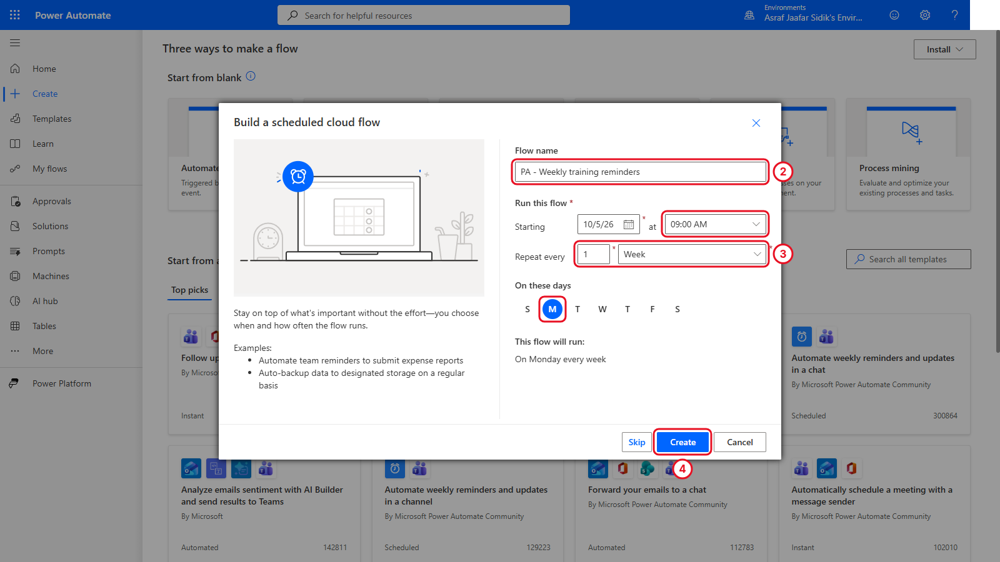
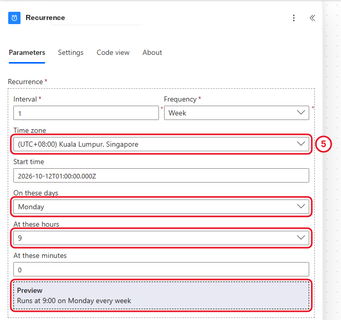
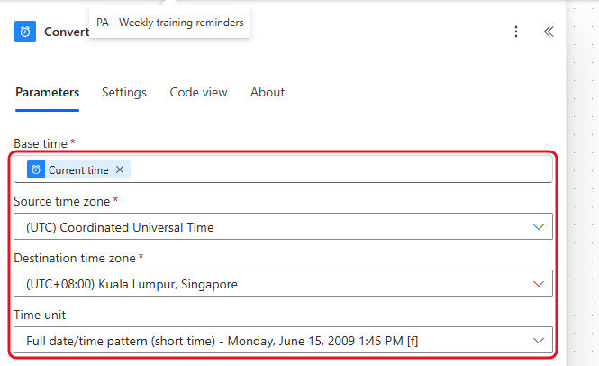
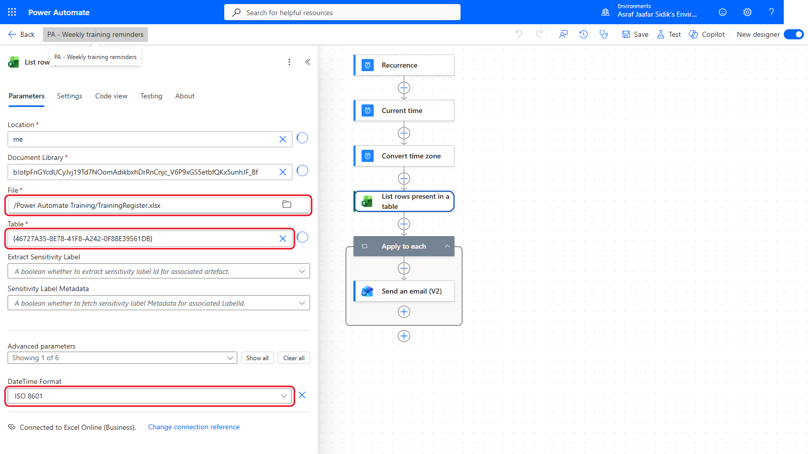
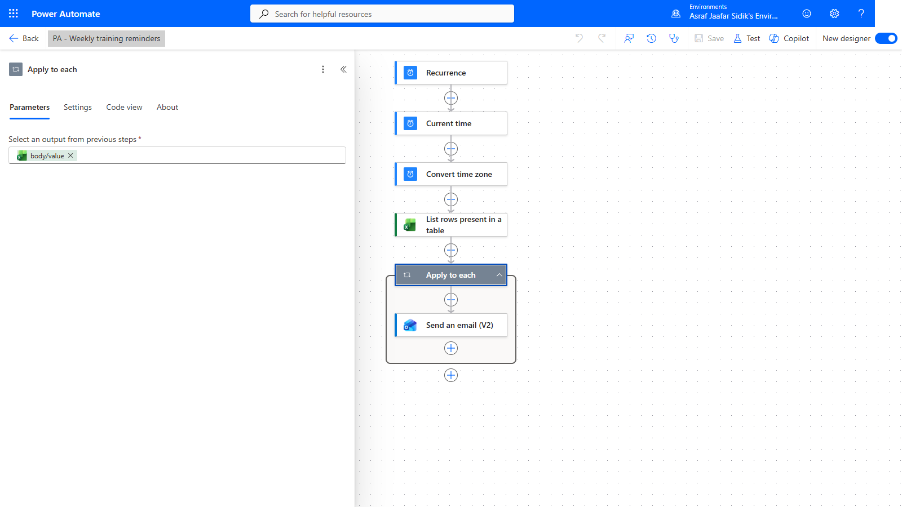
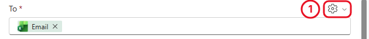
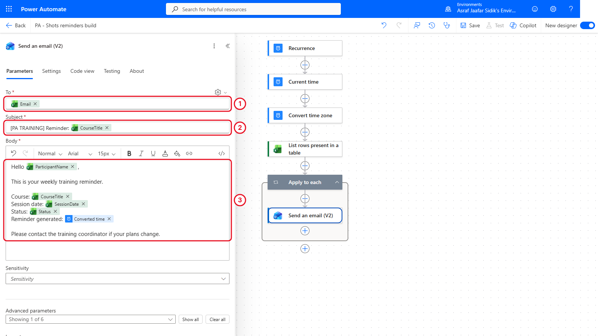
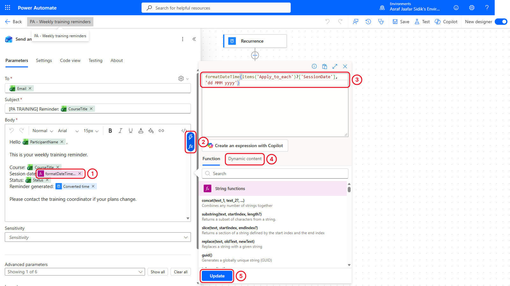
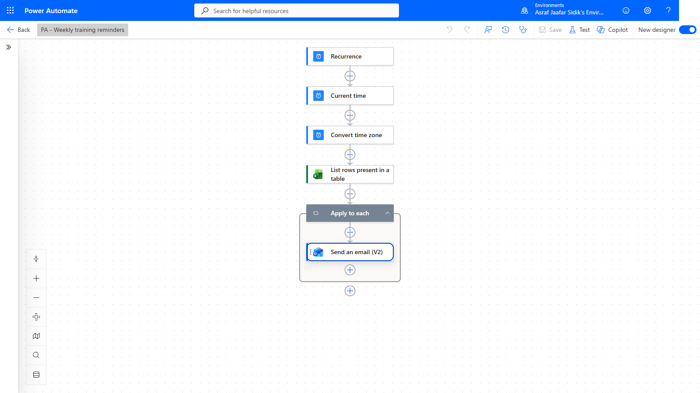

# 05 - Send Weekly Training Reminders

Every week the coordinator opens the register and writes the same reminder for each participant. A scheduled flow can do that at a predictable local time.

> **Copy-paste values:** the flow name, email text and the date expression are on the [copy-paste page](./copy-paste.md).

**Estimated time:** 75 minutes

**Your result:** A scheduled cloud flow that runs every Monday at 9:00 AM Malaysia time, reads the training register, and prepares one personalised reminder email for each row.

---

## What You Will Learn

- Schedule a flow with the **Recurrence** trigger and a local time zone
- Convert the current time into readable local time
- Loop through Excel rows with **Apply to each**
- Build a personalised email by typing text and inserting dynamic content
- Use a second expression, `formatDateTime()`, to make a date readable

---

## How the Flow Works

**Recurrence > Current time > Convert time zone > List rows present in a table > Apply to each > Send an email (V2)**

Recurrence decides when the flow starts. Current time and Convert time zone produce a readable local timestamp for the message. The Excel action returns the rows, and Apply to each handles them one at a time.

---

## Before You Begin

You need `Power Automate Training/TrainingRegister.xlsx` with the `tblTraining` table. This chapter uses every column: ParticipantName for the greeting, Email as the recipient, CourseTitle in the subject and body, SessionDate and Status in the body.

> **Important:** The sample register uses addresses like `learner1@example.com`. They can't receive mail, which is what you want while learning. Replace them with trainer-approved addresses only when the trainer authorises a live test.

---

## 5.1 Create the Weekly Schedule

1. Select **Create** on the left, then the **Scheduled cloud flow** tile.
2. In **Flow name**, enter `PA - Weekly training reminders`.
3. Set **Repeat every** to **1 Week**, tick **M** (Monday), and set the start time to **9:00 AM**. Your starting date will differ.
4. Select **Create**.

   

   *The dialog creates the Recurrence trigger for you.*

5. The designer opens. On the canvas, select the **Recurrence** card to open its settings on the left, and check these values. If you can't see the time zone fields, open **Advanced parameters** and select **Show all**.

| Setting | Value |
|---------|-------|
| Interval | 1 |
| Frequency | Week |
| Time zone | (UTC+08:00) Kuala Lumpur, Singapore |
| Start time | Filled in by the dialog. Leave it. |
| On these days | Monday |
| At these hours | 9 |
| At these minutes | 0 |

*Read the preview line at the bottom. It should say 9:00 on Monday every week.*

---

## 5.2 Produce a Readable Local Timestamp

1. On the canvas, select the **+** below **Recurrence**, then **Add an action**. In the search box, type `Current time`. Under the **Date Time** heading, select **Current time**. It needs no settings.
2. Select the **+** below **Current time**, then **Add an action**. Search for `Convert time zone` and select it under **Date Time**.
3. Click into **Base time**, select the lightning bolt icon beside it, and pick **Current time** under *Current time*.
4. Set the other boxes from their dropdowns:

| Setting | Value |
|---------|-------|
| Base time | **Current time** (the token from step 3) |
| Source time zone | (UTC) Coordinated Universal Time |
| Destination time zone | (UTC+08:00) Kuala Lumpur, Singapore |
| Format string (may be labelled **Time unit**) | Full date/time pattern (short time) |

*Pick the format from the dropdown. No expression needed.*

> **Key point:** The two time zone settings do different jobs. Recurrence decides *when the flow starts*. Convert time zone only changes a timestamp shown in the message.

---

## 5.3 Read the Excel Rows

The settings are the same as Chapter 4, section 4.3.

1. On the canvas, select the **+** below **Convert time zone**, then **Add an action**. Search for `List rows present in a table` and select it under **Excel Online (Business)**.
2. Open the **Location** dropdown and select **OneDrive for Business**.
3. Open the **Document Library** dropdown and select **OneDrive**.
4. In **File**, select the folder icon at the right end of the box. Select the **>** beside `Power Automate Training`, then select `TrainingRegister.xlsx`.

   > **Tip:** Clicking a folder's name selects it but doesn't open it. Use the **>** arrow on the right to go inside.

5. Open the **Table** dropdown and select `tblTraining`.
6. Under **Advanced parameters**, open the dropdown (it reads **Showing 0 of 6**) and tick **DateTime Format**. In the new **DateTime Format** box, choose **ISO 8601**.

After you pick them, **Location** shows `me`, **Document Library** shows a long code, and **Table** shows an ID in braces like `{46727A35-…}`. That's normal.

*Same settings as Chapter 4. The codes in Location, Document Library and Table stand for the names you picked.*

---

## 5.4 Process One Row at a Time

1. On the canvas, select the **+** below **List rows present in a table**, then **Add an action**. Search for `Apply to each` and select it under **Control**.
2. Click into **Select an output from previous steps**, select the lightning bolt icon beside it, and under *List rows present in a table* pick **body/value** (it may be labelled **value**). If you can't see it, select **See more** or type `value` in the picker's search box.

*The loop runs once per row in the table.*

**Checkpoint:** The input must be the whole list (**value**). A single column such as Email isn't a list of rows.

---

## 5.5 Prepare the Reminder Email

On the canvas, select the **+** inside the **Apply to each** box (below its header), then **Add an action**. Search for `Send an email`, then select **Send an email (V2)** under **Office 365 Outlook**.

1. **To:** this box opens a people picker, so it needs switching first. Select the small **settings** (gear) icon above the right end of the **To** box, on the same line as the **To** label. Choose **Use dynamic content**. Then click into the box, select the lightning bolt icon, and pick **Email** under *List rows present in a table* (select **See more** or type `Email` in the search box if it isn't listed).

   

   *The gear switches To from picking people to accepting dynamic content.*

2. **Subject:** click into the box and type `[PA TRAINING] Reminder: ` (with the space at the end). Select the lightning bolt icon and pick **CourseTitle** under *List rows present in a table*.
3. **Body:** click into the box and type the message below. Where a value belongs, put the cursor there, type `/` and choose **Insert dynamic content** (or select the lightning bolt), then pick the value:

> Hello **[ParticipantName]**,
>
> This is your weekly training reminder.
>
> Course: **[CourseTitle]**
> Session date: **[SessionDate]**
> Status: **[Status]**
> Reminder generated: **[Converted time]**
>
> Please contact the training coordinator if your plans change.

Each **[bold name]** is a dynamic content token. **Converted time** comes from *Convert time zone*. The rest come from *List rows present in a table*. If a value isn't listed, select **See more** or type its name in the picker's search box. You can also paste the whole body from the copy-paste page and replace each `[Name]` with its token.

*Type the words, insert the tokens. The email reads like a normal message.*

---

## 5.6 Make the Date Readable with an Expression

Run the flow now and the session date reads `2026-09-21T00:00:00.000Z`. That's correct, but nobody wants to read it. There's no dynamic content value for "the date, written nicely", so this is a job for an expression.

1. In the **Body** of **Send an email (V2)**, select the **x** on the **SessionDate** token to remove it. Make sure the cursor stays right after `Session date: ` on that line (click there if it moved).
2. Type `/` and choose **Insert expression** (or select the **fx** button that appears at the right edge of the Body box).
3. In the expression box, type `formatDateTime(`
4. At the top of the same panel, switch from the **Function** tab to the **Dynamic content** tab and select **SessionDate** (type `Session` in its search box if it isn't listed). It drops into the expression.
5. Type `, 'dd MMM yyyy')` and select **Add** (it reads **Update** if you're editing an expression that's already there).

   

   *formatDateTime() takes a date and a pattern, and gives back the date written in that pattern.*

   The finished expression is on the copy-paste page if you'd rather paste it. The pattern `dd MMM yyyy` means two-digit day, short month name, four-digit year, so `21 Sep 2026`.

   > **Tip:** Compare this with Chapter 4. `length()` counted a list, `formatDateTime()` reshapes a date. Both follow the same shape: a function name, then what you give it in brackets.

6. On the toolbar at the top, select **Save**, then **Flow checker**, and fix any error it reports.

*Recurrence, Current time, Convert time zone, List rows, and the loop with its email.*

---

## Trainer-Controlled Test

> **Important:** Don't select Test while the workbook still has `example.com` placeholders. A test sends one email per row, so six messages with the sample data. The trainer confirms the recipients and authorises the run immediately before you select Run flow.

After an authorised test, check the run history:

- Every step before the loop succeeded
- Apply to each shows six iterations
- Each email used that row's Email, CourseTitle and Status, and the date reads like `21 Sep 2026`
- The reminder timestamp is in Malaysia time

In this version every row gets a reminder, including Completed ones. Chapter 7 fixes that.

---

## Independent Practice

Change the scheduled hour to a value your trainer gives you, read the Recurrence preview, then set it back to 9:00. Explain why changing Convert time zone wouldn't change when the flow starts.

---

> **Going further: try other date patterns.** Change `'dd MMM yyyy'` to `'dddd, d MMMM'` and the date reads *Monday, 21 September*. You can also go back to Chapter 4 and use the same expression in Select's **Session date** value. Optional.

---

## Troubleshooting

| Symptom | What to check |
|---------|---------------|
| The flow starts at the wrong local time | Recurrence time zone, day, hour, minute and preview |
| The timestamp is eight hours early | Convert time zone source and destination |
| No Excel rows are returned | OneDrive location, workbook saved, formatted table and table name |
| Apply to each is empty | Use the Excel action's **value** list |
| A recipient or course is blank | Header spelling in the workbook. Re-pick the token |
| The date shows as a number | Set DateTime Format to ISO 8601 in List rows present in a table |
| The date expression shows an error | Brackets and quotes: `formatDateTime(` ... `, 'dd MMM yyyy')` |
| Completed records get reminders | Expected here. Chapter 7 adds the filter |

---

## Lesson Summary

A scheduled trigger starts the flow at a predictable local time. Date Time actions give a readable timestamp, Excel supplies the rows, Apply to each hands the current row to the email, and a second expression turned a raw date into something a person wants to read. Next you add a human approval decision.
