# 06 - Process a Training Approval

A training request needs a person to say yes or no before anything is confirmed. This flow collects the request with Microsoft Forms, asks an approver to decide, and posts a different Teams message for each outcome.

> **Copy-paste values:** every value you need is in the steps, with a Copy button. The [copy-paste page](./copy-paste.md) has them all on one page too.

**Estimated time:** 75 minutes

**Your result:** An automated cloud flow that reads a Forms response, asks a person to approve or reject it, and prepares a different Teams message for each outcome.

---

## What You Will Learn

- Start a flow when a Microsoft Forms response is submitted
- Retrieve the answers with **Get response details**
- Request a decision with **Start and wait for an approval**
- Branch on the approval outcome and post a different Teams message for each result

---

## How the Flow Works

**When a new response is submitted > Get response details > Start and wait for an approval > Condition > Approved or rejected Teams message**

The Forms trigger only supplies a response ID. Get response details uses that ID to fetch the answers. The approval action pauses the flow until someone decides. The Condition reads the approval **Outcome** and sends the flow down True or False.

---

## Before You Begin

You need Microsoft Forms, Approvals and Microsoft Teams through your work or school account. Your trainer names an approved test approver and Teams destination before any live test.

> **Important:** The screenshots use `approver@example.com`, a documentation placeholder. Replace it with a trainer-approved account before testing. Don't submit the form or run the flow while the placeholder is still there.

---

## 6.1 Prepare the Request Form

1. Go to [forms.office.com](https://forms.office.com) and sign in with your training account. It may open as forms.cloud.microsoft, which is the same app.
2. Select **New Form**. If a **Draft with Copilot** pane opens, close it.

   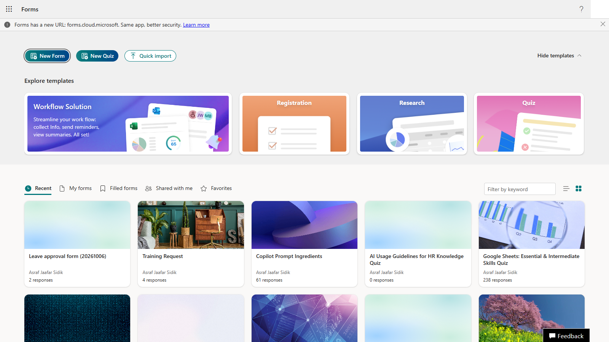

3. Select **Untitled form** at the top and type `Training Request`. In the description box under it, paste the description. Copy it from the box below.

   ```text
   Submit a fictional training request for the Power Automate approval exercise.
   ```

   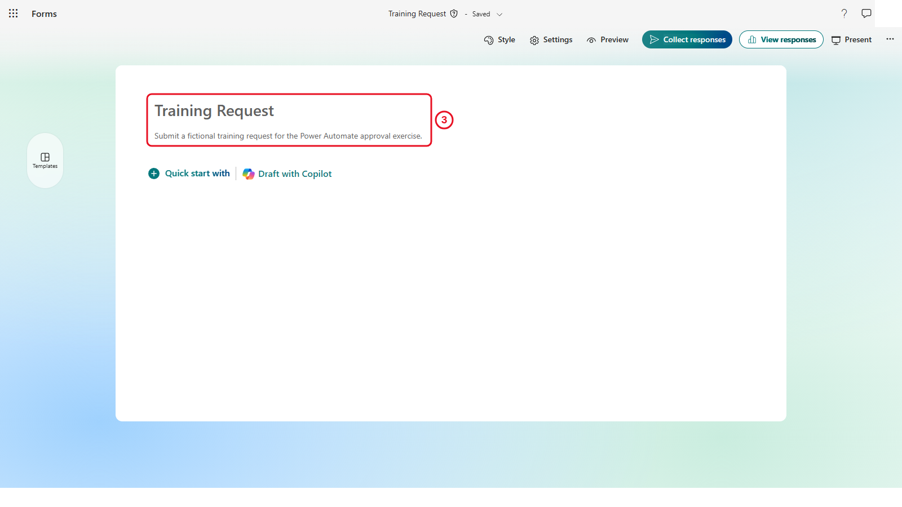

4. Select **+ Add new question** (on a brand-new form it reads **Quick start with**), then **Text**. Type `Requester name` as the question. Switch on **Required**: it's a switch along the bottom edge of the question you're editing.

   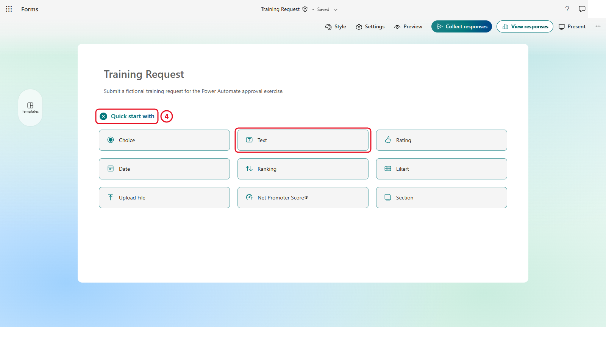

   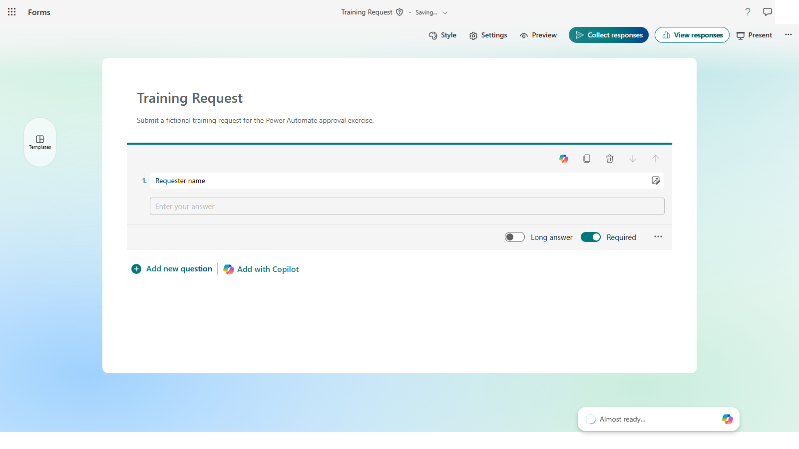

5. Scroll to the bottom of the form and select **+ Add new question** > **Choice**. Type `Course` as the question, then type the three options, one per option box: `Power Automate Basics`, `Approval Workflows`, `Excel Reporting`. Select **Add option** if you need a third box. Switch on **Required**.

   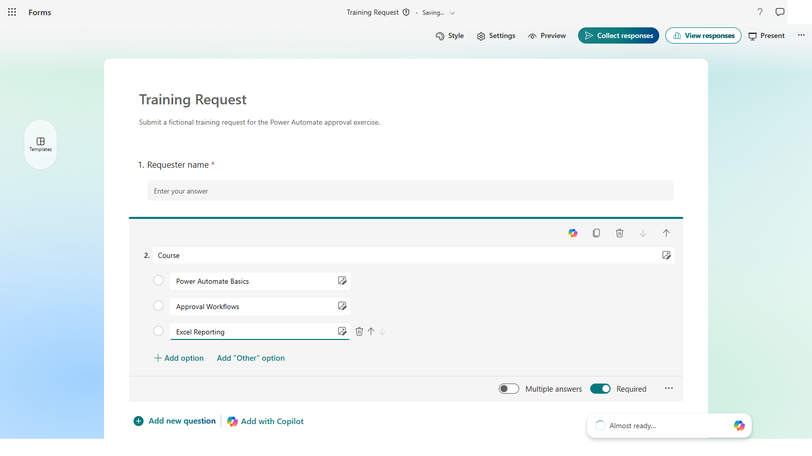

6. Select **+ Add new question** > **Date**. Type `Preferred date` and switch on **Required**.

   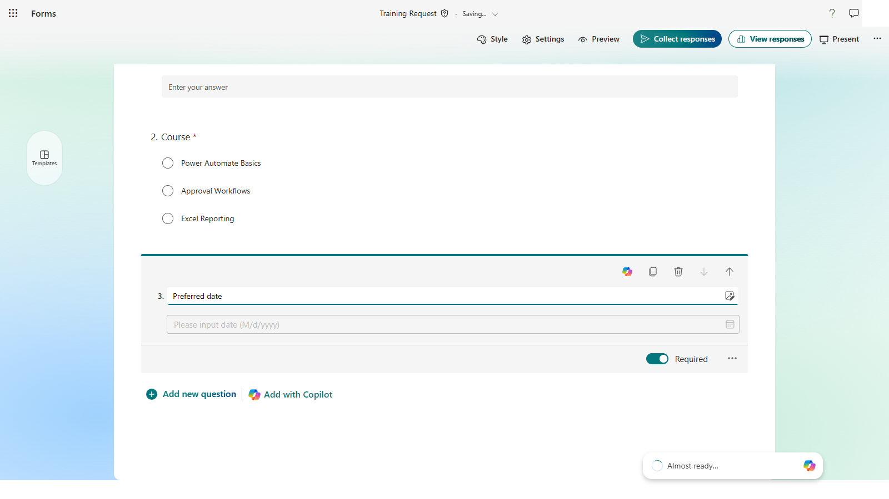

7. Select **+ Add new question** > **Text**. Type `Business reason`. Switch on **Long answer** and **Required**, both along the bottom edge of the question.

   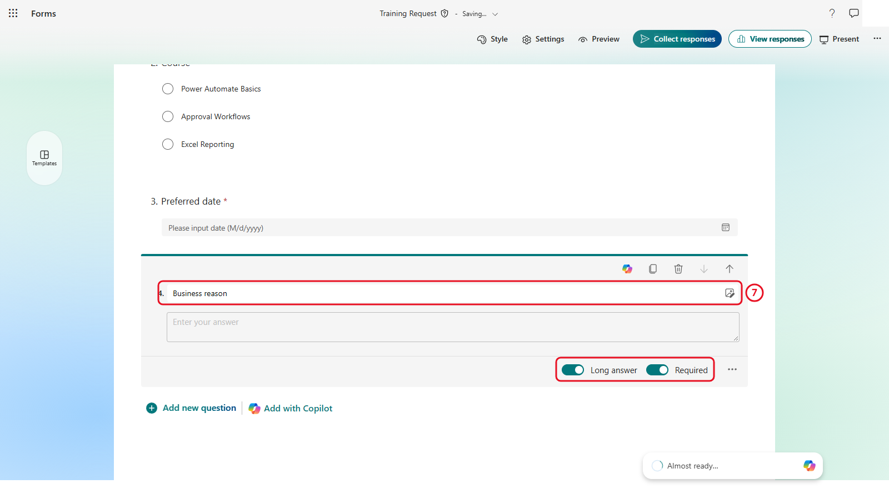

Forms saves as you go. There's no Save button.


*Four required questions. The red asterisk marks each one as required.*

**Checkpoint:** All four questions show the red required marker. A missing answer gives the approver an incomplete card.

---

## 6.2 Create the Automated Flow

1. In Power Automate, select **Create** on the left, then the **Automated cloud flow** tile.
2. In **Flow name**, enter `PA - Training request approval`.
3. In the trigger search box, type `Forms` and select **When a new response is submitted** (Microsoft Forms).
4. Select **Create**.


*The Forms trigger starts the flow whenever the form gets a response.*

---

## 6.3 Select the Form

1. On the canvas, select the **When a new response is submitted** card. Its settings open on the left.
2. Open the **Form Id** dropdown and select **Training Request**.


*After saving, Form Id shows the form's long internal ID instead of its name. That's normal.*

If the form isn't listed, check that you own or can access it, refresh the list, and confirm the Forms connection uses the right account.

**Check your flow so far.** Your screen should look like this.

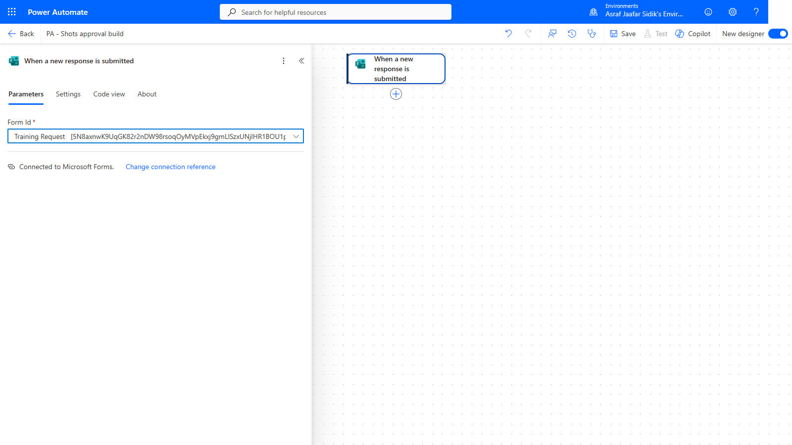

*Only the trigger so far.*

---

## 6.4 Retrieve the Answers

1. On the canvas, select the **+** below **When a new response is submitted**, then **Add an action**. Search for `Get response details` and select it under **Microsoft Forms**.
2. Open the **Form Id** dropdown and select **Training Request** again.
3. Click into **Response Id**, select the lightning bolt icon beside it, and pick **Response Id** under *When a new response is submitted*.


*The Response Id token links this step to the exact submission that started the flow. As in 6.3, Form Id shows the form's internal ID after saving.*

The trigger only says a response exists. Get response details returns the individual answers so later actions can use them.

**Check your flow so far.** Your screen should look like this.

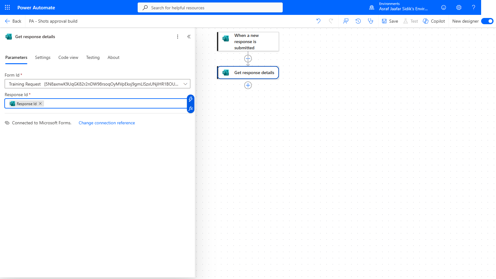

*Get response details sits under the trigger.*

---

## 6.5 Request the Decision

1. On the canvas, select the **+** below **Get response details**, then **Add an action**. Search for `Start and wait for an approval` and select it under **Approvals**.
2. Set **Approval type** to **Approve/Reject - First to respond**. If your list doesn't have it, choose **Basic**.
3. In **Title**, enter `[PA TRAINING] Training request`.
4. In **Assigned to**, type the trainer-approved approver's name or email and select them from the list.
5. In **Details**, paste the details template. Copy it from the box below.

   ```text
   **Requester name:** 
   **Course:** 
   **Preferred date:** 
   **Business reason:** 
   ```

   Put the cursor after each label, select the lightning bolt icon, and under *Get response details* pick the matching answer: **Requester name**, **Course**, **Preferred date**, **Business reason**. If the list is cut short, select **See more** or type the question name in the picker's search box.


*Each label in Details is followed by its answer. In the picker the answers show their question names; after saving they show as codes like `body/r96281c9…`. The screenshot uses Basic.*

**Checkpoint:** Use the values from **Get response details**, not similarly named values from another action.

**Check your flow so far.** Your screen should look like this.

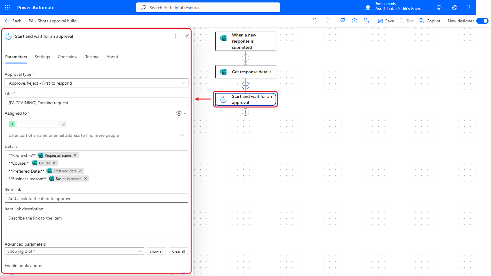

*Start and wait for an approval comes next.*

---

## 6.6 Branch on the Outcome

1. On the canvas, select the **+** below **Start and wait for an approval**, then **Add an action**. Search for `Condition` and select it under **Control**.
2. Click into the left **Choose a value** box, select the lightning bolt icon, and pick **Outcome** under *Start and wait for an approval*. (After saving it shows as `body/outcome`.)
3. Leave the middle box on **is equal to**.
4. In the right box, type `Approve`.
5. If an empty second row appears, select its **...** and then **Delete**.


*An Approve outcome goes to True. Anything else goes to False. The screenshot still shows the empty row; delete it on yours.*

> **Key point:** The text must be exactly `Approve`. A typo or a trailing space sends every approval down the False branch.

**Check your flow so far.** Your screen should look like this.

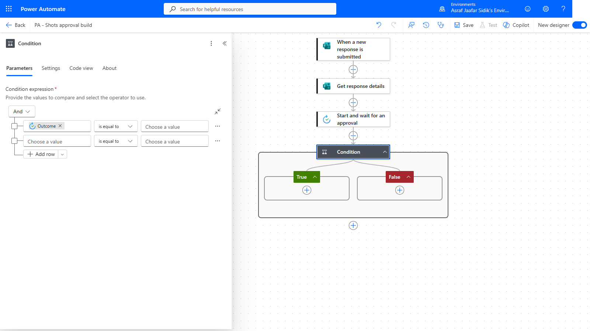

*The Condition, with True and False still empty.*

---

## 6.7 Prepare the Approved Message

1. On the canvas, select the **+** inside the green **True** box, then **Add an action**. Search for `Post message in a chat or channel` and select it under **Microsoft Teams**.
2. Open the **Post as** dropdown and select **Flow bot**. Open **Post in** and select **Chat with Flow bot**.
3. In **Recipient**, type the trainer-approved Teams account and select it from the list.
4. Click into **Message** and type the text below, with the space at the end. Copy it from the box below.

   ```text
   Training request approved for 
   ```

   Select the lightning bolt icon and pick **Course** under *Get response details*.


*The True branch posts the approved message. After saving, the Course token shows as a code like `body/rc6d429a1…`. That's normal. Replace `approver@example.com` with your trainer-approved account.*

**Check your flow so far.** Your screen should look like this.

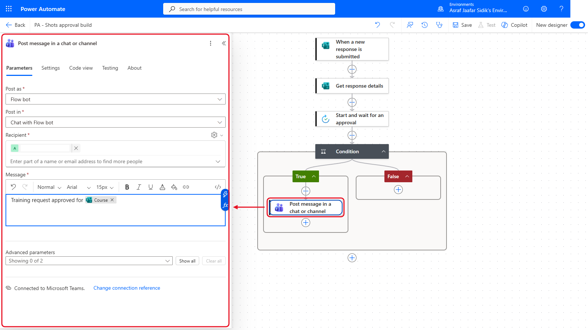

*A Teams message in True. False is still empty.*

---

## 6.8 Prepare the Rejected Message

1. On the canvas, select the **+** inside the red **False** box, then **Add an action**, and add a second **Post message in a chat or channel** (Microsoft Teams).
2. Use the same **Post as**, **Post in** and **Recipient** as section 6.7.
3. In **Message**, type the text below, with the space at the end. Copy it from the box below.

   ```text
   Training request rejected for 
   ```

   Then insert **Course** from *Get response details* with the lightning bolt, as in 6.7.

A production process would also handle outcomes like cancelled or timed-out approvals. This exercise sticks to the two standard Approve and Reject buttons.

**Check your flow so far.** Your screen should look like this.

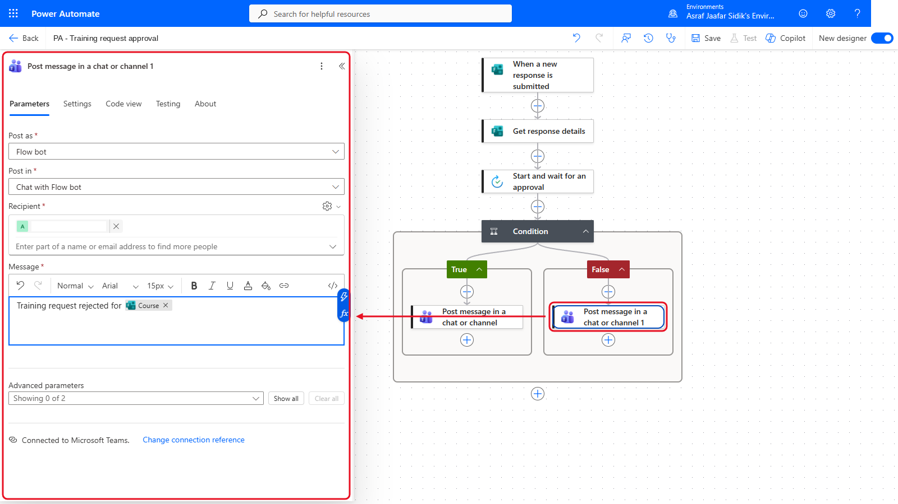

*A Teams message in each branch.*

---

## 6.9 Save and Check the Flow

1. On the toolbar at the top, select **Save**, then **Flow checker**. Fix every error before testing.
2. Confirm the canvas: three steps before the Condition, and one Teams action in each branch.


*Three steps, then one Teams message per branch.*

---

## Trainer-Controlled Test

Testing creates an approval request and may post to Teams. Replace all three `approver@example.com` placeholders first (**Assigned to** in 6.5 and the **Recipient** in each Teams action in 6.7 and 6.8) and confirm the recipient is ready. Then, with the trainer's go-ahead:

1. Submit one fictional Training Request response.
2. Approve it, and check the True branch and the approved Teams message.
3. Submit a second fictional response.
4. Reject it, and check the False branch and the rejected Teams message.

After each test, open run history and confirm the right branch succeeded while the other was skipped.

---

## Independent Practice

Without running the flow, change the approval title so it also includes the **Course** value. Which action supplies that value, and why can't the trigger supply it on its own?

---

## Troubleshooting

| Symptom | What to check |
|---------|---------------|
| Training Request isn't in Form Id | Form ownership or access, the Forms connection account, and a refreshed list |
| The approval has no request details | Get response details Form Id, the Response Id token and the Details tokens |
| The flow waits forever | The assigned approver, the notification, and whether a decision was made |
| An approval goes down False | The Outcome token, *is equal to*, and the exact text `Approve` |
| Teams can't resolve the recipient | Replace the placeholder with a trainer-approved account |
| No Teams message appears | The branch taken, Teams connection, Post in setting, recipient and the action result |
| Flow checker is clean but you can't test | Flow checker checks structure only, not placeholder recipients or policy |

---

## Lesson Summary

A Forms trigger starts the flow with a response ID, Get response details turns it into usable answers, Start and wait for an approval records a human decision, and a Condition routes the request to the matching branch. The flow is ready for a trainer-controlled test once approved recipients replace the placeholders.
