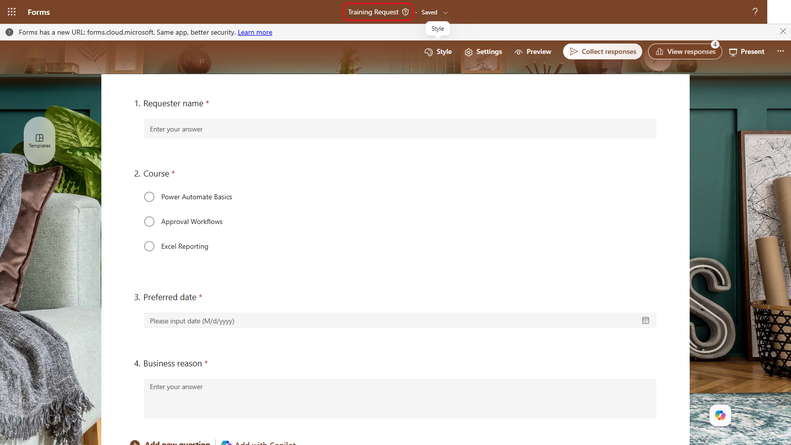
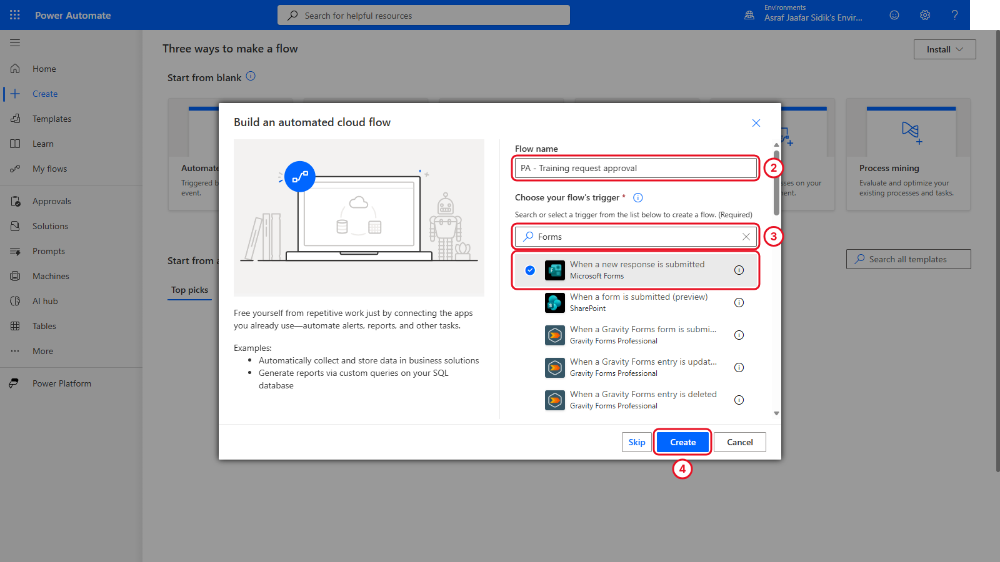
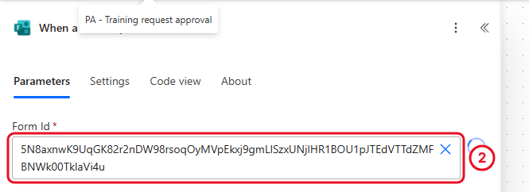
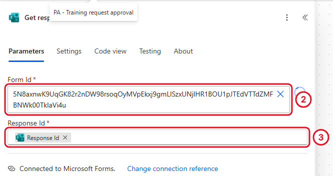
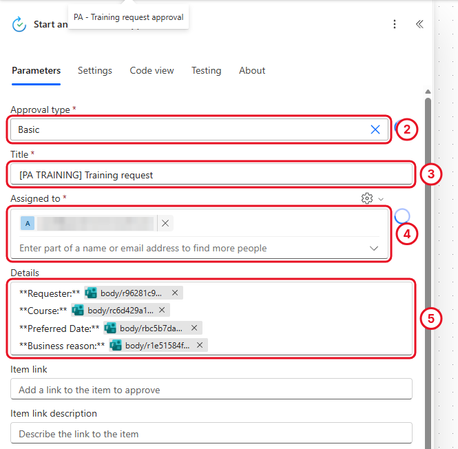
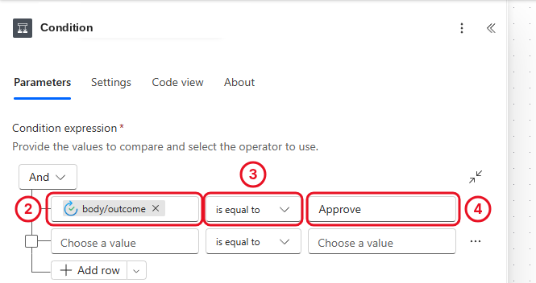
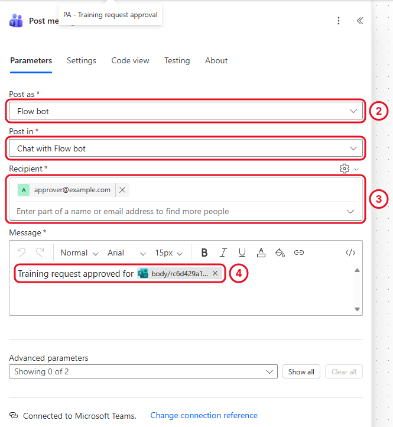
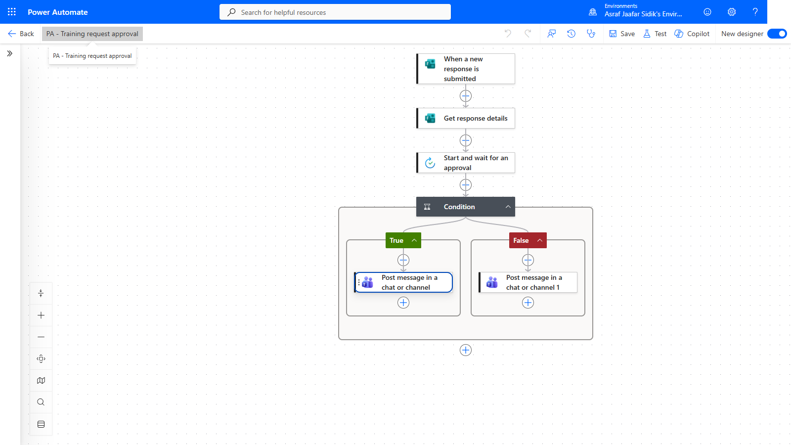

# 06 - Process a Training Approval

A training request needs a person to say yes or no before anything is confirmed. This flow collects the request with Microsoft Forms, asks an approver to decide, and posts a different Teams message for each outcome.

> **Copy-paste values:** the flow name, form text, approval title and messages are on the [copy-paste page](./copy-paste.md).

**Estimated time:** 75 minutes

**Your result:** An automated cloud flow that reads a Forms response, asks a person to approve or reject it, and prepares a different Teams message for each outcome.

---

## What You Will Learn

- Start a flow when a Microsoft Forms response is submitted
- Retrieve the answers with **Get response details**
- Request a decision with **Start and wait for an approval**
- Branch on the approval outcome and post a different Teams message for each result

---

## How the Flow Works

**When a new response is submitted > Get response details > Start and wait for an approval > Condition > Approved or rejected Teams message**

The Forms trigger only supplies a response ID. Get response details uses that ID to fetch the answers. The approval action pauses the flow until someone decides. The Condition reads the approval **Outcome** and sends the flow down True or False.

---

## Before You Begin

You need Microsoft Forms, Approvals and Microsoft Teams through your work or school account. Your trainer names an approved test approver and Teams destination before any live test.

> **Important:** The screenshots use `approver@example.com`, a documentation placeholder. Replace it with a trainer-approved account before testing. Don't submit the form or run the flow while the placeholder is still there.

---

## 6.1 Prepare the Request Form

In Microsoft Forms, create a form named **Training Request** with the description from the copy-paste page. Add four required questions:

| Question | Type | Options or setting |
|----------|------|--------------------|
| Requester name | Text | Single line |
| Course | Choice | Power Automate Basics; Approval Workflows; Excel Reporting |
| Preferred date | Date | Required |
| Business reason | Text | Long answer |

*Four required questions. The red asterisk marks each one as required.*

**Checkpoint:** All four questions show the red required marker. A missing answer gives the approver an incomplete card.

---

## 6.2 Create the Automated Flow

Select **Create > Automated cloud flow**. Name it `PA - Training request approval`, search for **Forms**, select **When a new response is submitted**, and select **Create**.

*The Forms trigger starts the flow whenever the form gets a response.*

---

## 6.3 Select the Form

Open the trigger and set **Form Id** to **Training Request**.

*Pick the form from the dropdown.*

If the form isn't listed, check that you own or can access it, refresh the list, and confirm the Forms connection uses the right account.

---

## 6.4 Retrieve the Answers

Add **Microsoft Forms > Get response details**. Set **Form Id** to Training Request, and in **Response Id** insert **Response Id** from the trigger.

*The Response Id token links this step to the exact submission that started the flow.*

The trigger only says a response exists. Get response details returns the individual answers so later actions can use them.

---

## 6.5 Request the Decision

Add **Approvals > Start and wait for an approval**:

| Field | Value |
|-------|-------|
| Approval type | Approve/Reject - First to respond (if your list doesn't have it, choose **Basic**) |
| Title | `[PA TRAINING] Training request` |
| Assigned to | Trainer-approved approver |
| Details | Requester name, Course, Preferred date and Business reason from Get response details |

Lay out Details so each label is followed by its matching value.

*Each label in Details is followed by its answer from Get response details.*

**Checkpoint:** Use the values from **Get response details**, not similarly named values from another action.

---

## 6.6 Branch on the Outcome

Add **Control > Condition**. Set the left value to **Outcome** from Start and wait for an approval, choose **is equal to**, and enter `Approve`.

*An Approve outcome goes to True. Anything else goes to False.*

> **Key point:** The text must be exactly `Approve`. A typo or a trailing space sends every approval down the False branch.

---

## 6.7 Prepare the Approved Message

In the **True** branch, add **Microsoft Teams > Post message in a chat or channel**:

| Field | Value |
|-------|-------|
| Post as | Flow bot |
| Post in | Chat with Flow bot |
| Recipient | Trainer-approved Teams account |
| Message | `Training request approved for` followed by **Course** from Get response details |

*The True branch posts the approved message.*

---

## 6.8 Prepare the Rejected Message

In the **False** branch, add a second **Post message in a chat or channel** with the same Post as, Post in and recipient. Set Message to `Training request rejected for` followed by **Course**.

A production process would also handle outcomes like cancelled or timed-out approvals. This exercise sticks to the two standard Approve and Reject buttons.

---

## 6.9 Save and Check the Flow

1. Select **Save** and open **Flow checker**. Fix every error before testing.
2. Confirm the canvas: three steps before the Condition, and one Teams action in each branch.

*Three steps, then one Teams message per branch.*

---

## Trainer-Controlled Test

Testing creates an approval request and may post to Teams. Replace both `approver@example.com` placeholders first and confirm the recipient is ready. Then, with the trainer's go-ahead:

1. Submit one fictional Training Request response.
2. Approve it, and check the True branch and the approved Teams message.
3. Submit a second fictional response.
4. Reject it, and check the False branch and the rejected Teams message.

After each test, open run history and confirm the right branch succeeded while the other was skipped.

---

## Independent Practice

Without running the flow, change the approval title so it also includes the **Course** value. Which action supplies that value, and why can't the trigger supply it on its own?

---

## Troubleshooting

| Symptom | What to check |
|---------|---------------|
| Training Request isn't in Form Id | Form ownership or access, the Forms connection account, and a refreshed list |
| The approval has no request details | Get response details Form Id, the Response Id token and the Details tokens |
| The flow waits forever | The assigned approver, the notification, and whether a decision was made |
| An approval goes down False | The Outcome token, *is equal to*, and the exact text `Approve` |
| Teams can't resolve the recipient | Replace the placeholder with a trainer-approved account |
| No Teams message appears | The branch taken, Teams connection, Post in setting, recipient and the action result |
| Flow checker is clean but you can't test | Flow checker checks structure only, not placeholder recipients or policy |

---

## Lesson Summary

A Forms trigger starts the flow with a response ID, Get response details turns it into usable answers, Start and wait for an approval records a human decision, and a Condition routes the request to the matching branch. The flow is ready for a trainer-controlled test once approved recipients replace the placeholders.
