# 07 - Capstone: Weekly Reminders and Summary

Chapter 5 sent a reminder to every row, including people who had already finished. The capstone turns that into a process a coordinator would actually use: skip completed training, limit the window to the next 14 days, count what was sent, and handle the week when nothing matches.

> **Copy-paste values:** action names, the variable name and summary text are on the [copy-paste page](./copy-paste.md).

**Estimated time:** 90 minutes

**Your result:** A copy of the weekly reminder flow that keeps only upcoming incomplete records, counts the reminders, and follows a clear summary or no-records branch.

---

## What You Will Learn

- Filter a list before a loop with **Filter array**
- Work out a future date with **Get future time**
- Use a condition with two rules that must both be true
- Count processed items with an integer variable
- Branch after a loop, including a week with no matching records

---

## How the Flow Works

**Recurrence > Current time > Convert time zone > List rows > Filter array > Get future time > Initialize variable > Apply to each (Condition > Send reminder > Increment variable) > Condition > Summary or no-records message**

Filter array removes completed rows before the loop starts. Inside the loop, a condition checks that the session falls in the next 14 days. A counter goes up once per reminder. After the loop, a second condition checks the counter and picks what to tell the coordinator.

---

## Before You Begin

Complete Chapter 5.

> **Important:** The sample register uses `example.com` addresses, which can't receive mail. Keep the capstone turned off and don't test it until the trainer has replaced every recipient with an approved destination.

> **Note:** The sample sessions run from 21 September to 5 October 2026. If your class is on a different date, ask your trainer to shift the SessionDate values so some fall in the next 14 days.

---

## 7.1 Make a Safe Capstone Copy

1. In the left navigation, select **My flows**. Select the flow's name `PA - Weekly training reminders` (not the pencil) to open its details page.

   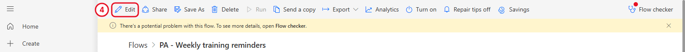

   *The original flow's details page. Save As and Edit are in this toolbar.*

2. In the toolbar at the top, select **Save As** (in the **...** menu if it isn't visible).
3. In **Flow name**, enter `PA - Weekly training capstone` and select **Save**. The copy starts turned off.

   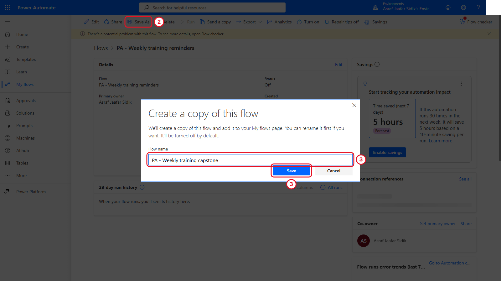

   *Working on a copy keeps your Chapter 5 flow safe.*

4. Go back to **My flows** and select the capstone copy's name (not the pencil). Its details page opens. Select **Edit** at the left of the toolbar to open it in the designer.

**Checkpoint:** The name at the top of the designer reads `PA - Weekly training capstone` before you change anything.

---

## 7.2 Remove Completed Rows with Filter Array

1. On the canvas, select the **+** between **List rows present in a table** and **Apply to each**, then **Add an action**.
2. In the search box at the top of the panel, type `Filter array`. Under the **Data Operation** heading, select **Filter array**. Its settings open on the left.
3. Rename it: select the action's title at the top of the panel and type `Filter out completed training`.
4. Click into the **From** box. Select the lightning bolt icon beside it (or type `/` and choose **Insert dynamic content**), then select **body/value** under *List rows present in a table*. (It may be labelled **value**. If you can't see it, select **See more** or type `value` in the picker's search box.)
5. Fill the row of three boxes under **Filter Query**, left to right:
   - Left box: open the lightning bolt and select **Status** under *List rows present in a table*. Type `Status` in the picker's search box if it isn't listed.
   - Middle dropdown: select **is not equal to**.
   - Right box: type `Completed`.

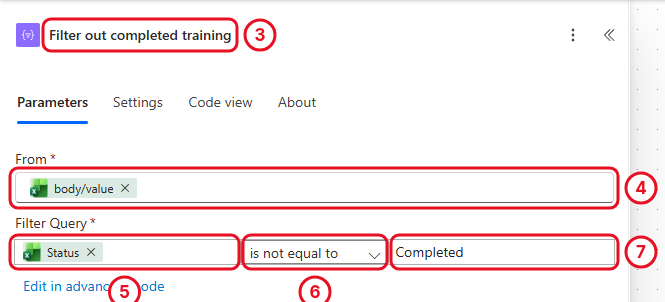

*Filter array keeps only the rows where the rule is true. Completed rows are dropped before the loop.*

> **Tip:** The comparison is exact, including capital letters. `Completed` and `completed` count as different. The sample data uses `Completed`.

**Check your flow so far.** Your screen should look like this.

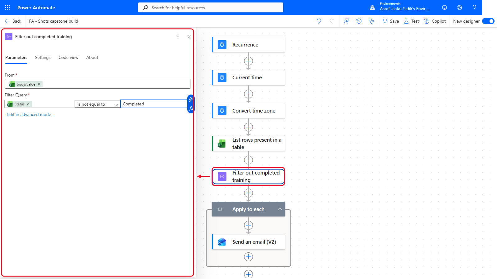

*Filter out completed training sits between List rows and Apply to each.*

---

## 7.3 Work Out the End of the Window

1. On the canvas, select the **+** below **Filter out completed training**, then **Add an action**.
2. Search for `Get future time` and select it under **Date Time**.
3. In **Interval**, enter `14`. Open the **Time unit** dropdown and select **Day**.

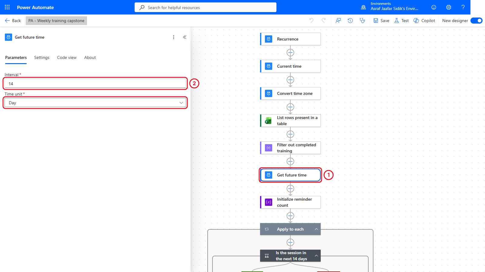

*This gives you "14 days from now" without any expression.*

You now have both ends of the window: **Current time** (already in the flow from Chapter 5) and **Future time** from this step.

**Check your flow so far.** Your screen should look like this.

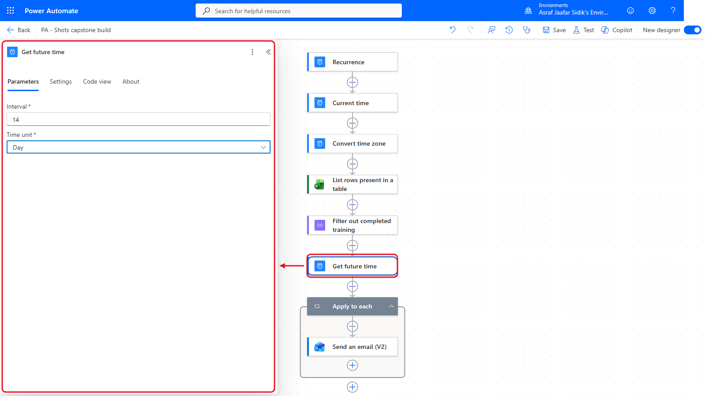

*Get future time comes after the filter.*

---

## 7.4 Start the Reminder Counter

1. On the canvas, select the **+** below **Get future time**, then **Add an action**. Search for `Initialize variable` and select it under **Variables**.
2. Rename it: select the title at the top of the panel and type `Initialize reminder count`.
3. Fill in the boxes below. For **Type**, open the dropdown and select **Integer**.

| Field | Value |
|-------|-------|
| Name | ReminderCount |
| Type | Integer |
| Value | 0 |

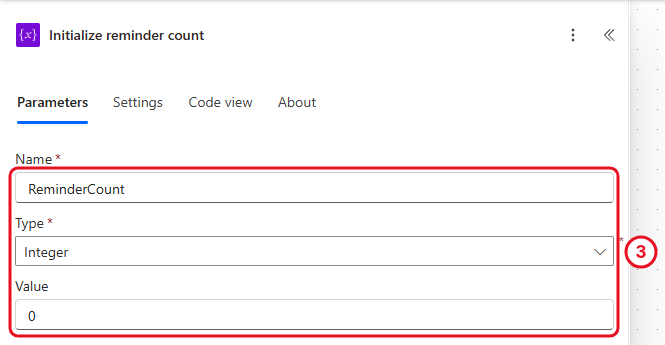

*A variable is a named box that can change while the flow runs. This one starts at zero.*

> **Key point:** Variables must be created at the top level of the flow, never inside a loop or a condition. That's why this step comes before Apply to each.

**Check your flow so far.** Your screen should look like this.

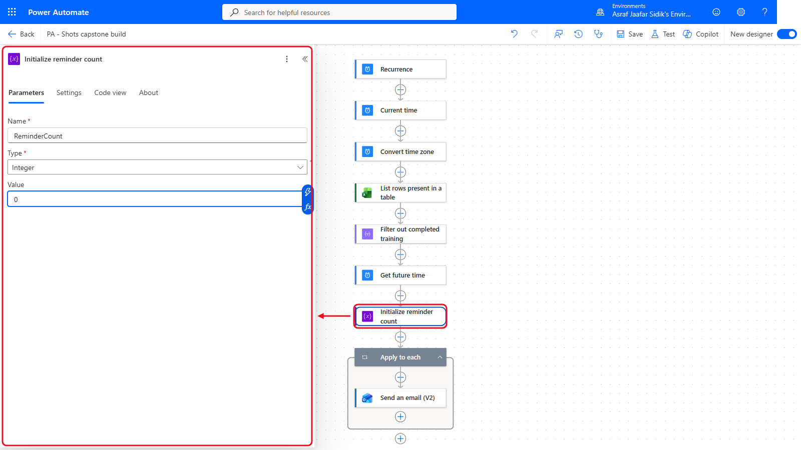

*Initialize reminder count sits just above the loop.*

---

## 7.5 Loop Through the Remaining Rows

1. On the canvas, select the **Apply to each** card to open its panel.
2. In **Select an output from previous steps**, select the **x** on the current token to remove it.
3. Click into the empty box, open the lightning bolt, and select **Body** under *Filter out completed training*.

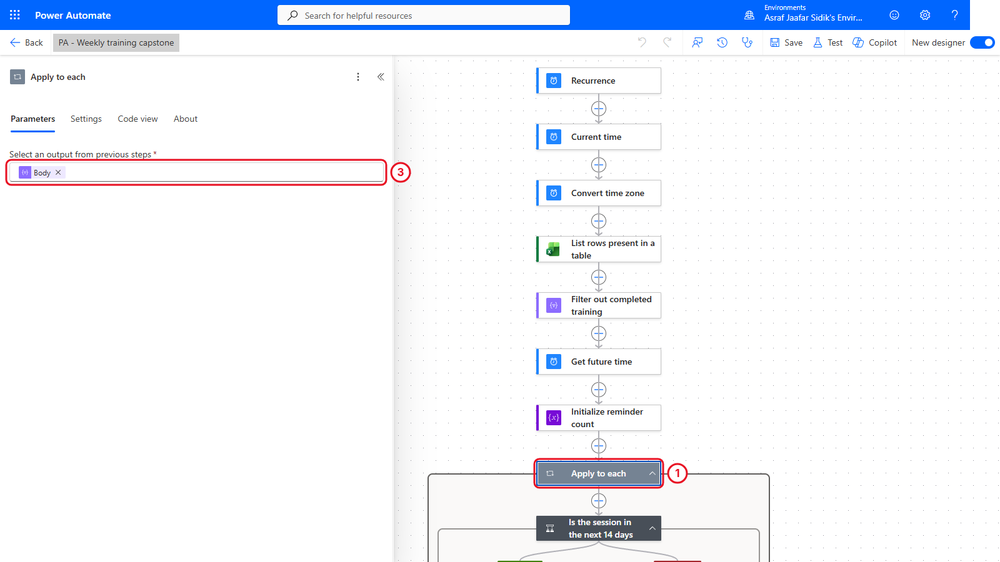

*The loop now only sees rows that aren't completed.*

> **Key point:** Don't leave the original Excel value here. That brings back the Chapter 5 behaviour and includes completed rows.

**Check your flow so far.** Your screen should look like this.

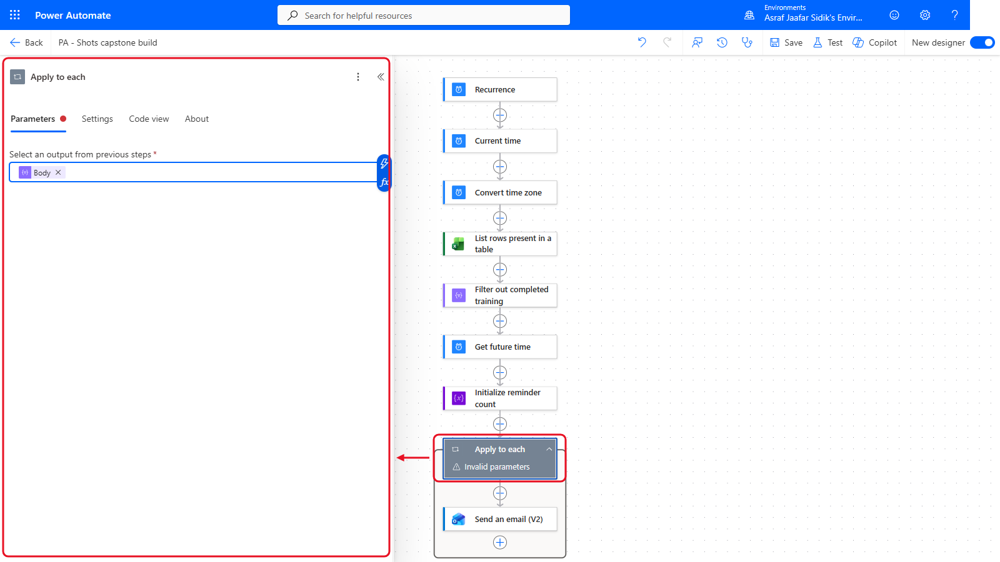

*Apply to each now loops over the filtered rows. If the loop shows Invalid parameters straight after the change, select another card and then the loop again. Flow checker in 7.11 confirms there are no errors.*

---

## 7.6 Check the Date Window

1. On the canvas, inside the **Apply to each** box, select the **+** just above **Send an email (V2)**, then **Add an action**. Search for `Condition` and select it under **Control**.
2. Rename it: select the title at the top of the panel and type `Is the session in the next 14 days`.
3. First row: click the left **Choose a value** box, type `/` and choose **Insert expression**. Paste `items('Apply_to_each')?['SessionDate']` and select **Add**. (See the box below for why.) The box now shows a token labelled **SessionDate**. Open the middle dropdown and select **is greater or equal to**. Click the right box, open the lightning bolt, and select **Current time** under *Current time*.
4. Select **Add row** below the rows. Second row: insert the same expression on the left, select **is less or equal to** in the middle, and on the right pick **Future time** under *Get future time*.
5. If an empty extra row appears below your two rows, select its **...** and then **Delete**.
6. Check the dropdown above the rows reads **And**, so both rules must be true.
7. Drag the **Send an email (V2)** card that now sits below the condition and drop it on the **+** inside the green **True** box. (Or delete it and add it again inside True with the same settings.)

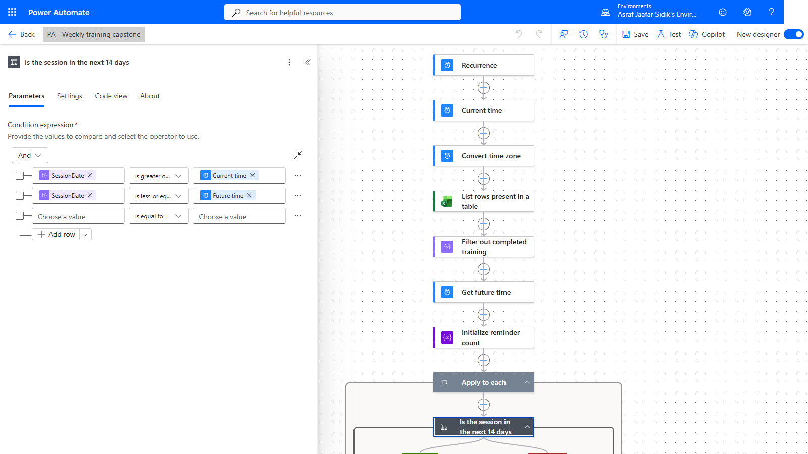

*Two rules joined by AND.*

> **Key point: why an expression here?** Once the loop runs over Filter array's **Body**, the dynamic content picker no longer lists the Excel columns. If you pick **SessionDate** from *List rows present in a table* anyway, the designer wraps the condition in a second, unwanted loop. The expression `items('Apply_to_each')?['SessionDate']` simply means "the SessionDate of the row this loop is on right now". It's on the copy-paste page. The email tokens you added in Chapter 5 keep working, because they already point at the loop's current row.

This works because the Excel dates are in ISO 8601 format (set in Chapter 5), the same format as Current time and Future time. Same format means they compare correctly.

**Check your flow so far.** Your screen should look like this.

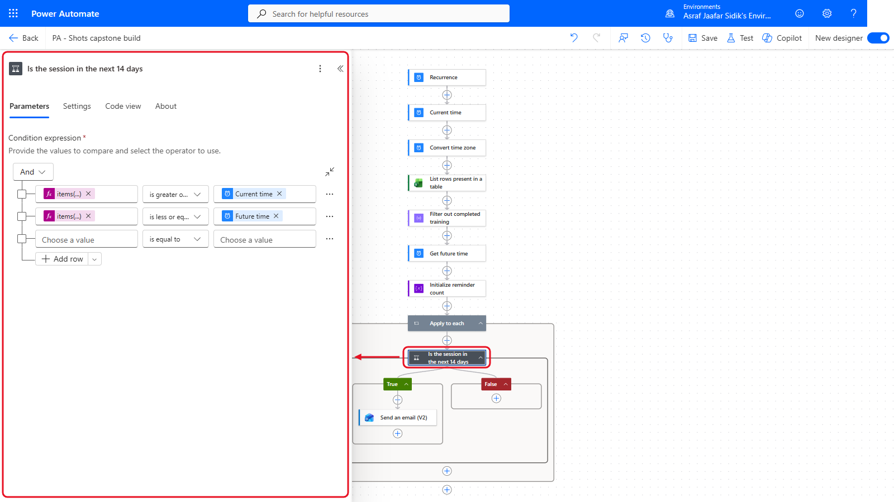

*The date condition sits inside the loop, with the email in True.*

---

## 7.7 Count Each Reminder

1. On the canvas, inside the green **True** box, select the **+** below **Send an email (V2)**, then **Add an action**. Search for `Increment variable` and select it under **Variables**.
2. Open the **Name** dropdown and select **ReminderCount**. In **Value**, enter `1`.

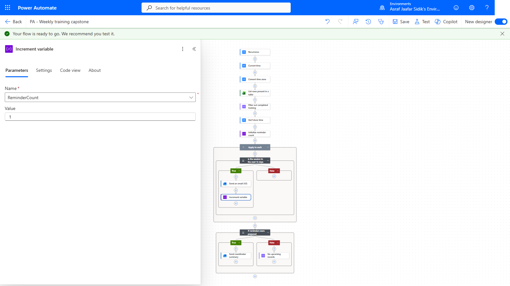

*Each reminder adds one to the counter.*

Keep the increment *after* the email, so the count only includes reminders that reached the email step.

**Check your flow so far.** Your screen should look like this.

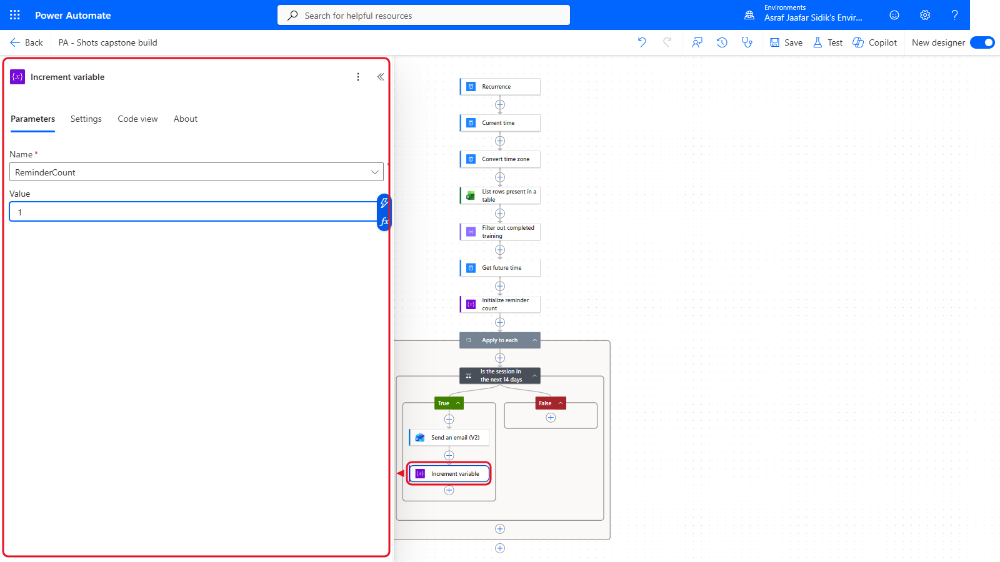

*Increment variable sits under the email in True.*

---

## 7.8 Decide Whether a Summary Is Needed

1. On the canvas, select the **+** below the **Apply to each** box (outside it, not one of the **+** inside the loop), then **Add an action**. Search for `Condition` and select it under **Control**.
2. Rename it `If reminders were prepared`.
3. Click the left **Choose a value** box, select the lightning bolt (or type `/` and choose **Insert dynamic content**), and pick **ReminderCount** under *Variables*.
4. Open the middle dropdown and select **is greater than**. Click the right box and type `0`.
5. If an empty extra row appears, select its **...** and then **Delete**.

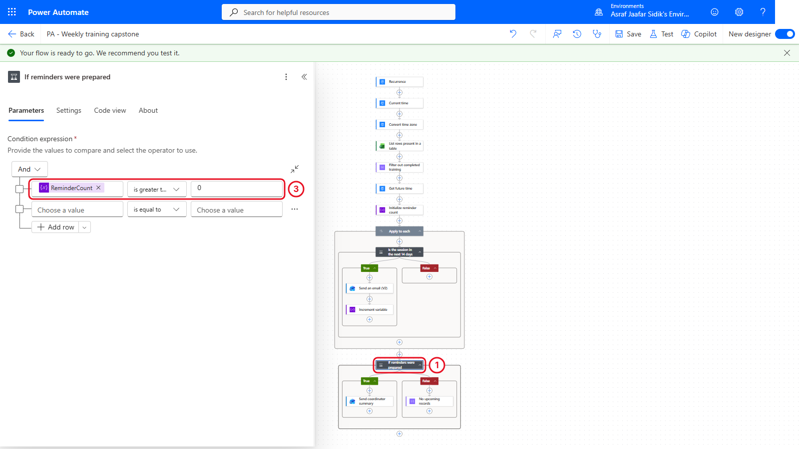

*A positive count goes to True. Zero goes to False.*

**Check your flow so far.** Your screen should look like this.

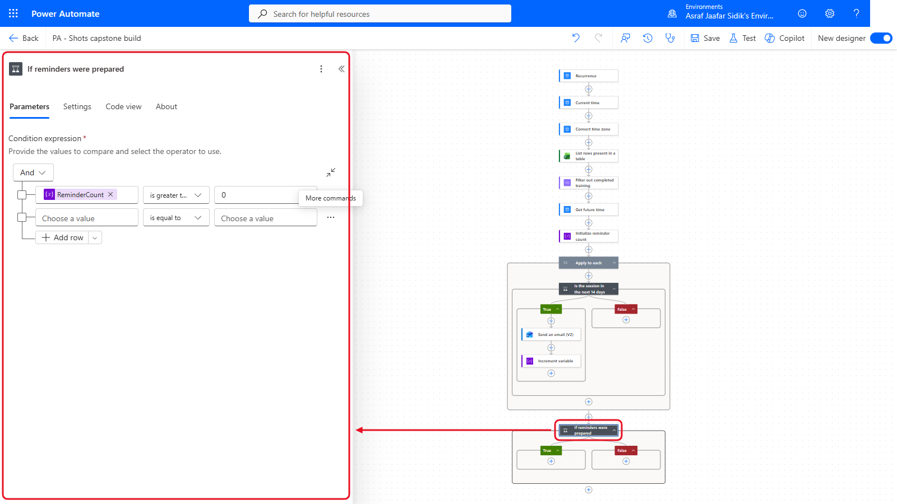

*The summary condition sits below the loop.*

---

## 7.9 Prepare the Coordinator Summary

On the canvas, inside the green **True** box under **If reminders were prepared**, select the **+**, then **Add an action**. Search for `Send an email`, select **Send an email (V2)** under **Office 365 Outlook**, and rename it `Send coordinator summary`:

| Field | Value |
|-------|-------|
| To | Type `coordinator@example.com`, then select it from the list (it shows as a custom value) |
| Subject | `[PA TRAINING] Weekly reminder summary` |
| Body | Type `The weekly training reminder flow prepared `, then select the lightning bolt (or type `/` and choose **Insert dynamic content**) and pick **ReminderCount** under *Variables*. Then type ` reminder(s) for upcoming sessions in the next 14 days.` |

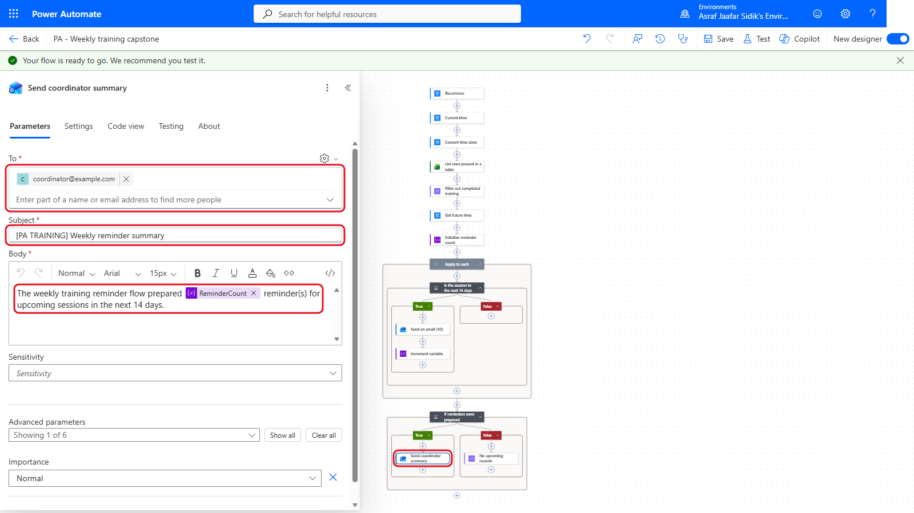

*The variable drops into the email like any other dynamic content.*

**Check your flow so far.** Your screen should look like this.

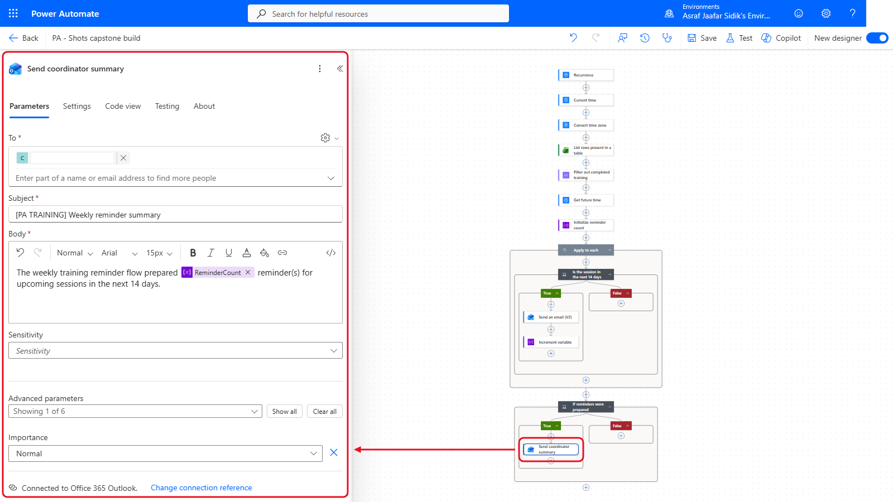

*Send coordinator summary sits in True.*

---

## 7.10 Handle a Week with No Matching Rows

On the canvas, inside the red **False** box, select the **+**, then **Add an action**. Search for `Compose` and select it under **Data Operation**. Rename it `No upcoming records`, and type `No upcoming training records were found for the next 14 days.` in **Inputs**.

That records a clear outcome in run history without sending an unnecessary email.

**Check your flow so far.** Your screen should look like this.

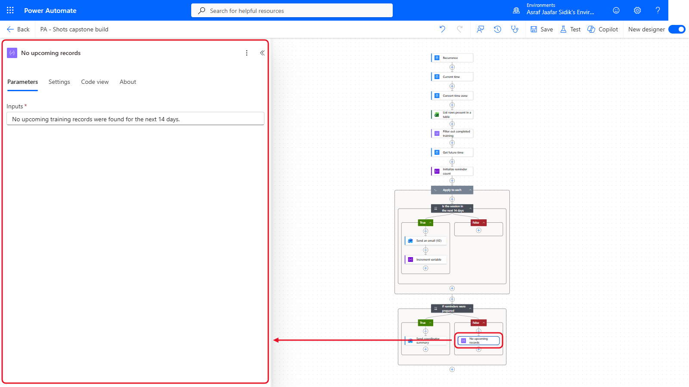

*No upcoming records sits in False. That is the whole capstone.*

---

## 7.11 Save and Check the Capstone

1. Select **Save** in the toolbar at the top right. Then select **Flow checker** in the same toolbar and confirm zero errors and zero warnings.
2. Close Flow checker. In the column of buttons at the bottom left of the canvas, select **Zoom view to fit**. Check the shape: filter before the loop, date check and count inside the loop, decision after the loop.

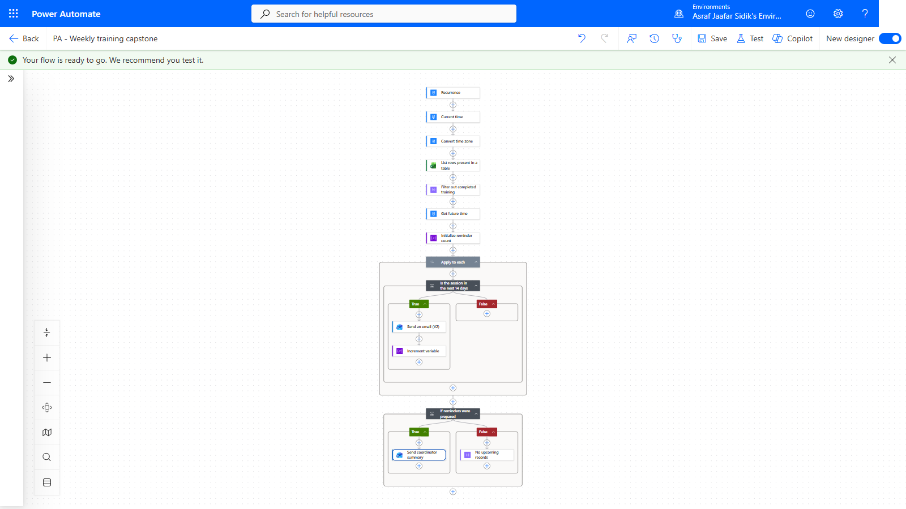

*Filter before, check and count inside, decide after.*

---

## Trainer-Controlled Test

A test can send one learner reminder per matching row plus, when the count is positive, a coordinator summary. With the sample data on 17 September 2026, four rows match (21, 22, 24 and 28 September). The trainer replaces every `example.com` address, saves the workbook, confirms the coordinator address and authorises the run first.

Afterwards, check the run history:

- Filter out completed training returned four rows
- Apply to each ran four times, and the date condition was true each time
- ReminderCount ended at 4
- The final condition took True and prepared the coordinator summary

---

## Independent Practice

Without running the flow, change the window from 14 days to 7 by editing only **Get future time**. Which sample rows would match on 17 September 2026? Then change it back to 14.

---

> **Going further: one filter that does it all.** Experienced makers often replace the filter and the date condition with a single Filter array in **advanced mode**, using an expression that also ignores capital letters and stray spaces. The expression is on the copy-paste page. You'll build flows like that in the advanced course. Optional.

---

## Troubleshooting

| Symptom | What to check |
|---------|---------------|
| A completed row still gets a reminder | Filter array right value is exactly `Completed`, and the loop uses Filter's **Body** |
| Every date fails the condition | DateTime Format is ISO 8601 in List rows present in a table |
| A second Apply to each appears inside the loop | You picked SessionDate from the Excel action. Delete the extra loop and use the expression from section 7.6 |
| No date passes the condition | The sample dates may be in the past. Ask the trainer to update SessionDate |
| ReminderCount stays at zero | Increment variable is inside the True branch of the date condition |
| Initialize variable can't be added | You're inside the loop. Variables are created at the top level |
| The summary runs before reminders finish | Put the final Condition below Apply to each, outside its box |
| Flow checker is clean but a test is unsafe | Flow checker checks structure. It doesn't approve recipients |

---

## Lesson Summary

The capstone filters out completed rows before looping, checks a date window with a two-rule condition, keeps a running count in a variable, and branches on the final count. That turns a broad weekly reminder into a controlled process with a clear result for the coordinator. Next, you'll use variables again, alongside parallel branches, in a flow that's all about you.
