# 08 - My Morning Briefing: Variables and Parallel Branches

Every morning you check the weather, your calendar and your inbox before the day starts. This flow does all three at once and sends you one email. It only reads your own data and only emails you, so it's safe to build in a live environment.

> **Copy-paste values:** every value you need is in the steps, with a Copy button. The [copy-paste page](./copy-paste.md) has them all on one page too.

**Estimated time:** 60 minutes

**Your result:** A scheduled flow that runs on weekday mornings, looks up the weather, your meetings and your important unread email in three parallel branches, and sends you one briefing email.

---

## What You Will Learn

- Create variables with **Initialize variable** and explain why they live at the top of a flow
- Change variables with **Increment variable**, **Append to string variable** and **Set variable**
- Run independent steps side by side with **parallel branches**
- Group parallel branches in a **Scope** and wait for the whole group before a final step
- Use a variable's value in a condition and an email

---

## How the Flow Works

```
Recurrence
  > Initialize four variables
  > Scope: Gather briefing data
      > Three parallel branches:
          Weather:  Get current weather
          Meetings: Current time > Get future time > Get calendar view > loop (count + list)
          Email:    Get emails > loop (list)
  > Condition: more than 4 meetings? > Set the subject
  > Send me the briefing
```

The three lookups don't depend on each other. The weather doesn't need your calendar and your calendar doesn't need your inbox. When steps are independent, they can run **in parallel**, side by side, instead of waiting in a queue. The **Gather briefing data** scope contains all three branches. The flow only moves on to **Busy day** and the email after the scope succeeds, once all three branches have finished.

> **Note:** Your trainer has confirmed that MSN Weather, Office 365 Outlook and the Date Time actions are allowed in your environment. Nothing in this flow changes your calendar or mailbox.

---

## 8.1 Create the Scheduled Flow

1. In the left navigation, select **Create**, then **Scheduled cloud flow**.
2. In **Flow name**, enter `PA - My morning briefing`.
3. Set **Repeat every** to **1 Week**. Make sure only **M T W T F** are selected: if **S** and **S** (the weekend) are already highlighted, select them to turn them off. Set the time to **8:00 AM**.
4. Select **Create**. The designer opens with a **Recurrence** card on the canvas.
5. Select the **Recurrence** card on the canvas to open its panel. If **Time zone** is blank, open the dropdown, type `Kuala` and pick **(UTC+08:00) Kuala Lumpur, Singapore**. If **At these hours** is blank, open it and select `8`. Leave **At these minutes** as it is (blank or `0` both work). Check the **Preview** at the bottom reads 8:00 on Monday to Friday. **Start time** is filled in for you; leave it.

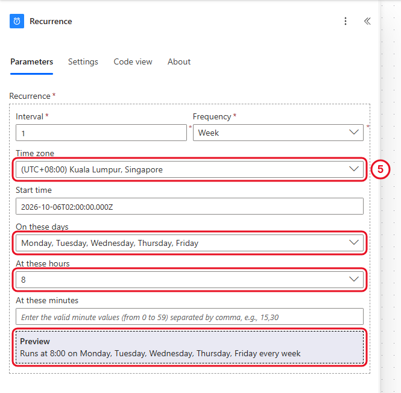

*Weekday mornings at 8:00, Malaysia time.*

**Check your flow so far.** Your screen should look like this.

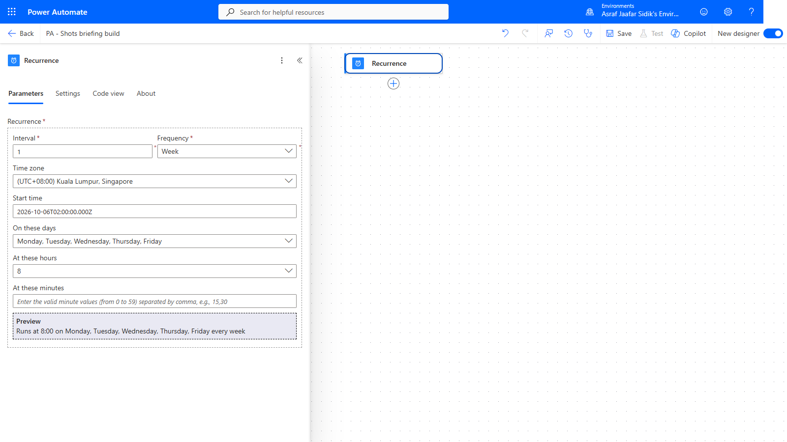

*Only Recurrence so far.*

---

## 8.2 Create the Variables

A **variable** is a named box that holds a value and can change while the flow runs. You've used one already: ReminderCount in Chapter 7. This flow uses four, of two types.

| Name | Type | Starting value | What it's for |
|------|------|----------------|---------------|
| `MeetingCount` | Integer | `0` | Counts today's meetings |
| `MeetingList` | String | *(leave empty)* | Collects the meeting names |
| `EmailList` | String | *(leave empty)* | Collects the important email subjects |
| `BriefingSubject` | String | `Your day ahead` | The email subject. May change later |

1. On the canvas, select the **+** below **Recurrence**, then **Add an action**. Search for `Initialize variable` and select it under **Variables**.
2. In **Name**, enter `MeetingCount`. Open the **Type** dropdown and select **Integer**. In **Value**, enter `0`.
3. Select the **+** below the variable you just made, then **Add an action** and search for `Initialize variable` again. Repeat until all four rows of the table are done. Leave **Value** empty for **MeetingList** and **EmailList**. For **BriefingSubject**, type `Your day ahead`.

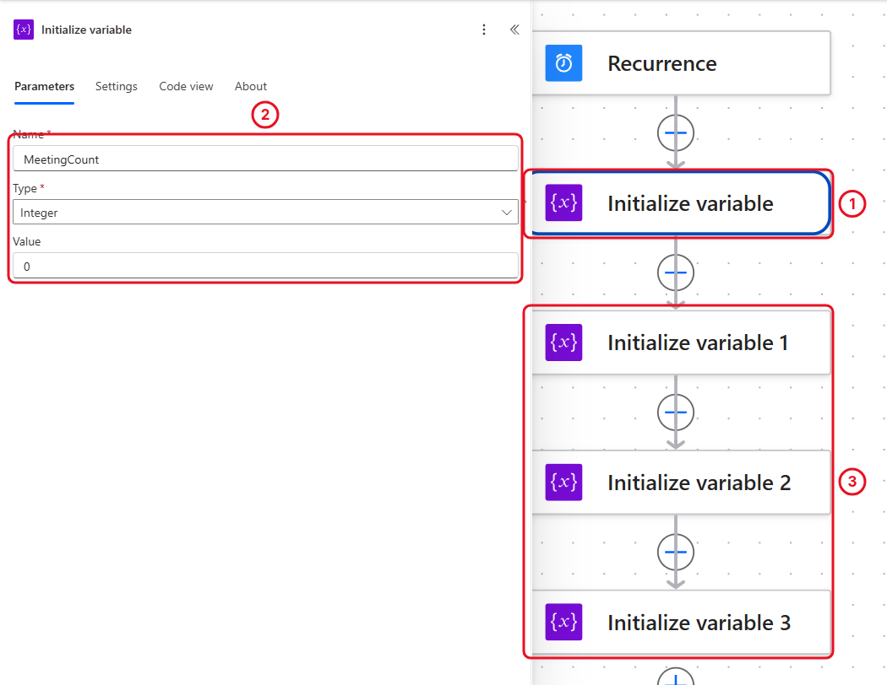

*Recurrence and four variables, before the scope and branches are added.*

> **Key point:** Initialize variable only works at the top level of a flow, not inside a scope, loop or condition. So every variable is created first, even ones you won't use until later.

**Check your flow so far.** Your screen should look like this.

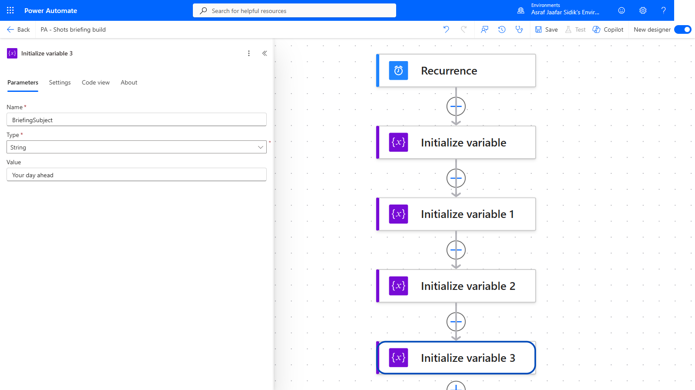

*Recurrence and four Initialize variable actions.*

---

## 8.3 Create the Scope and Branch 1: The Weather

A **Scope** is a container for related actions. We will put the weather, meetings and email branches inside one scope, so the next step can wait for the whole group. The scope groups the work; **Add a parallel branch** makes the lookups run side by side.

1. On the canvas, select the **+** below the last **Initialize variable** (named **Initialize variable 3**), then **Add an action**. Search for `Scope` and select it under **Control**.
2. Select the scope's title at the top of its panel, type `Gather briefing data`, then click away to finish renaming it. Keep all four Initialize variable actions outside the scope.
3. Select the **+** inside **Gather briefing data**, then **Add an action**. Search for `Get current weather` and select it under **MSN Weather**.
4. In **Location**, type `Kuala Lumpur`. Open the **Units** dropdown and select **Metric**.

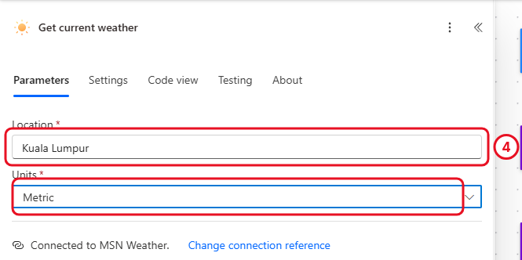

*One action. Its values (conditions, temperature) are used in the email later.*

**Check your flow so far.** Your screen should look like this.

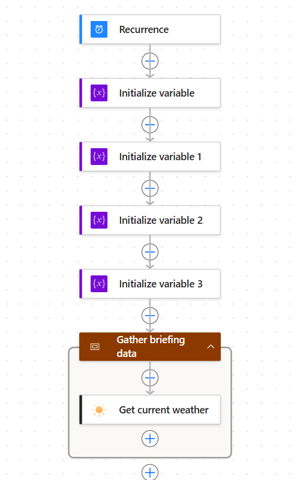

*Gather briefing data below the variables, with Get current weather inside it.*

---

## 8.4 Branch 2: Your Meetings

This branch starts *beside* the weather, inside **Gather briefing data**.

1. Inside **Gather briefing data**, select the **+** above **Get current weather** (right-click it if a menu doesn't open), then choose **Add a parallel branch**.

   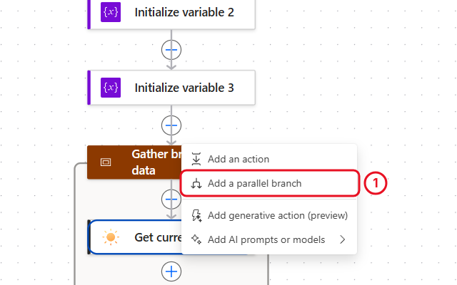

   *Add a parallel branch starts a new column next to the existing one.*

2. The action search opens for the new branch. Search for `Current time` and select it under **Date Time**.
3. On the canvas, select the **+** below **Current time**, then **Add an action**. Search for `Get future time` and select it under **Date Time**. In **Interval**, enter `12`. Open **Time unit** and select **Hour**.
4. Select the **+** below **Get future time**, then **Add an action**. Search for `Get calendar view` and select **Get calendar view of events (V3)** under **Office 365 Outlook**. For **Start Time** and **End Time**, click into the box, select the lightning bolt icon beside it (or type `/` and choose **Insert dynamic content**), and pick the value:

   | Field | Value |
   |-------|-------|
   | Calendar Id | Open the dropdown and select **Calendar** |
   | Start Time | **Current time** under *Current time* |
   | End Time | **Future time** under *Get future time* |

5. Select the **+** below **Get calendar view of events (V3)**, then **Add an action**. Search for `Apply to each` and select it under **Control**. Click into **Select an output from previous steps**, open the lightning bolt, and select **body/value** under *Get calendar view of events (V3)*. That's the list of events. (It may be labelled **value**. If you can't see it, select **See more** or type `value` in the picker's search box.)
6. Inside the loop, select the **+**, then **Add an action**. Search for `Increment variable` and select it under **Variables**. Open the **Name** dropdown and select **MeetingCount**. In **Value**, enter `1`.
7. Inside the same loop, select the **+** below **Increment variable** (if it's out of view, close the panel with **<<** and use **Zoom view to fit** at the bottom left of the canvas), then **Add an action**. Search for `Append to string variable` and select it under **Variables**. Open the **Name** dropdown and select **MeetingList**. In **Value**, paste the text below (it ends with a space). Copy it from the box below.

   ```text
   <br>• 
   ```

   Then open the lightning bolt and select **Subject** under *Get calendar view of events (V3)*. If Subject isn't listed, select **See more** under *Get calendar view of events (V3)*.

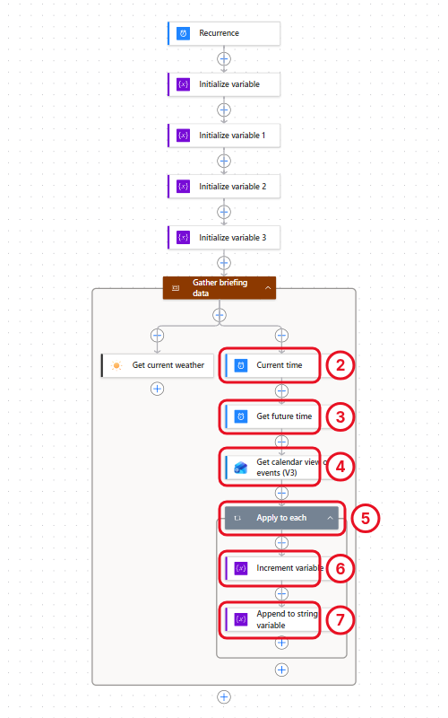

*Each meeting adds one to the count and one line to the list.*

> **Tip:** Email bodies are written in HTML, the language of web pages. `<br>` is HTML for "new line", so each meeting starts on its own line in the email.

**Check your flow so far.** Your screen should look like this.

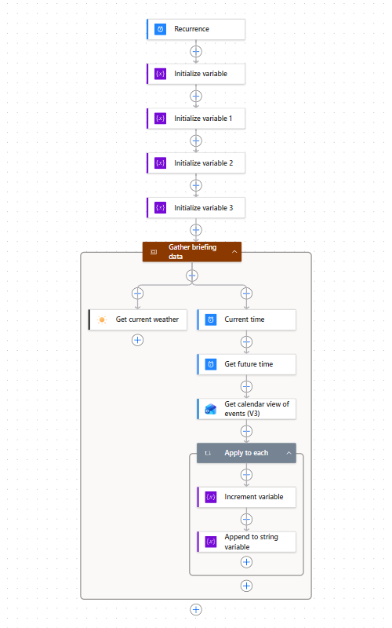

*The meetings branch runs beside the weather inside Gather briefing data.*

---

## 8.5 Branch 3: Important Unread Email

1. Add a third parallel branch the same way: inside **Gather briefing data**, select the **+** above the existing branches, then **Add a parallel branch**.
2. Search for `Get emails` and select **Get emails (V3)** under **Office 365 Outlook**. Set the fields below. If a field isn't shown, open the **Advanced parameters** dropdown and tick it.

   | Field | Value |
   |-------|-------|
   | Folder | Inbox |
   | Fetch Only Unread Messages | Yes |
   | Importance | High |
   | Top | 5 |

3. On the canvas, select the **+** below **Get emails (V3)**, then **Add an action**. Search for `Apply to each` and select it under **Control**. Click into **Select an output from previous steps**, open the lightning bolt, and select **body/value** under *Get emails (V3)*.
4. Inside the loop, select the **+**, then **Add an action**. Search for `Append to string variable` and select it under **Variables**. Open the **Name** dropdown and select **EmailList**. In **Value**, paste the start of the line (it ends with a space). Copy it from the box below.

   ```text
   <br>• 
   ```

   Insert **Subject**, then paste the text below (it starts and ends with a space).

   ```text
    (from 
   ```

   Insert **From**, then type `)`. Subject and From are under *Get emails (V3)* in the picker (select **See more** if they're hidden).

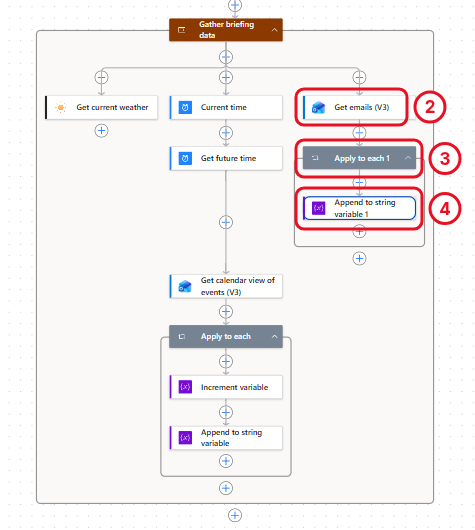

*Three independent branches inside Gather briefing data, running at the same time.*

> **Key point:** Each branch writes to its **own** variable. If all three appended to one shared variable, the sections would arrive in whatever order the branches happened to finish. Separate variables keep the email in a fixed order.

**Check your flow so far.** Your screen should look like this.

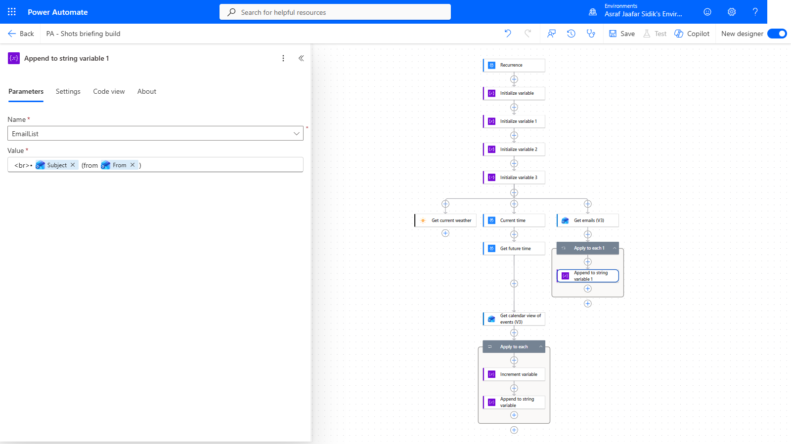

*Three branches side by side inside Gather briefing data.*

---

## 8.6 Wait for the Scope

The next step must wait until all three branches have finished. The scope gives us one completion point for the whole group.

1. On the canvas, select the **+** below the **Gather briefing data** box, **outside** it, then **Add an action**. Search for `Condition` and select it under **Control**. Rename it: select the title at the top of the panel and type `Busy day`.
2. Select **Busy day**, then the **Settings** tab. Under **Run after**, check that **Gather briefing data** is the only action listed. Expand it and leave only **Is successful** ticked. If another action is listed, use **Select actions** to select the scope instead.
3. Select **Save**. After saving, if the panel goes blank, select **Busy day** again to reopen it.

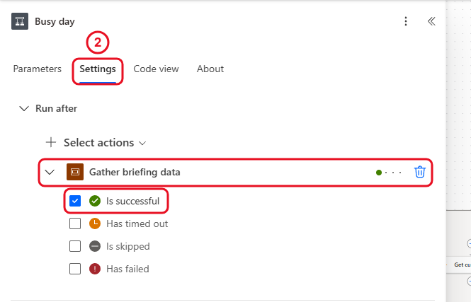

*Busy day waits for the whole scope to succeed.*

> **Check:** Busy day must be outside the scope. If it sits inside, it may depend on only one branch. Waiting for the scope's successful completion also means a failed lookup stops the briefing; this lab does not add error handling.

**Check your flow so far.** Your screen should look like this.

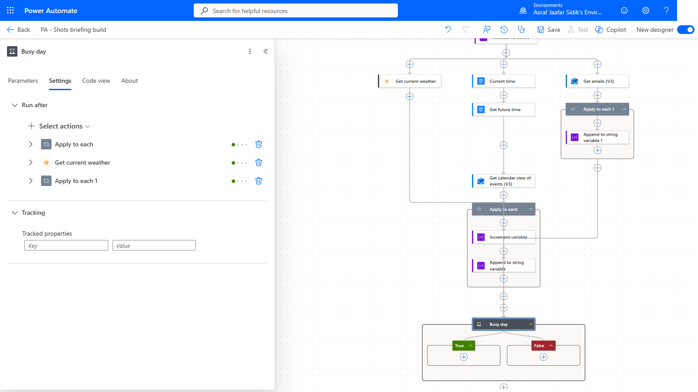

*One scope, then Busy day.*

---

## 8.7 Change the Subject on a Busy Day

1. In the **Busy day** panel, select the **Parameters** tab. Click the left **Choose a value** box, select the lightning bolt (or type `/` and choose **Insert dynamic content**), and pick **MeetingCount** under *Variables*. Open the middle dropdown and select **is greater than**. Click the right box and type `4`. If an empty extra row appears, select its **...** and then **Delete**. The designer may show an empty placeholder row again straight away: that's fine, only the filled row is saved.
2. On the canvas, inside the green **True** box, select the **+**, then **Add an action**. Search for `Set variable` and select it under **Variables**. Open the **Name** dropdown and select **BriefingSubject**. In **Value**, paste the text below (it ends with a space). Copy it from the box below.

   ```text
   Busy day ahead: 
   ```

   Insert **MeetingCount** (under *Variables*), then type ` meetings` (with the space at the start).
3. Leave **False** empty. The subject keeps its starting value, *Your day ahead*.

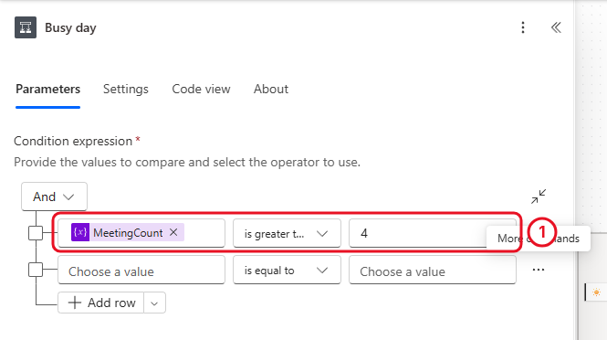

*Set variable replaces a variable's value. Append adds to it. Increment adds to a number. An empty placeholder row may remain in the designer.*

**Check your flow so far.** Your screen should look like this.

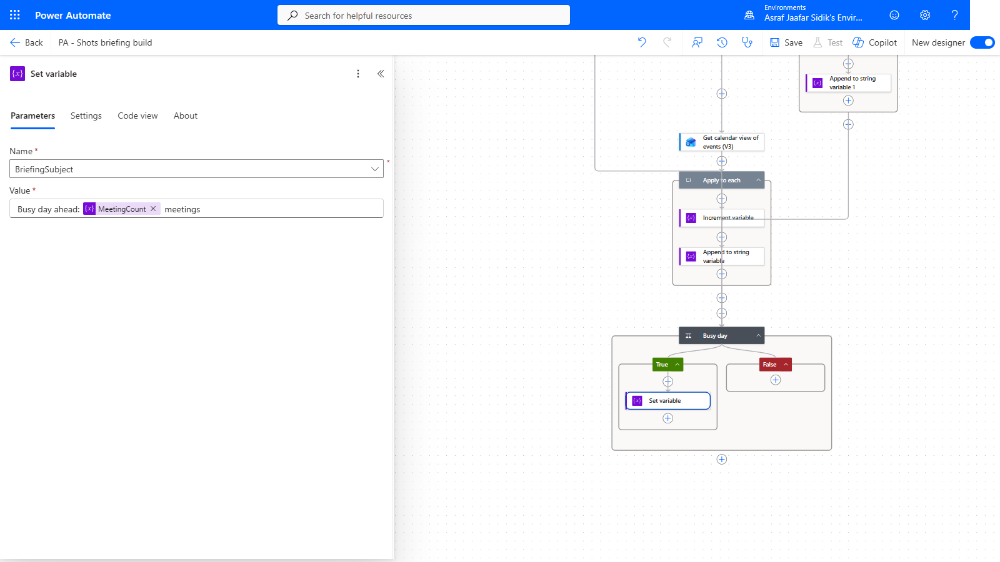

*Set variable sits in True.*

---

## 8.8 Send the Briefing

1. On the canvas, select the **+** below the **Busy day** box (outside it), then **Add an action**. Search for `Send an email`, then select **Send an email (V2)** under **Office 365 Outlook**.
2. **To:** start typing your name or email address, then select yourself from the list that appears. If no suggestion appears, type your full email address and press **Enter**.
3. **Subject:** click into the box, select the lightning bolt, and pick **BriefingSubject** under *Variables*.
4. **Body:** type the text below and insert the tokens shown in brackets. To insert a token, place the cursor where it goes, then select the lightning bolt (or type `/` and choose **Insert dynamic content**). **Conditions** and **Temperature** are under *Get current weather* (select **See more** if they're hidden). The rest are under *Variables*.

   > Good morning,
   >
   > Weather in Kuala Lumpur: **[Conditions]**, **[Temperature]**°C
   >
   > Meetings in the next 12 hours (**[MeetingCount]**):**[MeetingList]**
   >
   > Important unread email:**[EmailList]**

   The plain text pieces are in the boxes below, in order. Paste each one, then insert the token that follows it. Press **Enter** twice between lines to leave a blank line.

   ```text
   Good morning,
   ```

   ```text
   Weather in Kuala Lumpur: 
   ```

   After **[Conditions]**, type a comma and a space, insert **[Temperature]**, then type `°C`.

   ```text
   Meetings in the next 12 hours (
   ```

   After **[MeetingCount]**, type `):` and then insert **[MeetingList]**.

   ```text
   Important unread email:
   ```

   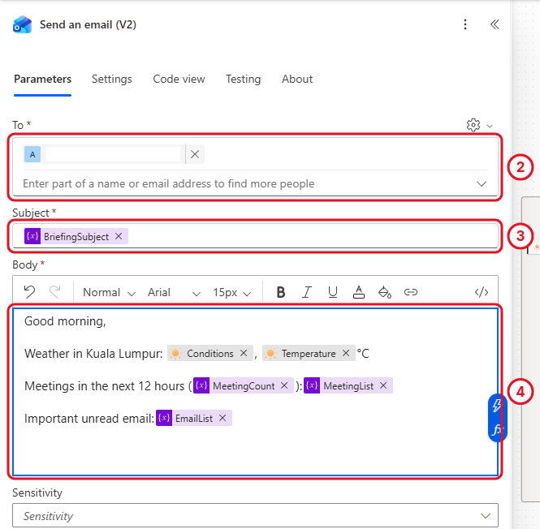

   *Variables drop into the email like any other dynamic content.*

5. Select **Save** in the toolbar at the top right, then the **Flow checker** icon (the stethoscope just left of **Save**; hover to see its name). Fix anything it reports.

**Check your flow so far.** Your screen should look like this.

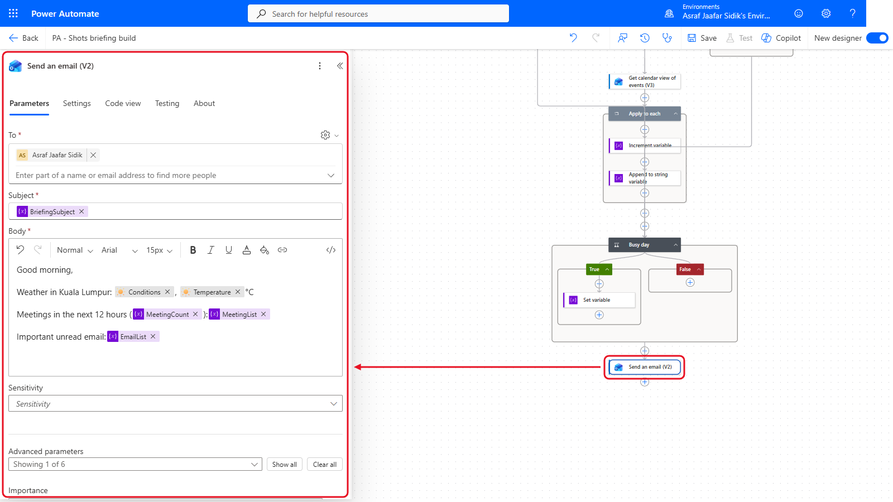

*Send an email (V2) at the bottom. That is the whole briefing.*

---

## 8.9 Test It

This flow only emails you, so you can test it yourself.

1. In the toolbar at the top right, select **Test**, choose **Manually**, select **Test**, then **Run flow**, then **Done**.
2. The run opens on the canvas. Expand **Gather briefing data** if it is collapsed. Check that the scope and all three branches succeeded, and notice that the branches started at almost the same moment.
3. Select **Busy day** and open **Run results** to see whether it was true or false. Select **Increment variable** inside the meetings loop to see the `1` it added each time (it shows no outputs, which is normal). If Busy day was false, **Set variable** shows as skipped. That's expected: the email's count is the final check.
4. In Outlook, find the email with the subject **Your day ahead** (or **Busy day ahead...**) in your Inbox. If it isn't near the top, type the subject in the search box at the top. If you've tested before, Outlook may group the briefings into one conversation: open it and check the newest message's time.

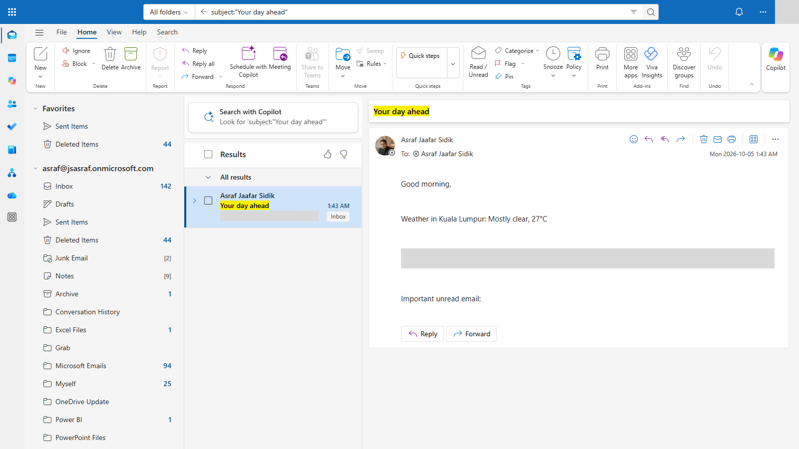

*Your briefing. Each section came from a different branch.*

If you have no meetings or no important unread email, those lists are simply empty and the count reads 0. That's correct.

---

## Independent Practice

Inside **Gather briefing data**, add a fourth parallel branch that counts up to 25 unread emails of any importance. Create an Integer variable `UnreadCount` at the top, use **Get emails (V3)** with **Fetch Only Unread Messages** set to Yes and **Top** set to 25, and increment the variable for each email. Add a line to the briefing: *Unread email: [UnreadCount]*.

---

> **Going further: skip empty sections.** Use a condition with **EmailList** *is equal to* (leave the right side empty) to set EmailList to `<br>Nothing urgent. Enjoy your morning.` when there's no important email. Optional.

---

## Troubleshooting

| Symptom | What to check |
|---------|---------------|
| Initialize variable isn't offered | You're inside a branch or loop. Add it below Recurrence |
| Get current weather is blocked | Your environment may block MSN Weather. Ask the trainer, or skip branch 1 |
| The meeting list is empty but you have meetings | Start Time is **Current time**, End Time is **Future time**, Calendar Id is **Calendar** |
| Meetings and email appear on one line | The `<br>` is missing at the start of the Append value |
| The email sends before a branch finishes | Busy day must sit outside Gather briefing data, with **Run after** set to that scope's successful completion |
| The subject never changes | Set variable is in the True branch, and the condition uses MeetingCount *is greater than* 4 |
| Times look eight hours off | The meeting window uses UTC from Current time. For a briefing, a 12-hour window still covers your day |

---

## Lesson Summary

Variables give a flow named boxes that change as it runs. You created four at the top, then used **Increment** to count, **Append** to build lists and **Set** to replace a value. Parallel branches let independent lookups run side by side, each writing to its own variable. A scope groups the branches, so Busy day and the final email wait for all of them. Next, you'll ask Copilot to plan a flow for you, and review what it suggests.
