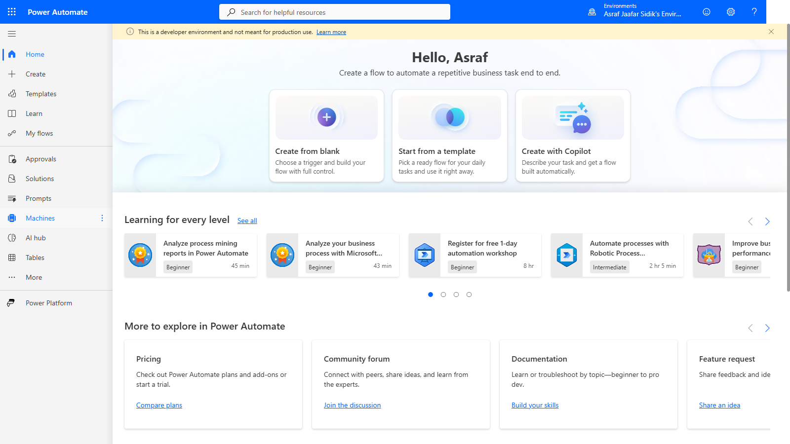
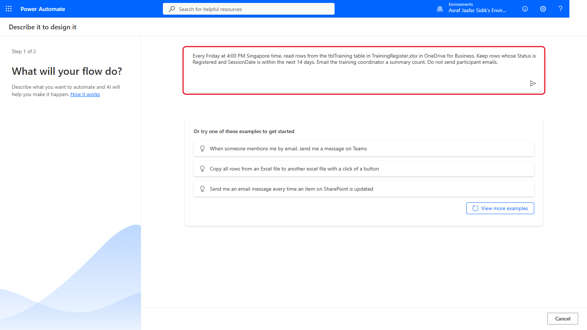
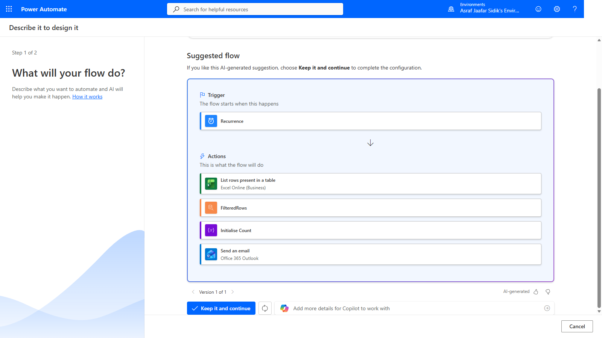
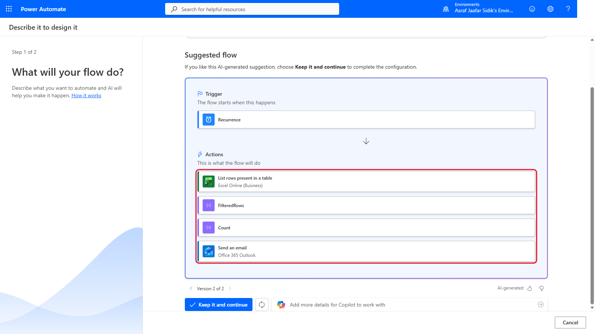
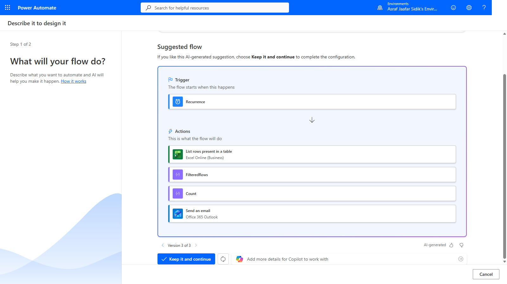

# 09 - Plan an Automation with Copilot

Copilot in Power Automate can turn a plain-language description into a suggested flow. A suggestion isn't a finished design, though. In this chapter you review what Copilot proposes, correct it precisely, and walk away without creating anything.

> **Copy-paste values:** the three prompts for this chapter are on the [copy-paste page](./copy-paste.md).

**Estimated time:** 30 minutes

**Your result:** A reviewed and improved flow plan produced with Copilot, without creating or running a cloud flow.

---

## What You Will Learn

- Describe an automation to Copilot with a clear, bounded prompt
- Review an AI-generated flow plan against the business rule
- Refine a suggestion by naming the exact change you need
- Leave the planning experience without creating a flow

---

## The Business Problem

Copilot may leave out a calculation, add an action you don't need, or read a broad instruction differently from what you meant. You ask it to plan a weekly coordinator summary, check every proposed step, and correct it until it matches this intended plan:

**Recurrence > List rows present in a table > Filter array > Compose count > Send one coordinator email**

---

## Before You Begin

Copilot availability depends on your organisation, environment, region and admin settings. If **Create with Copilot** or **Describe it to design it** isn't available, follow along with the manual's screenshots and answer the review questions without entering a prompt.

> **Important:** Use only fictional details and `coordinator@example.com`. Never put confidential information, personal data, passwords or real recipients into a training prompt.

---

## 9.1 Open the Copilot Planning Experience

On the Power Automate home page, select **Create with Copilot**. The Create page may call the same thing **Describe it to design it**.

*Create with Copilot starts from a plain-language description.*

---

## 9.2 Describe the Complete Business Outcome

In **What will your flow do?**, paste prompt 1 from the copy-paste page and select **Submit**.

*The prompt names the schedule, source, rule, output and a boundary.*

A strong prompt states the event, the data source, the rule, the output and the boundaries. Even so, Copilot doesn't know your approved recipient, the exact workbook location, your organisation's policies, or how you'll test the result.

---

## 9.3 Review the First Suggestion

Read the trigger and every proposed action before you select anything. In the manual's example, the first version suggested Recurrence, List rows present in a table, FilteredRows, Initialise Count and Send an email. It looks plausible, but **Initialise Count** doesn't say how the count is calculated.

*A plausible start, but the count isn't explained.*

Use these questions on any AI-generated flow plan:

| Review area | Question |
|-------------|----------|
| Trigger | Does it start at the intended event, time and time zone? |
| Data | Does it use the correct connector, file, table, list, form or mailbox? |
| Logic | Are filtering, looping, conditions and calculations explicit? |
| Output | Is the destination approved, and could the action contact real people? |
| Licensing | Are all proposed connectors and actions available to participants? |
| Testing | Can the plan be tested safely with fictional data and approved destinations? |

---

## 9.4 Clarify the Filter and Count

In **Add more details to improve the flow**, paste prompt 2 and select **Send**. It names the actions, gives the counting expression, and draws a clear line around who gets email.

---

## 9.5 Identify an Unnecessary Action

The second suggestion now has a proper Count and still one email, but it adds **Get file metadata using path** before List rows present in a table. You don't need it: List rows present in a table can select the workbook directly. The extra action is just another dependency.

*The count improved, but an unneeded step appeared.*

---

## 9.6 Request a Streamlined Design

Paste prompt 3 and select **Send**. It says what to remove, why, and exactly which structure to keep.

---

## 9.7 Validate the Final Suggestion

The third suggestion should have exactly these steps:

| Order | Proposed step |
|-------|---------------|
| 1 | Recurrence |
| 2 | List rows present in a table |
| 3 | FilteredRows |
| 4 | Compose Count |
| 5 | Send an email |

*The outline matches the intended plan.*

This only checks the outline. If you continued, you'd still need to configure the Friday schedule and time zone, the workbook and table, the filter and count expressions, the recipient, subject and body, error handling, and test data.

---

## 9.8 Exit Without Creating the Flow

Select **Cancel**, not **Keep it and continue**. Power Automate returns to the Create page. This exercise is planning only.

---

## Independent Practice

Write a prompt for a monthly training-capacity report. Include the schedule, data source, inclusion rule, output and one explicit boundary. Swap prompts with another participant and find one ambiguity before asking Copilot for a suggestion.

---

## Troubleshooting

| Symptom | What to check |
|---------|---------------|
| Create with Copilot is missing | Organisation settings, environment, region, account entitlement. Use the manual's example instead |
| Copilot suggests the wrong trigger | State the exact event or schedule: frequency, day, time and time zone |
| The plan has a participant email loop | Say only one coordinator summary is needed and explicitly rule out participant emails |
| The count is unclear | Name the filtered array and ask for `length(body('FilteredRows'))` |
| An unnecessary connector appears | Explain which existing action already provides the data and ask Copilot to remove the extra one |
| The final outline looks right | Keep reviewing. Fields, expressions, connections, recipients and testing aren't configured yet |

---

## Lesson Summary

Copilot can propose a trigger and action sequence quickly, keep versions, and respond to refinements. You stay responsible for the business rule, connector choice, licensing, recipient safety, expressions, configuration and testing. The best result came from reviewing each suggestion and stating the exact correction.
