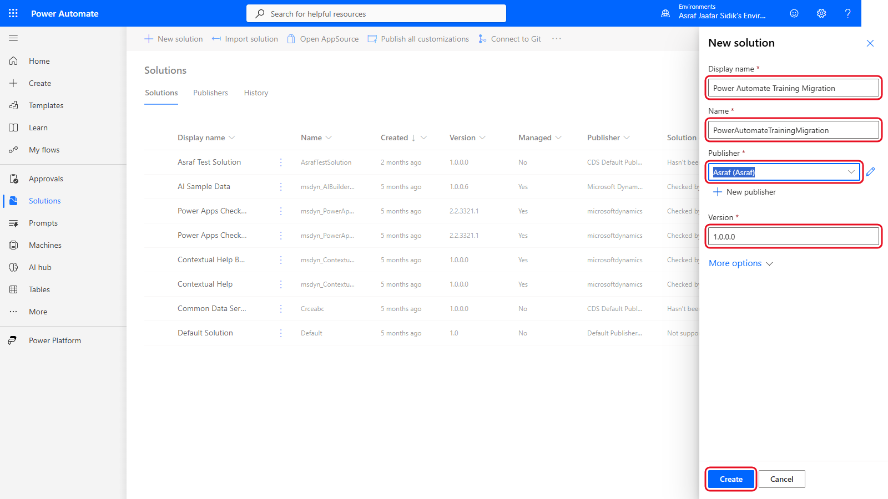
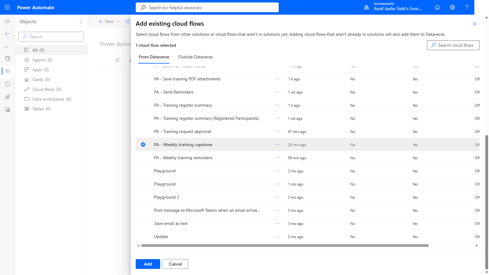
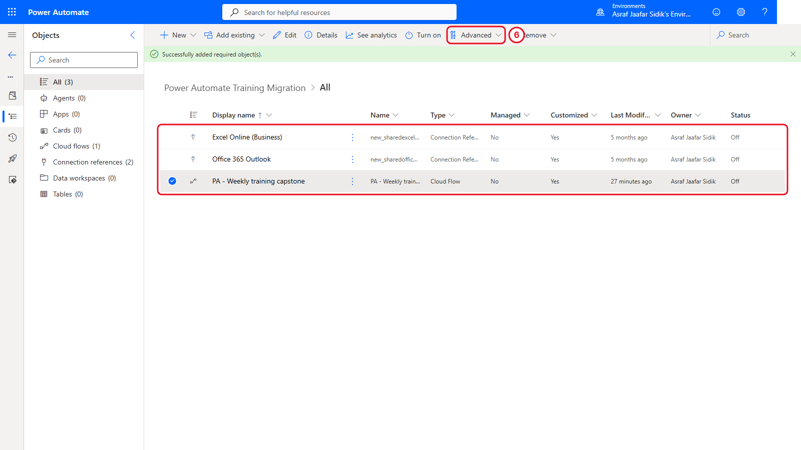
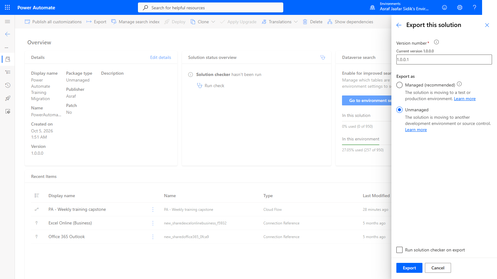

# 10 - Move Automations with Environments and Solutions

A flow that works in one environment can still be hard to move safely. It depends on connections, tables and other components, and copying them one at a time makes it easy to miss something. Solutions package those pieces together.

> **Copy-paste values:** the solution names are on the [copy-paste page](./copy-paste.md).

**Estimated time:** 60 minutes (trainer demonstration)

**Your result:** You can explain how a flow moves between environments, after watching your trainer package the capstone flow in a solution and walk through where an import starts.

---

## What You Will Learn

- Explain what an environment is and why organisations separate development from production
- Describe what a solution can contain
- Explain how Power Automate, Power Apps and Copilot Studio can share solution components
- Follow how a solution is created and an existing cloud flow added
- Follow how an unmanaged solution is published and exported
- Identify the safe import, connection-repair, verification and testing sequence

---

## The Migration Path

**Development environment > Solution > Publish > Export package > Target environment > Import > Repair connections > Verify > Authorised test**

The live demonstration stops after opening the import screen. Importing back into the same environment isn't a real migration test, and testing the capstone could send email.

---

## Before You Begin

> **Important:** This chapter is a **trainer demonstration**. Your class works in a live environment, and solutions create real components there (a solution, a publisher, connection references). Watch the demo and follow along on this page. Don't create, export or import solutions yourself unless your trainer gives you a separate practice environment.

The demo uses `PA - Weekly training capstone` from Chapter 7, kept turned off. Solutions also need Microsoft Dataverse in the environment, and Power Automate Free alone doesn't guarantee that.

---

## Environments in Plain Language

An environment is a separate workspace for apps, flows, data, connections and security. The environment selector at the top of Power Automate shows which one you're in.

| Environment | Typical purpose | Practical rule |
|-------------|-----------------|----------------|
| Development | Build and change automations | Use fictional or approved test data |
| Test | Validate behaviour before release | Reconnect services and run controlled tests |
| Production | Run approved business processes | Restrict changes and monitor real operation |

Separating these stages stops unfinished changes reaching real users, but only when permissions, connection ownership, data and release steps are controlled too.

Power Automate, Power Apps and Copilot Studio all sit on the Power Platform, so one solution can package the flows, apps, agents, tables, connection references and environment variables behind a single business process. What's available depends on the environment and licences.

---

## 10.1 Confirm the Current Environment

Check the environment selector before you create or import anything, and confirm with the trainer that it's the development or training environment. If a flow or solution seems to be missing, check the environment before rebuilding it.

---

## 10.2 Create the Solution

Open **Solutions**, select **New solution**, and enter:

| Field | Value |
|-------|-------|
| Display name | Power Automate Training Migration |
| Name | PowerAutomateTrainingMigration |
| Publisher | The trainer-approved publisher |
| Version | 1.0.0.0 |

Then select **Create**. The display name is the friendly label. The unique name is used internally and normally shouldn't change later.

*The display name is for people. The name is used internally.*

---

## 10.3 to 10.7 Add the Capstone Flow

1. Open the new solution. Its object list is empty: a new solution is just a container.
2. Select **Add existing** and point to **Automation**.
3. Under Automation, select **Cloud flow**.
4. Find `PA - Weekly training capstone`. Depending on how your environment stores flows, it's on the **From Dataverse** tab or the **Outside Dataverse** tab.
5. Select the capstone, then **Add**.
6. If only the flow appears in the solution, select it, then **Advanced** > **Add required objects**. This adds the connection references it needs.

*Pick the capstone from the list. Here it's on the From Dataverse tab.*

Power Automate may also add **connection references**. A connection reference is a solution component that points to a connection. The target environment still needs a valid connection and an authorised account.

---

## 10.8 Verify the Solution Components

Confirm the solution has three objects: the capstone cloud flow and the Excel Online (Business) and Office 365 Outlook connection references.

*Three objects: the flow and its two connection references.*

> **Key point:** Showing up in the object list doesn't mean a dependency is ready. File locations, table names, recipients, connection accounts, environment variables and permissions can all differ in the target environment.

---

## 10.9 Review the Solution Before Export

Open **Overview** and check the name, version, package type, publisher and included items.

---

## 10.10 to 10.12 Publish and Export

1. Select **Export**. If a **Before you export** panel offers **Publish**, select it so the latest changes are included, and wait for **Published**.
2. Select **Next**.

   

   *Unmanaged suits a learning exercise. The version number goes up with each export.*

3. Confirm the version, select **Unmanaged**, and select **Export**. Power Automate suggests the next version number (for example 1.0.0.1), so every exported package has its own version.
4. When the success message appears, select **Download** and store the ZIP in the trainer-approved location. The worked example produced `PowerAutomateTrainingMigration_1_0_0_1.zip`.

An unmanaged package suits this exercise because its components can be edited after import. Managed solutions are normally used for controlled distribution where recipients shouldn't edit the components. That's an organisational decision, so don't switch package types casually in an established process.

> **Tip:** Don't unzip or rename the package before import. Treat it as a release artifact and record who exported it, from which environment, and why.

---

## 10.13 and 10.14 Switch Environment and Start the Import

1. Use the environment selector to choose the trainer-approved target environment, and confirm its name before opening **Solutions**.
2. Select **Import solution**, then **Browse** to the exported ZIP. Select **Next** only after confirming the package name and the target environment.

The demonstration stops here. No file is uploaded and nothing is imported. Your trainer may not switch environments at all if there's no second training environment. **Never use production as a stand-in for a training target.**

---

## 10.15 Repair Connections and Settings

After the package is selected, Power Platform may ask for connection mappings or environment-specific values. Before import or first use:

1. Map each connection reference to an approved connection in the target environment.
2. Confirm the Excel workbook and `tblTraining` table exist in the intended target location.
3. Review recipients, team and channel selections, form references, schedules, time zones and environment variables.
4. Confirm the importing account and future flow owner have the required permissions.
5. Keep the imported flow turned off until verification is complete.

---

## 10.16 Verify and Test Safely

After an authorised import, open the solution and confirm the expected components are there. Run Flow checker, review every connection and setting, and use fictional data and approved destinations for the first test.

Testing is a separate release decision. An imported flow can be structurally valid and still point at the wrong workbook, mailbox, form, team, channel or recipient. Get trainer authorisation right before any test that can send messages or change shared data.

---

## Independent Practice

Create a migration checklist for one of the earlier flows. Name its trigger, connectors, data sources, recipients, environment-specific settings, owner, safe test data, and the evidence you'd need before turning it on in production. Don't export, import or run anything.

---

## Troubleshooting

| Symptom | What to check |
|---------|---------------|
| Solutions is missing or unavailable | Environment type, Dataverse, licence, security role and maker permissions |
| The flow isn't in the list | Current environment, both the From Dataverse and Outside Dataverse tabs, flow ownership, and whether it's already in another solution |
| Connection references are missing | Select the flow in the solution, then Advanced > Add required objects |
| Extra components appear | Connection references and other dependencies may be added automatically. Review each one |
| Export stays pending | Refresh Solutions, open export history, and confirm publishing finished |
| Import says the solution already exists | Check you're in the intended target, and whether this is an upgrade or an accidental same-environment import |
| A connection shows an error after import | Create or pick an approved target connection and remap the connection reference |
| The flow imports but can't find the workbook | Target OneDrive or SharePoint location, file name, table name, permissions and connector account |
| The imported flow is off | Leave it off while reviewing. Turn it on only through the approved release process |

---

## Lesson Summary

Environments separate workspaces, permissions, data and release stages. Solutions package related Power Platform components so a process can move in a controlled way. A safe migration covers dependency review, publishing, a versioned export, a confirmed target, connection mapping, configuration checks, Flow checker, controlled testing and a deliberate decision to switch the flow on.
