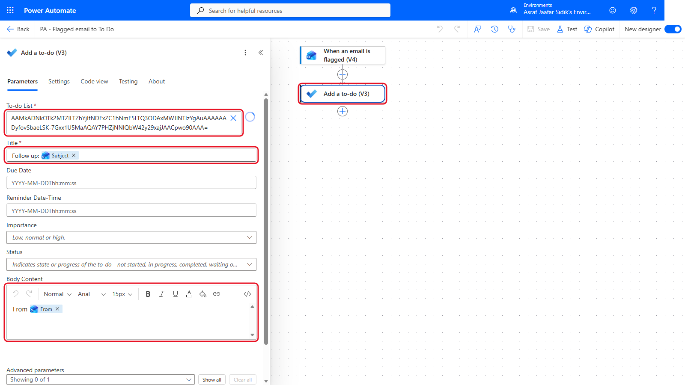
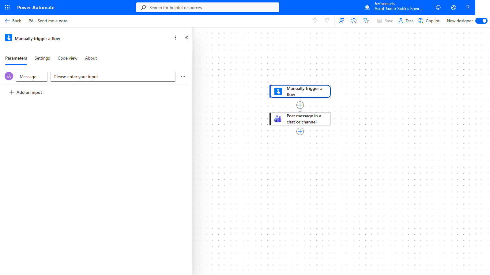
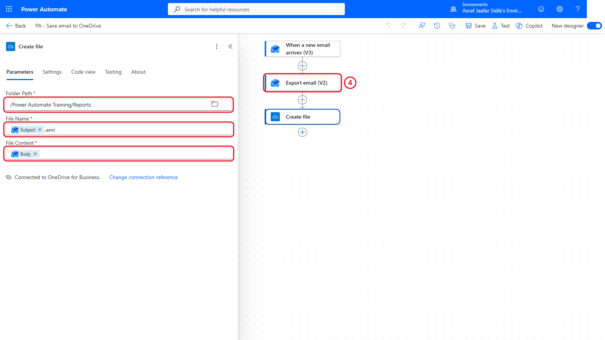
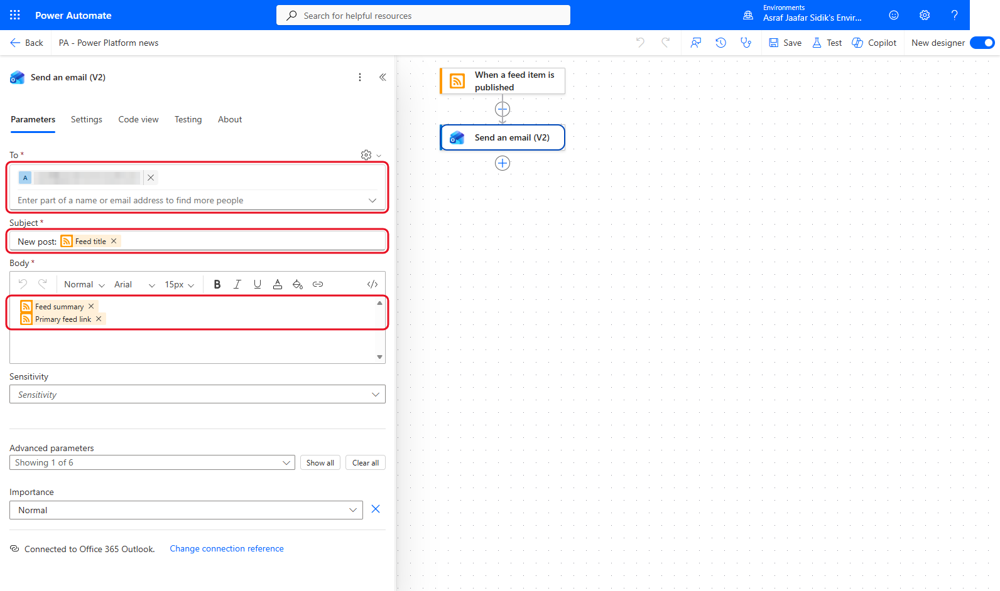
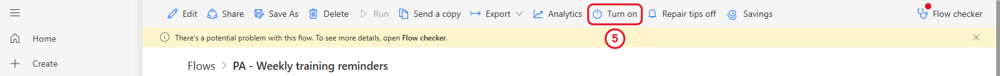

# 11 - Extra Practice: Personal Automations

Four small flows for when you finish early, or for practice back at your desk. Each one only reads your own data or writes to your own OneDrive training folder, and only notifies you. None of them touches shared sites, lists, teams or other people's mailboxes.

> **Copy-paste values:** flow names and text for every exercise are on the [copy-paste page](./copy-paste.md).

**Estimated time:** 15 to 20 minutes each, self-paced

**Your result:** Up to four working personal flows, each built with the skills from Chapters 3 to 8.

---

## Which One Should I Try?

| Exercise | Flow type | Practises | Connectors |
|----------|-----------|-----------|------------|
| A. Flagged email to To Do | Automated | Triggers and dynamic content | Office 365 Outlook, Microsoft To Do (Business) |
| B. Send me a note | Instant | Trigger inputs | Microsoft Teams (your own Flow bot chat) |
| C. Save an email to OneDrive | Automated | Trigger filters, file actions | Office 365 Outlook, OneDrive for Business |
| D. News digest | Automated | A non-Microsoft 365 trigger | RSS, Office 365 Outlook |

> **Tip:** Turn each flow off when you've finished testing, unless you want to keep using it. Open it from **My flows** and select **Turn off** in the toolbar, where **Turn on** was.

---

## A. Flagged Email to To Do

**The problem:** You flag emails to come back to, then forget about them. This flow adds every flagged email to your personal To Do list.

1. Select **Create** > **Automated cloud flow**. Name it `PA - Flagged email to To Do`.
2. Choose the trigger **When an email is flagged (V4)** (Office 365 Outlook) and select **Create**.
3. In the trigger, set **Folder** to **Inbox**.
4. Add **Add a to-do (V3)** (Microsoft To Do (Business)):

   | Field | Value |
   |-------|-------|
   | To-do List | Tasks |
   | Title | Type `Follow up: ` then insert **Subject** |
   | Body Content | Type `From ` then insert **From** |

   

   *The flagged email's subject becomes the task title.*

5. Save, then **Test** > **Manually** > **Test**. Flag any email in your Outlook inbox. Within a minute, the task appears in Microsoft To Do.

---

## B. Send Me a Note

**The problem:** You think of something and want a quick reminder where you'll see it. This instant flow asks you for a message and sends it to you as a Teams chat from Flow bot. It only posts in your own chat with Flow bot.

1. Select **Create** > **Instant cloud flow**. Name it `PA - Send me a note`.
2. Choose **Manually trigger a flow** and select **Create**.
3. Select the trigger, then **+ Add an input** > **Text**. Rename the input from *Input* to `Message`.

   

   *A trigger input asks the person running the flow to type something first.*

4. Add **Post message in a chat or channel** (Microsoft Teams):

   | Field | Value |
   |-------|-------|
   | Post as | Flow bot |
   | Post in | Chat with Flow bot |
   | Recipient | Your own email address |
   | Message | Type `Reminder: ` then insert **Message** from the trigger |

5. Save, then **Test** > **Manually** > **Test**. Type a short message and select **Run flow**. The message appears in Teams, in your chat with Flow bot.

> **Note:** Earlier versions of this exercise used **Send me a mobile notification**. During testing that action reported that the Power Automate mobile app had been retired and notifications had nowhere to go, so this version uses Teams instead.

---

## C. Save an Email to OneDrive

**The problem:** Some emails need keeping as files: a confirmation, a booking, an agreement. This flow saves any email you send yourself with `[PA SAVE]` in the subject as a file in your training folder.

1. Select **Create** > **Automated cloud flow**. Name it `PA - Save email to OneDrive`.
2. Choose **When a new email arrives (V3)** (Office 365 Outlook) and select **Create**.
3. In the trigger, set **Folder** to **Inbox**. Under **Show all**, set **Subject Filter** to `[PA SAVE]`.
4. Add **Export email (V2)** (Office 365 Outlook). In **Message Id**, insert **Message Id** from the trigger.
5. Add **Create file** (OneDrive for Business):

   | Field | Value |
   |-------|-------|
   | Folder Path | `/Power Automate Training/Reports` |
   | File Name | Insert **Subject**, then type `.eml` |
   | File Content | Insert **Body** from *Export email (V2)* |

   

   *Export email turns the message into a file. Create file saves it.*

6. Save and **Test**. Send yourself an email with the subject `[PA SAVE] Booking confirmation`. A `.eml` file appears in Reports. Double-click it to open it in Outlook.

---

## D. News Digest

**The problem:** You want to keep up with Power Automate news without checking the blog. This flow emails you whenever a new post is published.

1. Select **Create** > **Automated cloud flow**. Name it `PA - Power Platform news`.
2. Search for `RSS`, choose **When a feed item is published**, and select **Create**.
3. In **The RSS feed URL**, paste the Microsoft Power Platform blog feed from the copy-paste page.
4. Add **Send an email (V2)** (Office 365 Outlook):

   | Field | Value |
   |-------|-------|
   | To | Your own email address |
   | Subject | Type `New post: ` then insert **Feed title** |
   | Body | Insert **Feed summary**, press Enter, then insert **Primary feed link** |

   

   *The RSS connector watches a public web feed. It reads, and never writes, anything.*

5. Save, then select **Back** (top left) to reach the flow's details page, and select **Turn on** in the toolbar. The next new blog post arrives in your inbox.

   

   *Turn on is in the toolbar of the flow's details page.* The RSS trigger checks for new posts on a schedule, so a test may not fire straight away.

> **Note:** If the feed URL stops working, open the blog in your browser and look for its RSS link, or try any other news site that offers an RSS feed.

---

## Lesson Summary

Small personal flows are the best way to keep practising after the course. Each one here uses a different starting point (a flag, a button, a subject filter and a web feed) with the same building blocks: a trigger, dynamic content and an action.
