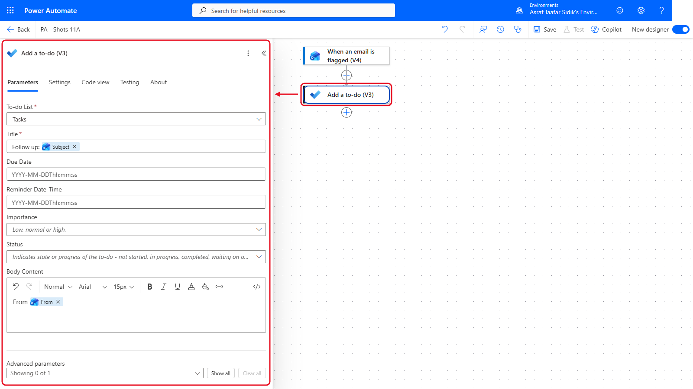
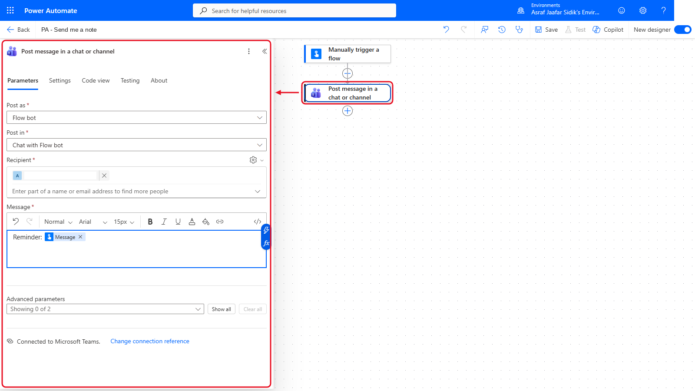
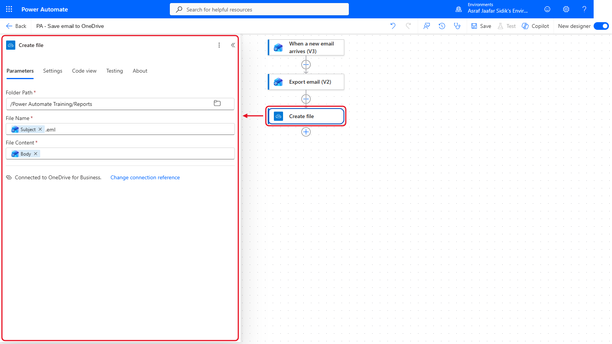
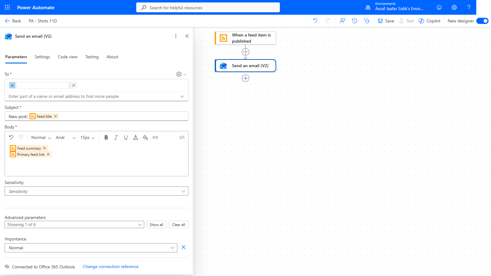

# 11 - Extra Practice: Personal Automations

Four small flows for when you finish early, or for practice back at your desk. Each one only reads your own data or writes to your own OneDrive training folder, and only notifies you. None of them touches shared sites, lists, teams or other people's mailboxes.

> **Copy-paste values:** every value you need is in the steps, with a Copy button. The [copy-paste page](./copy-paste.md) has them all on one page too.

**Estimated time:** 15 to 20 minutes each, self-paced

**Your result:** Up to four working personal flows, each built with the skills from Chapters 3 to 8.

---

## Which One Should I Try?

| Exercise | Flow type | Practises | Connectors |
|----------|-----------|-----------|------------|
| A. Flagged email to To Do | Automated | Triggers and dynamic content | Office 365 Outlook, Microsoft To Do (Business) |
| B. Send me a note | Instant | Trigger inputs | Microsoft Teams (your own Flow bot chat) |
| C. Save an email to OneDrive | Automated | Trigger filters, file actions | Office 365 Outlook, OneDrive for Business |
| D. News digest | Automated | A non-Microsoft 365 trigger | RSS, Office 365 Outlook |

> **Tip:** Turn each flow off when you've finished testing, unless you want to keep using it. In **My flows**, select the **...** beside the flow, then **Turn off**.

> **How the steps work:** the designer basics are the same as in Chapter 3.
>
> - **Add an action:** on the canvas, select the **+** under the last step, then **Add an action**. Type the action's name in the search box and pick it under the named connector.
> - **Insert a value:** click into the field, then select the lightning bolt icon beside the box (or type `/` and choose **Insert dynamic content**) and pick the value. If you can't see it, select **See more** under the step's name, or type the value's name in the picker's search box.
> - **Save** and **Test** are at the top right of the designer.

---

## A. Flagged Email to To Do

**The problem:** You flag emails to come back to, then forget about them. This flow adds every flagged email to your personal To Do list.

1. Select **Create** in the left navigation, then the **Automated cloud flow** tile. In **Flow name**, enter `PA - Flagged email to To Do`.
2. In the trigger search box, type `flagged`, select **When an email is flagged (V4)** under **Office 365 Outlook**, and select **Create**.
3. Select the trigger card on the canvas to open its panel on the left, and set **Folder** to **Inbox**.
4. Under the trigger, select **+** > **Add an action**, search `to-do`, and choose **Add a to-do (V3)** under **Microsoft To Do (Business)**. Open the **To-do List** dropdown and pick **Tasks**, then fill in the other two fields:

   | Field | Value |
   |-------|-------|
   | Title | Type `Follow up: ` (with a space at the end), then insert **Subject** |
   | Body Content | Type `From ` (with a space at the end), then insert **From** |

   Title start (ends with a space):

   ```text
   Follow up: 
   ```

   Body Content start (ends with a space):

   ```text
   From 
   ```

   

   *The flagged email's subject becomes the task title.*

   > **Note:** After you pick **Tasks**, the To-do List field may show a long ID instead of the name. That's normal.

5. Select **Save**, then **Test** > **Manually** > **Test**. In Outlook, flag any email in your inbox. Within a minute, the task appears in Microsoft To Do.

**Check your flow so far.** Your screen should look like this.



*Two steps: the trigger and Add a to-do (V3).*

---

## B. Send Me a Note

**The problem:** You think of something and want a quick reminder where you'll see it. This instant flow asks you for a message and sends it to you as a Teams chat from Flow bot. It only posts in your own chat with Flow bot.

1. Select **Create** in the left navigation, then the **Instant cloud flow** tile. In **Flow name**, enter `PA - Send me a note`.
2. Under **Choose how to trigger this flow**, select **Manually trigger a flow**, then select **Create**.
3. Select the trigger card on the canvas. In its panel, select **+ Add an input**, then **Text**. Select the first box, which reads *Input*, delete that word and type `Message`.

   

   *A trigger input asks the person running the flow to type something first.*

4. Under the trigger, select **+** > **Add an action**, search `post message`, and choose **Post message in a chat or channel** under **Microsoft Teams**. Fill in the fields in this order, because **Recipient** only appears after you choose **Post in**:

   | Field | Value |
   |-------|-------|
   | Post as | Flow bot |
   | Post in | Chat with Flow bot |
   | Recipient | Your own email address |
   | Message | Type `Reminder: ` (with a space at the end), then insert **Message** from *Manually trigger a flow* |

   Message start (ends with a space):

   ```text
   Reminder: 
   ```

5. Select **Save**, then **Test** > **Manually** > **Test**. In the panel that opens, type a short message, then select **Run flow**. The message appears in Teams, in your chat with Flow bot.

> **Note:** Earlier versions of this exercise used **Send me a mobile notification**. During testing that action reported that the Power Automate mobile app had been retired and notifications had nowhere to go, so this version uses Teams instead.

**Check your flow so far.** Your screen should look like this.



*Two steps: the trigger and the Teams message.*

---

## C. Save an Email to OneDrive

**The problem:** Some emails need keeping as files: a confirmation, a booking, an agreement. This flow saves any email you send yourself with `[PA SAVE]` in the subject as a file in your training folder.

1. Select **Create** in the left navigation, then the **Automated cloud flow** tile. In **Flow name**, enter `PA - Save email to OneDrive`.
2. In the trigger search box, type `new email`, select **When a new email arrives (V3)** under **Office 365 Outlook**, and select **Create**.
3. Select the trigger card on the canvas to open its panel, and set **Folder** to **Inbox**. Near the bottom of the panel, next to **Advanced parameters**, select **Show all**, then type `[PA SAVE]` in **Subject Filter**.
4. Under the trigger, select **+** > **Add an action**, search `export email`, and choose **Export email (V2)** under **Office 365 Outlook**. Click into **Message Id** and insert **Message Id** from *When a new email arrives (V3)*.
5. Under **Export email (V2)**, select **+** > **Add an action**, search `create file`, and choose **Create file** under **OneDrive for Business**:

   | Field | Value |
   |-------|-------|
   | Folder Path | Type `/Power Automate Training/Reports`, or select the folder icon at the right of the box and browse to **Reports** |
   | File Name | Insert **Subject** from the trigger, then type `.eml` straight after it |
   | File Content | Insert **Body** from *Export email (V2)* |

   Folder Path:

   ```text
   /Power Automate Training/Reports
   ```

   

   *Export email turns the message into a file. Create file saves it.*

6. Select **Save**, then **Test** > **Manually** > **Test**. In Outlook, send yourself an email with the subject below. Copy it from the box below.

   ```text
   [PA SAVE] Booking confirmation
   ```

   A `.eml` file appears in Reports. Double-click it to open it in Outlook.

**Check your flow so far.** Your screen should look like this.



*Three steps: the trigger, Export email (V2) and Create file.*

---

## D. News Digest

**The problem:** You want to keep up with Power Automate news without checking the blog. This flow emails you whenever a new post is published.

1. Select **Create** in the left navigation, then the **Automated cloud flow** tile. In **Flow name**, enter `PA - Power Platform news`.
2. In the trigger search box, type `RSS`, select **When a feed item is published**, and select **Create**.
3. Select the trigger card on the canvas. In **The RSS feed URL**, paste the Microsoft Power Platform blog feed. Copy it from the box below.

   ```text
   https://www.microsoft.com/en-us/power-platform/blog/feed/
   ```
4. Under the trigger, select **+** > **Add an action**, search `send an email`, and choose **Send an email (V2)** under **Office 365 Outlook**:

   | Field | Value |
   |-------|-------|
   | To | Type your own email address and select it from the suggestions |
   | Subject | Type `New post: ` (with a space at the end), then insert **Feed title** |
   | Body | Insert **Feed summary**, press Enter, then insert **Primary feed link** |

   Subject start (ends with a space):

   ```text
   New post: 
   ```

   

   *The RSS connector watches a public web feed. It reads, and never writes, anything. Ignore any extra fields such as **Importance**; leave them as they are.*

5. Select **Save**, then select **My flows** on the left. Select the **...** beside **PA - Power Platform news**, then **Turn on**. The next new blog post arrives in your inbox.

   

   *Turn on is in the flow's ... menu in My flows.* The RSS trigger checks for new posts on a schedule, so a test may not fire straight away.

> **Note:** If the feed URL stops working, open the blog in your browser and look for its RSS link, or try any other news site that offers an RSS feed.

**Check your flow so far.** Before step 5, your designer should look like this.



*Two steps: the feed trigger and Send an email (V2).*

---

## Lesson Summary

Small personal flows are the best way to keep practising after the course. Each one here uses a different starting point (a flag, a button, a subject filter and a web feed) with the same building blocks: a trigger, dynamic content and an action.
