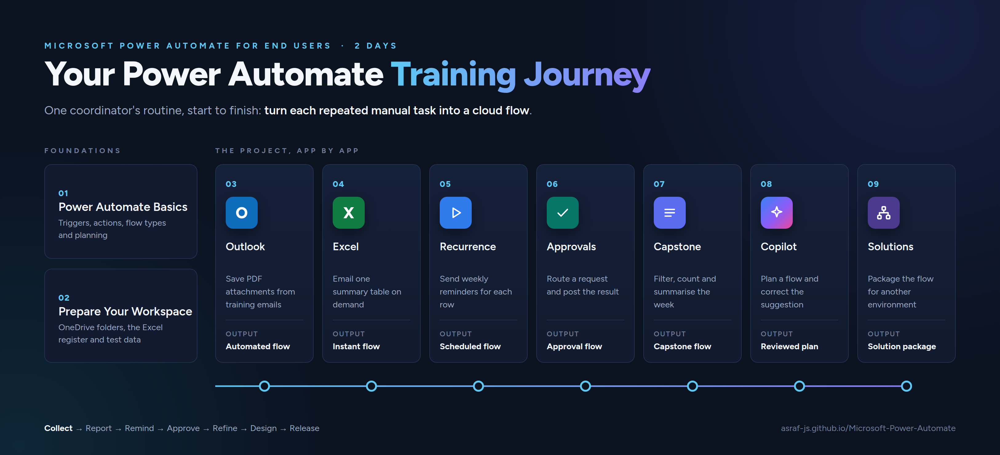

# Microsoft Power Automate for End Users

Participant resources for the two-day **Microsoft Power Automate for End Users** course: chapter notes, copy-paste expressions, the participant manual and a sample workbook.

You do not need a GitHub account to use anything on this page.

**Version 1.1**, last updated 4 October 2026.

---

## Program Flow

---

## How to Use This Site

Each chapter has a **Notes** page that walks through the concepts and steps, and a **Copy-paste** page with every flow name, expression and text value you type during the exercises.

To copy a value: open the chapter's copy-paste page, find the value, and click the copy icon in the top-right corner of the grey box. Then paste it into Power Automate. Copying from the box is safer than copying from the PDF, which can add line breaks or change the quotation marks.

To download everything: **[download all course files (ZIP)](https://github.com/Asraf-JS/Microsoft-Power-Automate/archive/refs/heads/main.zip)**. Save the ZIP, then right-click it and choose **Extract All** before you open any file.

To follow the screenshots: open the **[participant manual (PDF)](./Microsoft-Power-Automate-for-End-Users-Participant-Manual.pdf)**. It has a screenshot for nearly every step.

To read offline or print: download the **[course book (PDF)](./Microsoft-Power-Automate-Course-Book.pdf)**. It has every chapter's notes and copy-paste values in one file.

---

## Course Scenario

Throughout the course you automate the work of one training coordinator.

> **You coordinate training for a small organisation.** Course materials arrive by email, session details live in an Excel register, requests need approval, and participants need reminders.

Each chapter takes one of those manual tasks and turns it into a flow:

| Stage | What happens |
|-------|-------------|
| Plan | Learn how flows work and write a plan before building anything |
| Prepare | Set up the OneDrive folders, Excel register, test email, Forms and Teams destinations |
| Collect | Save PDF attachments from training emails to OneDrive automatically |
| Report | Send the coordinator a one-click summary table from the Excel register |
| Remind | Send weekly reminders to every participant on a schedule |
| Approve | Route a training request form through an approval and post the result to Teams |
| Refine | Filter reminders to upcoming incomplete sessions, count them and summarise the week |
| Design | Use Copilot to plan a flow, then review and correct its suggestion |
| Release | Package the finished flow in a solution and export it for another environment |

---

## Chapters

| Day | # | Chapter | Copy-paste | What you will do | Time |
|-----|---|---------|-------|------------------|------|
| 1 | 01 | [Understand Power Automate](./01-understand-power-automate/) | [Copy-paste](./01-understand-power-automate/copy-paste.md) | Learn triggers, actions and flow types, find your way around Power Automate, and plan an automation | 45 min |
| 1 | 02 | [Prepare your training workspace](./02-prepare-workspace/) | [Copy-paste](./02-prepare-workspace/copy-paste.md) | Create the OneDrive folders, the Excel register and a test email | 90 min |
| 1 | 03 | [Save email attachments automatically](./03-save-email-attachments/) | [Copy-paste](./03-save-email-attachments/copy-paste.md) | Build an automated flow that saves PDF attachments to OneDrive | 120 min |
| 1 | 04 | [Create and distribute an Excel summary](./04-excel-summary/) | [Copy-paste](./04-excel-summary/copy-paste.md) | Build an instant flow that emails one summary table from Excel | 120 min |
| 2 | 05 | [Send weekly training reminders](./05-weekly-reminders/) | [Copy-paste](./05-weekly-reminders/copy-paste.md) | Build a scheduled flow that sends a reminder for each row | 75 min |
| 2 | 06 | [Process a training approval](./06-training-approval/) | [Copy-paste](./06-training-approval/copy-paste.md) | Connect Forms, Approvals and Teams in one flow | 75 min |
| 2 | 07 | [Capstone](./07-capstone/) | [Copy-paste](./07-capstone/copy-paste.md) | Filter weekly reminders and send a coordinator summary | 90 min |
| 2 | 08 | [Plan an automation with Copilot](./08-plan-with-copilot/) | [Copy-paste](./08-plan-with-copilot/copy-paste.md) | Review and refine a Copilot flow plan | 30 min |
| 2 | 09 | [Move automations with solutions](./09-environments-and-solutions/) | [Copy-paste](./09-environments-and-solutions/copy-paste.md) | Package a flow for another environment | 60 min |

---

## Sample Data

The file [TrainingRegister.xlsx](./02-prepare-workspace/TrainingRegister.xlsx) in the Chapter 2 folder is a ready-made Excel workbook with the `tblTraining` table and six fictional records. Only use it if your trainer tells you to, instead of building it yourself. Chapters 2 to 7 use it.

The [test-files](https://github.com/Asraf-JS/Microsoft-Power-Automate/tree/main/02-prepare-workspace/test-files) folder in Chapter 2 holds the fictional email attachments for Chapters 2 and 3: `CourseOutline.pdf`, `TrainerPhoto.jpg` and `SessionNotes.docx`.

---

## Before You Start

- Use only the fictional data in these files. Never put real names, email addresses or company documents into the practice resources.
- Keep your flows turned off until your trainer asks you to test them.
- Only send test emails to the addresses your trainer has approved.

---

## What to Learn Next

These free Microsoft Learn resources pick up where the course ends.

- [Build and optimize cloud flows in Power Automate](https://learn.microsoft.com/en-us/training/paths/build-optimize-cloud-flows-power-automate/): expressions, error handling and troubleshooting slow flows.
- [Demonstrate the capabilities of Microsoft Power Automate](https://learn.microsoft.com/en-us/training/paths/demonstrate-capabilities-microsoft-power-automate/): a wider tour of what Power Automate can do.
- [Microsoft Certified: Power Platform Fundamentals (PL-900)](https://learn.microsoft.com/en-us/credentials/certifications/power-platform-fundamentals/): a beginner certification if you want proof of your skills.
- [Power Automate documentation](https://learn.microsoft.com/en-us/power-automate/): the official reference for every connector and action.

---

## Need Help?

During the course, ask your trainer. After the course, contact the training coordinator who arranged your class.

---

*Last updated: October 2026 | Trainer: Asraf*

© Asraf Jaafar Sidik, Microsoft Certified Trainer. These materials are for course participants' personal use. Please don't redistribute or resell them.
